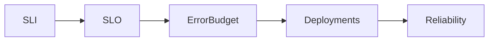

# AGENTS.md

# Site Reliability Engineering (Google SRE) Course Authoring System

## Purpose

This repository contains a didactic course built with MkDocs based primarily on:

* Beyer, B.; Jones, C.; Petoff, J.; Murphy, N. R. (eds.). *Site Reliability Engineering: How Google Runs Production Systems*. O'Reilly Media / Google, 2016.
* Beyer, B.; Murphy, N. R.; Rensin, D.; Kawahara, K.; Thorne, S. (eds.). *The Site Reliability Workbook*. O'Reilly Media / Google, 2018.

The objective is NOT to reproduce the books.

The objective is to create a modern, concise, practical, educational and original learning experience that teaches SRE concepts in a structured and accessible way.

---

# Core Principles

## P1 - Educational First

The repository exists to teach.

Every chapter must optimize for:

* Understanding
* Retention
* Practical application
* Interview preparation
* Real-world engineering usage

---

## P2 - No Plagiarism

Forbidden:

* Literal translations of chapters.
* Copying paragraphs.
* Rewriting sentences with minimal modifications.
* Reproducing examples extensively.

Required:

* Synthesize.
* Explain.
* Interpret.
* Contextualize.
* Expand.

Every chapter must provide value beyond the original source.

---

## P3 - Attribution

All borrowed concepts must be referenced.

Every page must contain:

```markdown
## Referências
```

Referências são obrigatórias.

---

## P4 - Modernization

The original SRE book was published in 2016.

Each chapter should explain the original concept and its practical use today
when that context improves understanding. Do not add a modernization paragraph
when it is generic or unrelated to the chapter.

Modernization must explain how the concept appears in real production systems
today: cloud platforms, Kubernetes, internal platforms, observability, CI/CD,
incident response, platform engineering, operational security, resilience, or
AI systems. Do not turn modernization into a list of tools detached from the
chapter's central idea.

Whenever relevant, discuss:

* Kubernetes
* Cloud Native
* CNCF
* OpenTelemetry
* GitOps
* Platform Engineering
* AI Operations
* SRE for AI systems

Preferred sources for modernization:

* Google SRE and Site Reliability Workbook
* Google Cloud Architecture Framework
* AWS Well-Architected Framework
* Microsoft Learn and Azure Well-Architected Framework
* CNCF and OpenTelemetry
* DORA
* NIST publications when resilience, risk or security engineering is relevant

---

## P5 - Brazilian Portuguese Language Standard

All student-facing content must be written in **Português Brasileiro (pt-BR)**.

Mandatory rules:

* Use correct Brazilian Portuguese spelling, grammar and graphic accents.
* Do not publish unaccented Portuguese words such as `capitulo`, `automacao`, `confiavel`, `pratica`, `latencia`, `operacao`, `disponivel`, `critico`, `usuario` or `servico`.
* Prefer Portuguese section titles for student-facing pages, for example `Objetivos de aprendizagem`, `Conceitos-chave`, `Exemplo prático`, `Perguntas de entrevista` and `Referências`.
* Technical English terms may be kept when they are industry-standard, for example SRE, SLI, SLO, SLA, error budget, toil, rollback, rollout, runbook, GitOps and Kubernetes.
* When using an English technical term, explain it in Portuguese on first use when the term is not obvious.
* Highlight central concepts in **bold** at first definition and at important decision points.
* Generated Markdown must be reviewed for accentuation before publishing.
* Scripts that generate content should either store text already accented or apply a pt-BR normalization step.

Forbidden in student-facing material:

* Mixing English headings with Portuguese body text unless there is a deliberate pedagogical reason.
* Omitting accents because of ASCII-only defaults.
* Literal translation that sounds unnatural in Brazilian Portuguese.
* Decorative bold that highlights whole paragraphs without a learning purpose.

---

## P6 - Fluent Concept Explanation

Student-facing text must explain concepts directly and naturally.

Forbidden meta-explanations:

* "No contexto de..."
* "Este conceito deve ser tratado como..."
* "Este conceito sustenta a ideia central do capítulo..."
* "Use-o para sair de uma discussão abstrata..."
* "Tratar X como termo de vocabulário..."
* "Este capítulo mostra..."
* "Nesta seção..."
* "A segunda metade da introdução..."
* References to the page structure such as "the previous section", "the next section",
  "above", "below", or "this page explains" when the sentence should teach the
  concept directly.
* Repeating fixed labels for every concept, such as `O que é`, `Por que importa`, `Como aplicar` and `Armadilha comum`.
* Any sentence that talks about the writing structure instead of teaching the concept.

Required style:

* Explain the concept as if teaching a student who needs to apply it tomorrow.
* Prefer direct definitions followed by practical consequences.
* Use short paragraphs, but avoid repetitive templates.
* Each concept subsection must read as a natural mini-lesson, not as a form filled with labels.
* Vary the structure according to the concept: some concepts need a definition, some need an example, some need a contrast, and some need a warning.
* Use the book's concepts as the backbone, but rewrite with original Brazilian Portuguese prose.
* Use **bold** for core terms such as **SRE**, **SLI**, **SLO**, **SLA**, **error budget**, **toil**, **observabilidade**, **automação**, **resiliência**, **prontidão para produção**, **dependências críticas** and **ambiente de produção**.
* Write as if the concept is true in production, not as if describing what a
  chapter or section contains.

Example of weak writing:

```markdown
No contexto de Introdução, este conceito deve ser tratado como uma pergunta operacional concreta.
```

Example of acceptable writing:

```markdown
Um limite explícito para trabalho operacional impede que a equipe de SRE vire apenas uma fila de tarefas manuais. Quando a carga reativa passa do limite combinado, o serviço precisa receber investimento em automação, correção de causa raiz ou devolução de responsabilidade para a equipe de produto.
```

---

## P7 - Editorial Consolidation

Chapters may be consolidated when separate pages create repetition, artificial
progression or a weaker learning path. Consolidation is preferred when a single
page can teach the concepts with more clarity and less duplication.

When consolidating chapters:

* Keep the student-facing page clear about what was consolidated.
* Preserve important concepts from both original chapters.
* Update `mkdocs.yml` and `docs/index.md` so the navigation reflects the new
  learning path.
* Keep a legacy page only when it is useful for old links, generated file
  counts or repository continuity.
* A legacy page must point to the consolidated page, remain concise, include
  `## Referências`, and not compete with the main reading path.
* If a page is intentionally kept outside the MkDocs navigation, this must be a
  deliberate compatibility decision.

---

## P8 - Progressive Learning Path

The course must guide students from **basic** to **advanced** SRE practice.

The learning path must make progression explicit:

* Basic: vocabulary, production environment, SLIs, SLOs, error budgets, toil,
  monitoring and simplicity.
* Intermediate: alerting, on-call, troubleshooting, incident response,
  postmortems, outage tracking, testing and internal SRE tooling.
* Advanced: load balancing, overload, cascading failures, consensus, distributed
  scheduling, data integrity, launch coordination and resilience design.
* Organizational: onboarding, interrupts, operational overload, communication,
  engagement models, cross-industry lessons and continuous improvement.

Student-facing material should help the learner move from "what is this?" to:

* what risk this reduces;
* what decision it improves;
* what artifact should exist;
* what evidence proves it works;
* how it behaves during change, failure and recovery.

---

## P9 - SRE Development Cycle

The course must teach SRE as a complete development and operations cycle, not as
isolated concepts.

When relevant, chapters should connect their topic to this cycle:

1. Understand the service and critical user journey.
2. Define SLIs, SLOs and accepted risk.
3. Design architecture, dependencies and failure modes.
4. Implement tests, automation, instrumentation and runbooks.
5. Release with canaries, rollback and objective criteria.
6. Operate with actionable alerts, dashboards and on-call.
7. Respond to incidents and mitigate impact.
8. Learn through postmortems and historical outage data.
9. Reduce toil, simplify and evolve the service.

Each major chapter should help the student produce or improve at least one
practical artifact: service map, SLO document, alert rule, runbook, release
policy, incident template, postmortem action plan, reliability backlog or
maturity roadmap.

---

## P10 - Book Examples and Tools in Context

Examples and tools from the book must be placed inside the chapters where they
support the concept being taught. Do not isolate them in a detached catalog
unless the user explicitly asks for an index.

Required approach:

* Explain whether the item is a Google-internal tool, an example service, an
  operational technique, an algorithm or a process artifact.
* Explain the engineering problem it solves.
* Translate the pattern to modern environments when useful.
* Avoid suggesting that Google-internal tools are generally available products.
* Avoid copying extended examples from the book; synthesize and contextualize.

Examples of placement:

* Borg, BNS, Colossus, Bigtable, Spanner, Chubby, GSLB and Shakespeare belong
  with production environment and service architecture.
* Borgmon belongs with monitoring, time series and alerting.
* Prodtest and Rapid belong with automation and release engineering.
* Escalator and Outalator belong with outage tracking.
* Paxos, Chubby and quorum belong with critical state and consensus.
* Distributed cron and Workflow belong with scheduling and pipelines.
* Incident state documents, postmortems and launch checklists belong with
  incident response, learning and launch coordination.

---

## P11 - Direct Editorial Source

Rich editorial revisions must be made directly in the Markdown content under
`docs/`. Do not use `scripts/generate_docs.py` to rewrite chapters during
manual course authoring.

`scripts/generate_docs.py` may exist as legacy automation, but student-facing
chapter improvements, examples, tool mappings and learning-path refinements
must treat the Markdown files as the source of truth.

When updating course content:

* edit `docs/capitulos/*.md`, `docs/index.md`, `docs/conceitos-centrais.md` or
  other student-facing pages directly;
* update `mkdocs.yml` only when navigation changes;
* avoid regenerating chapters unless the user explicitly requests it;
* keep direct chapter edits coherent with the progression basic to advanced.

---

# Authoring Skill System

All content generation must be guided by the following skill framework.

Skills are internal authoring requirements and are not displayed to students.

---

## S01 - Knowledge Extraction

Identify:

* Concept
* Problem
* Motivation
* Benefits
* Limitations
* Dependencies

Output structure:

```text
Concept
Problem
Solution
Impact
```

---

## S02 - First Principles Thinking

Always explain:

```text
Problem
Premises
Mechanism
Result
```

The reader must understand WHY the concept exists.

---

## S03 - Mental Models

Use analogies only when they make an abstract idea easier to understand.
Do not create a mandatory "mental model" section for every chapter.

Examples:

| Concept      | Mental Model                    |
| ------------ | ------------------------------- |
| SLA          | Contract                        |
| SLO          | Target                          |
| SLI          | Thermometer                     |
| Error Budget | Risk Wallet                     |
| Toil         | Operational Debt                |
| Postmortem   | Aircraft Accident Investigation |

---

## S04 - Storytelling

Introduce a realistic scenario only when it helps explain a concrete operational
tradeoff. Do not force the same scenario structure across all chapters.

When using a scenario, write it as normal prose. Avoid fixed labels such as
`Context`, `Problem`, `Impact`, `Solution` and `Lesson Learned` unless the
chapter is explicitly a case study.

---

## S05 - Feynman Simplification

Use plain-language explanation when a concept is abstract or overloaded with
jargon. This does not require a fixed section title.

Maximum:

* 150 words

No jargon.

---

## S06 - Systems Thinking

Show relationships between concepts when the relationship is important.

Prefer Mermaid diagrams.
Use one good diagram when it clarifies the chapter. Avoid adding diagrams that
only repeat generic SRE flow.

Example:



---

## S07 - Practical Engineering

Explain practical implementation in a compact section. The section title can vary
according to the chapter, such as `Aplicação prática`, `Como usar isso no serviço`
or `Checklist de revisão`.

---

## S08 - Interview Preparation

Include interview or review questions when they reinforce the chapter. Use
Portuguese titles and avoid making the chapter feel like a form.

---

## S09 - Industry Mapping

Show where the concept appears.

Example:

| Tool         | Usage             |
| ------------ | ----------------- |
| Prometheus   | Metrics           |
| Grafana      | Dashboards        |
| Alertmanager | Alerts            |
| PagerDuty    | Incident Response |
| Datadog      | Observability     |

---

## S10 - DevOps Mapping

Explain relationships with:

* DevOps
* Platform Engineering
* Cloud
* Security
* Kubernetes
* CI/CD

---

## S11 - Academic Structuring

Use progressive structure, but do not require fixed sections named
`Fundamentos`, `Conceitos intermediários` and `Conceitos avançados`. Prefer a
natural explanation that starts from prerequisites and moves toward application.

---

## S12 - Bloom Taxonomy

When exercises are useful, vary cognitive levels:

* Understanding
* Application
* Analysis
* Evaluation
* Creation

---

## S13 - Visual Learning

Prefer:

* Tables
* Diagrams
* Flowcharts
* Checklists
* Timelines
* Original diagrams created for this course

Avoid text-only pages.

Visual assets policy:

* Prefer original Mermaid diagrams, tables, checklists and locally authored visual summaries.
* Do not extract or reproduce images, figures or diagrams from the PDF/book unless explicit permission or a compatible license is available.
* Internet images may be used only when the source is reputable, the license permits reuse, and attribution is added near the image.
* When licensing is uncertain, link to the official resource instead of embedding the image.
* Use original diagrams when they clarify relationships, flow, decision logic or architecture.
* Do not add a diagram when it only repeats a generic SRE loop.

Depth requirement:

* Key concepts must not be listed only as bullets.
* Key concepts should be explained as short mini-lessons with examples or consequences when useful.
* Worked examples, checklists and common mistakes are optional learning aids. Use them where they make the material clearer.

---

## S14 - Cognitive Load Reduction

Mandatory:

* Short paragraphs
* Short sentences
* Lists
* Tables

Forbidden:

* Long walls of text
* Large paragraphs
* Unstructured explanations

---

## S15 - Modern SRE Evolution

Discuss current practices when the chapter benefits from modernization. Avoid a
fixed `Como isso evoluiu depois de 2016` section in every chapter.

Modernization should connect the original concept to current production work,
for example cloud architecture reviews, Kubernetes operations, internal
developer platforms, OpenTelemetry instrumentation, CI/CD, incident management,
security operations, resilience engineering, AI operations or service ownership.
Use only the connections that clarify the chapter.

---

## S16 - External Knowledge Expansion

Use external resources selectively. Prefer one compact resources section with
official or reputable links. Do not repeat the same video, article and
documentation block mechanically in every chapter.

When expanding beyond the book, separate:

* The book's original idea.
* Current practice from official or reputable sources.
* Authorial interpretation for this course.

External sources should be registered in `## Referências` when they support a
factual claim. `## Recursos complementares` is for useful student links and can
be shorter than the full reference list.

---

## S17 - Anti-Hallucination

Never invent:

* Statistics
* Research findings
* Benchmarks
* Adoption numbers

Every factual claim must have a source.

Do not invent:

* Internal Google details not present in the cited source.
* Cloud-provider recommendations not present in official documentation.
* Industry consensus where sources only support a narrower claim.

---

## S18 - Learning Closure

Every chapter must have a clear close, but the close can be a short synthesis,
questions for review, practical next steps, or a next-chapter link. Do not force
`Principais aprendizados` and `Próximo capítulo` as separate sections if a more
natural close works better.

---

# Mandatory Skill Matrix

| Content Type         | Required Skills |
| -------------------- | --------------- |
| Fundamental Concepts | S01 S02 S03 S05 |
| Metrics & SLOs       | S01 S02 S06 S07 |
| Monitoring           | S01 S06 S07 S13 |
| Incident Management  | S01 S04 S07 S13 |
| Reliability Culture  | S01 S03 S04 S05 |
| Case Studies         | S04 S06 S07     |
| Exercises            | S12             |
| External Resources   | S16             |

---

# Learning Levels

## L1 - Foundations

Examples:

* What is SRE
* What is Reliability
* What is an SLI

Required Skills:

```text
S01 S02 S03 S05
```

---

## L2 - Application

Examples:

* Defining SLOs
* Monitoring
* Alerting

Required Skills:

```text
S01 S06 S07 S13
```

---

## L3 - Operations

Examples:

* On-call
* Incident Response
* Postmortems

Required Skills:

```text
S01 S04 S06 S07 S13
```

---

## L4 - Architecture

Examples:

* Capacity Planning
* Reliability Design
* Risk Management

Required Skills:

```text
S01 S02 S06 S07 S15
```

---

# Virtual Author Roles

Every chapter must be internally reviewed through five perspectives.

---

## Author

Creates content.

Focus:

* Technical accuracy
* Structure

---

## Technical Reviewer

Validates:

* SRE concepts
* Terminology
* Engineering practices

---

## Academic Reviewer

Validates:

* Referências
* Attribution
* Citations

---

## Pedagogical Reviewer

Validates:

* Learning effectiveness
* Clarity
* Progressive understanding

---

## Editorial Reviewer

Validates:

* Grammar
* Consistency
* Formatting

---

# Standard Chapter Shape

Chapters must not follow a rigid template. Use the structure below as a flexible
shape, adapting it to the subject matter.

Recommended core:

```markdown
# Título

## Objetivos de aprendizagem

## Síntese

## Por que isso importa

## Conceitos essenciais

## Aplicação prática

## Diagrama de apoio

## Relação com práticas atuais

## Recursos complementares

## Fechamento

## Referências
```

Use optional blocks only when they add clarity:

```markdown
## Exemplo prático

## Checklist

## Erros comuns

## Perguntas para revisão

## Exercícios
```

Forbidden: adding all optional blocks to every chapter just to satisfy a template.
The final text should feel like a course chapter, not a checklist.

Required behavior:

* Core concepts should be defined in natural prose and highlighted in **bold**
  when first introduced.
* `## Recursos complementares` should contain useful links for students when
  external material improves the chapter.
* `## Referências` must contain the sources used to ground the chapter.
* `## Fechamento` should preserve the main idea and point to the next reading
  when a next step is useful.
* `## Relação com práticas atuais` should be included only when modern context
  adds real value.

## Legacy or Consolidated Pages

When a chapter is absorbed into another page, the old page may remain as a
legacy compatibility page. It must:

* State that the content was consolidated.
* Link to the consolidated page.
* Preserve `## Referências`.
* Stay concise.
* Avoid introducing a competing explanation of the same topic.
* Be removed from `mkdocs.yml` navigation unless there is a strong learning
  reason to keep it visible.

---

# External Resources Policy

External resources are recommended, not mechanically required. Use them when
they support modernization, clarify a difficult concept, or provide a useful
official reference for deeper study.

## Videos

Preferred sources:

* Google Cloud
* Google SRE
* CNCF
* KubeCon
* O'Reilly
* Microsoft Learn
* AWS Events

Videos are optional. Do not add a video just to satisfy a template.

---

## Articles

Preferred sources:

* Google SRE
* CNCF
* AWS Architecture Center
* Microsoft Learn
* Grafana Labs
* Prometheus
* OpenTelemetry

Articles are optional. Prefer official or practitioner material with clear
authorship, provenance and technical substance.

---

## Documentation

Prefer official documentation.

Preferred documentation and research sources:

* Google SRE
* Site Reliability Workbook
* Google Cloud Architecture Framework
* AWS Well-Architected Framework
* Microsoft Learn and Azure Well-Architected Framework
* CNCF projects
* OpenTelemetry
* DORA
* NIST publications

Avoid:

* Anonymous blogs
* Marketing-only content
* Unsourced articles
* Sources that make unsupported claims or exaggerate adoption

---

# Citation Standards

Book citation:

```text
Beyer, B.; Jones, C.; Petoff, J.; Murphy, N. R. (eds.).
Site Reliability Engineering: How Google Runs Production Systems.
O'Reilly Media / Google, 2016.
https://sre.google/sre-book/
```

Workbook citation:

```text
Beyer, B.; Murphy, N. R.; Rensin, D.; Kawahara, K.; Thorne, S. (eds.).
The Site Reliability Workbook.
O'Reilly Media / Google, 2018.
https://sre.google/workbook/
```

---

# Chapter Quality Gate

A chapter is considered COMPLETE only if all checks pass.

## Content

* [ ] Learning objectives present
* [ ] Problem explained
* [ ] Concepts explained
* [ ] Core concepts highlighted in **bold** where helpful
* [ ] Practical application included

## Pedagogy

* [ ] Explanation progresses from problem to mechanism to application
* [ ] Key concepts are mini-lessons, not bullet-only vocabulary
* [ ] Questions, exercises or review prompts included when they reinforce learning

## Engineering

* [ ] Production implications are explicit
* [ ] Operational decisions, risks or tradeoffs are explained
* [ ] Tools are mentioned only when they clarify the concept

## Expansion

* [ ] Modern context included when relevant
* [ ] External sources used selectively and from reputable sources
* [ ] `## Recursos complementares` included when useful

## Compliance

* [ ] Referências incluídas
* [ ] Sources cited for factual claims
* [ ] No plagiarism detected
* [ ] No invented statistics, benchmarks, research findings or adoption numbers

## Structure

* [ ] Page feels like a chapter, not a checklist
* [ ] No repetitive template language
* [ ] Navigation updated when pages are renamed, merged or removed
* [ ] Legacy pages are concise and point to the consolidated page

If any check fails:

```text
STATUS = REWORK REQUIRED
```

---

# MkDocs Requirements

Preferred stack:

```bash
pip install mkdocs
pip install mkdocs-material
```

Optional:

```bash
pip install mkdocs-mermaid2-plugin
pip install mkdocs-glightbox
pip install mkdocs-awesome-pages-plugin
```

## MkDocs Layout Requirements

The course is diagram-heavy and should prioritize reading space.

Mandatory layout rules:

* Use a wide content layout.
* Hide the right-side table-of-contents sidebar in desktop views.
* Keep the left navigation available for course structure.
* Mermaid diagrams must use the available content width and remain horizontally scrollable when needed.
* Layout customizations must live in `docs/stylesheets/extra.css` and be referenced by `extra_css` in `mkdocs.yml`.

## Local Repository Workflow

Use the Makefile as the canonical interface for local development:

```bash
make install
make run
make strict
make generate
```

The primary Portuguese PDF source is stored outside the MkDocs repository,
one directory above the project root:

```text
../Engenharia de Confiabilidade do Google ( etc.).pdf
```

Generated chapter pages must be edited through `scripts/generate_docs.py`
whenever the change affects all chapters or the standard structure. Manual
edits to files under `docs/capitulos/` may be overwritten by `make generate`.

---

# Expected Outcome

The final course should be:

* Easy to read.
* Technically rigorous.
* Suitable for university courses.
* Suitable for professional training.
* Useful for interview preparation.
* Practical and modern.
* Properly referenced.
* Legally safe regarding copyright and plagiarism.
* Consistent across all chapters.
