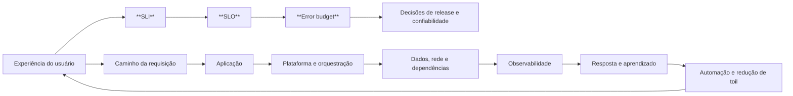

# Capítulo 01 - Introdução à SRE e ao ambiente de produção

Esta página consolida a introdução conceitual de **Site Reliability Engineering (SRE)** com a visão do ambiente onde essa disciplina atua: sistemas de produção compostos por aplicações, infraestrutura, rede, armazenamento, automação, telemetria, pessoas, processos e dependências externas.

## Objetivos de aprendizagem

- Entender **SRE** como uma disciplina de engenharia aplicada à operação de serviços.
- Relacionar **confiabilidade** com decisões explícitas de produto, engenharia e operação.
- Reconhecer que um serviço em produção depende de um **ecossistema técnico e organizacional**, não apenas do código da aplicação.
- Distinguir **SLI**, **SLO**, **SLA**, **error budget**, **toil**, **observabilidade**, **automação** e **prontidão para produção**.
- Aplicar esses conceitos em uma primeira análise de um serviço real.

## Síntese

SRE nasceu no Google como uma resposta ao limite do modelo clássico que separa desenvolvimento e operações. A definição curta continua útil: **SRE é a aplicação de engenharia de software ao trabalho historicamente tratado como operações**. Isso significa escrever software, automatizar rotinas, reduzir intervenção manual, medir comportamento real do serviço e usar evidências para decidir quando acelerar mudanças ou priorizar estabilidade.

Confiabilidade não vive em uma aplicação isolada. Um serviço real passa por **balanceadores**, **redes**, **clusters**, **orquestradores**, **bancos de dados**, **filas**, **caches**, **sistemas de configuração**, **mecanismos de deploy**, **telemetria**, **plantão** e **processos de incidente**. O ambiente de produção do Google usa ferramentas específicas, como Borg, Colossus, Bigtable e Spanner, mas a lição transportável é mais ampla: para operar bem, a equipe precisa entender o caminho completo da requisição e os modos de falha das dependências.

Em uma frase: **SRE transforma confiabilidade em engenharia mensurável dentro de um ecossistema de produção real.**

## Por que isso importa

Em produção, falhas raramente respeitam fronteiras de time ou de componente. Um erro percebido pelo usuário pode nascer em uma mudança de configuração, saturação de CPU, exaustão de conexões, lentidão de banco, fila acumulada, perda de zona, certificado expirado, regressão de deploy, dependência externa instável ou alarme mal desenhado.

Por isso, a introdução à SRE deve unir duas ideias:

- **Confiabilidade é uma propriedade do sistema inteiro**, incluindo software, infraestrutura, dados, rede, operação e decisões de negócio.
- **Operar em escala exige engenharia**, porque trabalho manual, reação improvisada e conhecimento tribal não crescem com o serviço.

Essa visão também evita uma leitura estreita do material do Google. O Google fornece uma base forte, mas práticas atuais de AWS, Azure, Google Cloud, DORA, OpenTelemetry e engenharia de resiliência reforçam o mesmo ponto: serviços confiáveis combinam **metas claras**, **arquitetura resiliente**, **automação**, **telemetria útil**, **recuperação testada** e **aprendizado operacional**.

## Conceitos essenciais

### **SRE**

**SRE** é uma disciplina que trata operação como problema de engenharia. Em vez de aumentar indefinidamente o número de pessoas para lidar com alertas, deploys, reparos e tickets, a equipe busca mudar o sistema: automatiza tarefas repetitivas, melhora design, reduz ambiguidade operacional e constrói mecanismos de recuperação.

Na prática, SRE não substitui desenvolvimento, operações, segurança ou produto. Ela força uma conversa objetiva entre essas áreas: **qual confiabilidade é necessária, como será medida, quanto risco é aceitável e o que faremos quando o serviço sair do comportamento esperado**.

### **Confiabilidade**

**Confiabilidade** é a capacidade de um serviço cumprir sua função corretamente e de forma consistente quando necessário. Em produção, isso inclui disponibilidade, latência, durabilidade de dados, corretude, capacidade, degradação controlada e recuperação.

Buscar 100% de disponibilidade costuma ser economicamente errado e tecnicamente enganoso. O objetivo é definir um nível adequado ao usuário e ao negócio, medir esse nível e tomar decisões coerentes com ele.

### **SLI, SLO e SLA**

**SLI** é o indicador que mede uma característica observável do serviço, como taxa de sucesso, latência de uma rota crítica, frescor de dados ou durabilidade de escrita.

**SLO** é a meta definida para esse indicador, por exemplo, "99,9% das requisições de checkout devem concluir com sucesso em uma janela de 30 dias".

**SLA** é um compromisso formal, geralmente externo, que pode envolver consequências contratuais ou financeiras. Nem todo SLO precisa virar SLA, e um SLA não substitui a disciplina interna de medir o que o usuário percebe.

### **Error budget**

**Error budget** é o orçamento de risco derivado do SLO. Se o SLO permite 0,1% de falhas em uma janela, esse 0,1% é o espaço que a equipe pode gastar com incidentes, degradações e mudanças arriscadas.

O valor do conceito está na decisão. Quando há orçamento, a equipe pode aceitar mais mudança. Quando o orçamento acaba ou queima rápido demais, confiabilidade deixa de ser uma preferência subjetiva e vira prioridade operacional clara.

### **Toil**

**Toil** é trabalho manual, repetitivo, reativo, sem valor durável e que cresce junto com o serviço. Exemplos comuns: reiniciar processos manualmente, executar rotinas de deploy frágeis, responder sempre ao mesmo alerta, liberar capacidade caso a caso ou fazer correções operacionais sem remover a causa.

Nem todo trabalho operacional é ruim. O problema aparece quando a operação consome o tempo que deveria ser usado para engenharia. A disciplina de SRE exige medir e limitar toil para que a equipe consiga melhorar o sistema.

### **Ambiente de produção**

**Ambiente de produção** é o conjunto de componentes que permite entregar valor ao usuário real. Ele inclui aplicação, runtime, infraestrutura, orquestração, armazenamento, rede, identidade, configuração, pipelines, observabilidade, backups, runbooks, plantão, processos de incidente e fornecedores externos.

O capítulo 02 do livro descreve o ambiente do Google com detalhes próprios da empresa. A leitura útil para outras organizações é abstrair o padrão: uma requisição cruza várias camadas, e cada camada tem seus próprios limites, garantias e modos de falha.

### **Orquestração e plataforma**

**Orquestração** coordena onde e como workloads executam. No Google, o exemplo histórico é Borg; em ambientes atuais, a discussão costuma envolver Kubernetes, plataformas internas, serviços gerenciados, filas, jobs, service meshes ou sistemas de deploy.

O ponto de confiabilidade não é a ferramenta em si. O ponto é garantir que workloads tenham isolamento adequado, limites de recurso, distribuição entre domínios de falha, rollouts controlados, rollback possível e comportamento previsível quando máquinas, zonas ou dependências falham.

### **Dependências críticas**

**Dependências críticas** são componentes cuja falha afeta diretamente a experiência do usuário ou a recuperação do serviço. Elas podem ser internas, como banco de dados, cache, fila, DNS, identidade e configuração; ou externas, como provedores de pagamento, APIs de parceiros, CDN e serviços cloud.

Uma dependência crítica precisa de dono, contrato de comportamento, telemetria, limites, timeouts, política de retry, estratégia de degradação e plano de contingência. Sem isso, a equipe descobre a arquitetura real apenas durante incidentes.

### **Observabilidade e monitoração**

**Monitoração** detecta condições conhecidas e aciona resposta. **Observabilidade** aumenta a capacidade de investigar estados internos do sistema a partir de sinais externos. Em ambientes modernos, esses sinais normalmente incluem **métricas**, **logs** e **traces**, com contexto suficiente para correlacionar eventos.

O princípio de SRE continua direto: alertas devem representar sintomas relevantes para usuários e exigir ação humana imediata. Coletar tudo sem critério gera custo, ruído e fadiga de alerta.

### **Automação**

**Automação** reduz variação humana e torna ações operacionais repetíveis. Boa automação é idempotente, observável, testável e segura para interromper ou repetir.

Automatizar sem entender a rotina pode apenas acelerar um processo ruim. A automação mais valiosa remove a causa do toil, codifica estado desejado, valida pré-condições, registra o que fez e permite recuperação quando algo não sai como esperado.

### **Prontidão para produção**

**Prontidão para produção** é a avaliação de que um serviço consegue operar com risco conhecido antes de receber tráfego crítico. Isso envolve SLOs, capacidade, dependências, deploy, rollback, segurança operacional, observabilidade, resposta a incidentes, backup, restauração, documentação e clareza de ownership.

No vocabulário de SRE, práticas como **Production Readiness Review (PRR)** ajudam a transformar experiência operacional em uma revisão estruturada. A revisão não deve ser burocracia: ela deve revelar lacunas que realmente aumentam risco em produção.

### **Resiliência**

**Resiliência** é a capacidade de antecipar, resistir, recuperar e adaptar-se a condições adversas. Em SRE, isso aparece em práticas como redundância, isolamento, degradação graciosa, testes de recuperação, controle de carga, limites, timeouts, backoff, restauração validada e aprendizado pós-incidente.

Confiabilidade olha para o serviço cumprindo sua função; resiliência olha também para como ele se comporta quando o mundo deixa de ser ideal.

## Aplicação prática

Escolha um serviço real e execute uma análise inicial em cinco passos:

1. Desenhe o **caminho de uma requisição crítica**, do usuário até as dependências de dados e volta.
2. Liste **dependências críticas** e marque quais são internas, externas, síncronas, assíncronas, stateful ou stateless.
3. Defina um **SLI inicial** para a experiência do usuário, como sucesso, latência, frescor ou durabilidade.
4. Proponha um **SLO inicial** com janela de medição e uma consequência prática quando o orçamento de erro for consumido.
5. Liste três fontes de **toil** e escolha uma para remover por automação, simplificação ou mudança de design.

Depois da análise, procure uma evidência simples de melhoria: alerta mais acionável, rollback mais claro, menos intervenção manual, dependência documentada, capacidade melhor estimada, redução de latência, teste de recuperação executado ou decisão de release mais fácil de defender.

## Aprofundamento prático

Um bom primeiro exercício de **SRE** é escolher um serviço conhecido e produzir um mapa operacional de uma página. Esse mapa deve mostrar usuário, ponto de entrada, autenticação, aplicação, banco de dados, filas, caches, dependências externas, mecanismo de deploy, telemetria e plantão. O livro usa a infraestrutura do Google para mostrar que produção é um ecossistema; em uma empresa menor, o mesmo raciocínio vale para uma API atrás de um load balancer, executando em Kubernetes, usando banco gerenciado e fila de mensagens.

Procedimento recomendado:

1. Desenhe o caminho de uma requisição crítica do usuário até a resposta.
2. Marque onde a requisição pode falhar, ficar lenta ou retornar dado incorreto.
3. Para cada ponto, registre o sinal disponível: métrica, log, trace, evento de deploy ou alarme.
4. Escolha um **SLI** inicial ligado à experiência do usuário, não ao estado interno da máquina.
5. Liste três tarefas manuais recorrentes e classifique se são **toil**.

Artefato mínimo:

| Campo | Exemplo |
| --- | --- |
| Jornada crítica | Autorizar pagamento |
| SLI inicial | Porcentagem de autorizações bem-sucedidas |
| Dependência crítica | Gateway externo de pagamento |
| Modo de falha | Timeout, erro 5xx, resposta lenta |
| Ação operacional | Rollback, degradação, troca de rota ou abertura de incidente |

A evidência de aprendizado é simples: uma pessoa nova deve conseguir explicar como o serviço atende o usuário, onde ele falha e qual sinal justificaria acordar o plantão.

## Diagrama de apoio

## Erros comuns

- Tratar **SRE** como um time que apenas recebe alertas ou executa tarefas de operação.
- Copiar práticas do Google, AWS ou Azure sem adaptar ao risco, escala, maturidade e contexto do serviço.
- Definir **SLOs** com métricas internas que não representam a experiência do usuário.
- Confundir **SLA** contratual com engenharia diária de confiabilidade.
- Automatizar rotinas frágeis sem entender causa, impacto e pré-condições.
- Alertar sobre causas técnicas de baixo impacto e ignorar sintomas reais para usuários.
- Mapear arquitetura apenas em diagramas estáticos, sem incluir dependências, limites, filas, timeouts e modos de falha.
- Fazer postmortems que culpam pessoas em vez de melhorar sistema, processo e decisões.
- Considerar produção pronta sem testar recuperação, rollback, backup, restauração e comunicação de incidente.

## Perguntas para revisão

1. O que muda quando tratamos operação como problema de engenharia?
2. Qual diferença prática entre **SLI**, **SLO** e **SLA**?
3. Como um **error budget** ajuda a negociar velocidade de mudança e estabilidade?
4. Quais camadas aparecem no caminho de uma requisição crítica do seu serviço?
5. Que dependência crítica hoje falharia de modo pouco visível para a equipe?
6. Qual alerta atual poderia ser removido, reescrito ou transformado em automação?

## Exercícios

### Compreensão

Explique em até cinco linhas por que **SRE** não é apenas "operação com outro nome".

### Aplicação

Escolha uma API, aplicação web, pipeline ou serviço interno. Desenhe o caminho de uma requisição ou execução crítica e identifique pelo menos cinco dependências.

### Análise

Defina um **SLI** e um **SLO** para esse serviço. Depois, descreva o que a equipe deveria fazer se o **error budget** fosse consumido antes do fim da janela.

### Revisão operacional

Liste três tarefas que parecem **toil**. Para cada uma, indique se a melhor ação inicial é automatizar, remover, simplificar, documentar ou mudar o design.

## Relação com práticas atuais

Em ambientes atuais, os conceitos desta introdução aparecem em revisões de arquitetura, plataformas Kubernetes, serviços gerenciados de cloud, pipelines de CI/CD, catálogos de serviço, gestão de incidentes, observabilidade, engenharia de plataforma, chaos engineering, FinOps e governança de risco.

A ampliação além do Google confirma a mesma direção:

- O **AWS Well-Architected Reliability Pillar** enfatiza recuperação automática, teste de recuperação, escala horizontal, capacidade baseada em dados e mudança gerenciada por automação.
- O **Azure Well-Architected Framework** organiza confiabilidade como decisões ao longo do ciclo de vida, conectando requisitos, desenho de solução, dependências e revisão contínua.
- O **Google Cloud Well-Architected Framework** trata confiabilidade como um pilar arquitetural junto com operações, segurança, desempenho, custo e sustentabilidade.
- O programa **DORA** reforça que desempenho de entrega e desempenho operacional dependem de capacidades sociotécnicas, não apenas de ferramentas.
- O **OpenTelemetry** consolidou uma linguagem prática para instrumentação baseada em métricas, logs e traces em software cloud native.
- A engenharia de **resiliência** documentada pelo NIST reforça a necessidade de antecipar, resistir, recuperar e adaptar sistemas sob condições adversas.

Essas referências não substituem o livro-base; elas ajudam a conectar a introdução de SRE com a operação moderna de produção.

## Recursos complementares

- **Livro oficial online do Google SRE:** <https://sre.google/sre-book/>
- **Capítulo 01 do Google SRE Book - Introduction:** <https://sre.google/sre-book/introduction/>
- **Capítulo 02 do Google SRE Book - The Production Environment at Google:** <https://sre.google/sre-book/production-environment/>
- **The Site Reliability Workbook:** <https://sre.google/workbook/>
- **Implementing SLOs:** <https://sre.google/workbook/implementing-slos/>
- **Alerting on SLOs:** <https://sre.google/workbook/alerting-on-slos/>
- **Non-Abstract Large System Design:** <https://sre.google/workbook/non-abstract-design/>
- **AWS Well-Architected Reliability Pillar:** <https://docs.aws.amazon.com/wellarchitected/latest/reliability-pillar/welcome.html>
- **Azure Well-Architected Reliability:** <https://learn.microsoft.com/en-us/azure/well-architected/reliability/>
- **Google Cloud Well-Architected Framework:** <https://docs.cloud.google.com/architecture/framework>
- **DORA Research Program:** <https://dora.dev/research/>
- **OpenTelemetry Signals:** <https://opentelemetry.io/docs/concepts/signals/>
- **NIST SP 800-160 Vol. 2 Rev. 1:** <https://csrc.nist.gov/pubs/sp/800/160/v2/r1/final>

## Fechamento

Guarde a ideia principal: **SRE transforma operação em engenharia mensurável, e confiabilidade só pode ser entendida olhando o sistema de produção inteiro**.

Próximo: [Capítulo 02 - Risco, objetivos de serviço e error budget](capitulo-02.md).

## Referências

- Beyer, B.; Jones, C.; Petoff, J.; Murphy, N. R. (eds.). **Site Reliability Engineering: How Google Runs Production Systems**. O'Reilly Media / Google, 2016. <https://sre.google/sre-book/>
- Beyer, B.; Murphy, N. R.; Rensin, D.; Kawahara, K.; Thorne, S. (eds.). **The Site Reliability Workbook**. O'Reilly Media / Google, 2018. <https://sre.google/workbook/>
- Google SRE. **Introduction**. <https://sre.google/sre-book/introduction/>
- Google SRE. **The Production Environment at Google, from the Viewpoint of an SRE**. <https://sre.google/sre-book/production-environment/>
- Google SRE. **Implementing SLOs**. <https://sre.google/workbook/implementing-slos/>
- Google SRE. **Alerting on SLOs**. <https://sre.google/workbook/alerting-on-slos/>
- Google SRE. **Introducing Non-Abstract Large System Design**. <https://sre.google/workbook/non-abstract-design/>
- Amazon Web Services. **Reliability Pillar - AWS Well-Architected Framework**. <https://docs.aws.amazon.com/wellarchitected/latest/reliability-pillar/welcome.html>
- Microsoft. **Azure Well-Architected Framework - Reliability**. <https://learn.microsoft.com/en-us/azure/well-architected/reliability/>
- Google Cloud. **Well-Architected Framework**. <https://docs.cloud.google.com/architecture/framework>
- DORA. **DORA Research Program**. <https://dora.dev/research/>
- OpenTelemetry. **Signals**. <https://opentelemetry.io/docs/concepts/signals/>
- National Institute of Standards and Technology. **SP 800-160 Vol. 2 Rev. 1: Developing Cyber-Resilient Systems**. <https://csrc.nist.gov/pubs/sp/800/160/v2/r1/final>
- PDF local usado como fonte primária em português: `../Engenharia de Confiabilidade do Google ( etc.).pdf`.
