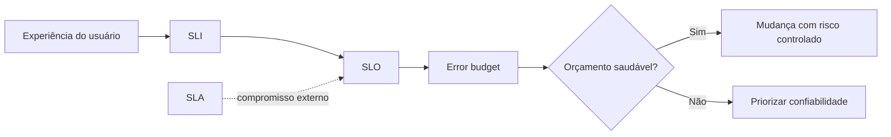

# Capítulo 02 - Risco, objetivos de serviço e error budget

## Objetivos de aprendizagem

- Explicar por que confiabilidade absoluta raramente é a meta correta.
- Transformar risco aceito em **SLIs**, **SLOs**, **SLAs** e **error budgets**.
- Usar objetivos de serviço para orientar releases, incidentes e priorização.

## Síntese

**Confiabilidade** é uma decisão econômica, técnica e de produto. Um serviço não precisa ser perfeito; ele precisa ser confiável o suficiente para a expectativa do usuário e para o risco aceito pelo negócio. A disciplina de SRE torna essa conversa objetiva ao medir a experiência real com **SLIs**, definir metas com **SLOs**, separar compromissos externos com **SLAs** e administrar a margem de falha com **error budgets**.

Em uma frase: **risco só vira engenharia quando é medido, aceito explicitamente e conectado a decisões de operação e produto**.

## Por que isso importa

Sem um objetivo mensurável, confiabilidade vira disputa de opinião. Produto pode querer lançar mais rápido, engenharia pode querer estabilizar, suporte pode sentir a dor do usuário e liderança pode cobrar disponibilidade sem dizer quanto risco aceita pagar. **SLOs** resolvem parte dessa tensão porque criam uma linguagem comum: qual experiência importa, qual nível é bom o suficiente e o que acontece quando a margem de erro está acabando.

## Conceitos essenciais

### **Risco administrado**

**Risco administrado** é a decisão explícita de aceitar alguma chance de falha porque eliminar todo risco seria caro, lento ou desnecessário para o usuário. O ponto não é tratar falhas como normais demais; é reconhecer que todo serviço opera dentro de limites econômicos, técnicos e humanos.

Um serviço de busca, uma API de pagamento e um sistema interno de relatórios não precisam do mesmo nível de confiabilidade. A pergunta correta é: qual falha o usuário percebe, qual impacto ela causa e quanto investimento faz sentido para reduzi-la?

### **SLI**

**SLI** é o indicador que mede uma experiência relevante do serviço. Bons SLIs medem comportamento percebido pelo usuário: sucesso de requisição, latência, disponibilidade, durabilidade, frescor de dados ou completude de processamento.

Métricas internas continuam úteis para diagnóstico, mas não substituem o SLI. CPU alta pode explicar um problema; taxa de checkout bem-sucedido mostra se o usuário foi atendido.

### **SLO**

**SLO** é a meta para um SLI em uma janela de tempo. Ele define o que é bom o suficiente. Um SLO de 99,9% em 30 dias é uma decisão diferente de 99,99% em 7 dias, porque muda a margem de erro, a velocidade de reação e o custo de cumprir a promessa.

Um SLO bom precisa ter fonte de dados, janela, método de cálculo, dono e consequência operacional. Sem consequência, o SLO vira decoração de dashboard.

### **SLA**

**SLA** é o compromisso externo, normalmente contratual, com consequências quando a promessa não é cumprida. Ele deve ser tratado com mais cautela que o SLO interno, porque envolve expectativa formal de clientes, suporte, jurídico e negócio.

O erro comum é começar pelo SLA. A equipe deve primeiro entender o comportamento real do serviço, definir SLOs internos saudáveis e só então decidir que promessa externa faz sentido.

### **Error budget**

**Error budget** é a margem de falha permitida pelo SLO. Se a meta é 99,9%, a diferença até 100% é o orçamento que pode ser consumido por incidentes, degradações e mudanças arriscadas dentro da janela.

O valor do error budget está na decisão. Com orçamento saudável, a equipe pode continuar mudando com risco controlado. Com orçamento queimando rápido, releases arriscados devem desacelerar e trabalho de confiabilidade ganha prioridade.

### **Janelas de medição e queima de orçamento**

Janelas curtas mostram incidentes rápidos; janelas longas mostram tendência. Alertar por **burn rate**, ou taxa de queima do orçamento, evita esperar o mês acabar para descobrir que o SLO já ficou irrecuperável.

Na prática, a equipe precisa combinar sinais rápidos para resposta e sinais longos para governança. Um alerta deve acordar alguém quando a queima do orçamento indica impacto real ou risco iminente.

Um alerta multi-janela combina duas perguntas: "o serviço está queimando o
orçamento rápido demais agora?" e "o serviço está mantendo uma tendência ruim?".
Por exemplo, para um SLO mensal de 99,9%, uma queima muito alta por poucos
minutos indica incidente agudo; uma queima moderada por várias horas indica
degradação persistente. A regra exata depende do SLO, mas a decisão é sempre a
mesma: alertar cedo o suficiente para proteger o orçamento sem acordar pessoas
por ruído.

## Aplicação prática

Escolha um serviço e execute uma análise enxuta:

- Defina uma jornada crítica do usuário.
- Escolha 1 ou 2 **SLIs** diretamente ligados a essa jornada.
- Proponha um **SLO** com janela e fonte de dados.
- Calcule o **error budget** aproximado.
- Escreva uma regra simples para quando releases devem desacelerar.

## Aprofundamento prático

**SLO** só muda comportamento quando vira regra de decisão. Um exemplo concreto: uma API de checkout mede requisições elegíveis, considera sucesso qualquer resposta 2xx antes de 800 ms e avalia o resultado em janela móvel de 30 dias. Com SLO de 99,9%, a equipe aceita até 0,1% de falhas elegíveis na janela. Se metade desse orçamento for consumida nos primeiros dias, releases de maior risco devem desacelerar e correções de confiabilidade ganham prioridade.

Procedimento recomendado:

1. Defina a jornada de usuário, como login, busca, pagamento ou geração de relatório.
2. Escreva quais eventos entram e quais ficam fora do cálculo.
3. Escolha janela, fonte de dados e forma de agregação.
4. Combine uma política de ação para orçamento saudável, em alerta e esgotado.
5. Revise o SLO depois de observar dados reais por algumas semanas.

Exemplo de especificação:

```yaml
service: checkout-api
sli: http_success_rate
eligible_events: "POST /checkout com cliente autenticado"
good_events: "status < 500 e latency_ms <= 800"
window: 30d
slo: 99.9
policy:
  healthy_budget: "rollouts normais com canário"
  high_burn: "pausar mudanças arriscadas e abrir revisão"
  exhausted: "priorizar correções de confiabilidade"
alerts:
  fast_burn: "erro acima do aceitável em janela curta e longa"
  slow_burn: "tendência de consumo excessivo por várias horas"
```

O erro mais comum é publicar o SLO no dashboard e não mudar nenhuma decisão. A prática só está viva quando release, capacidade, incidentes e roadmap usam o orçamento de erro como entrada.

Ferramentas como OpenSLO, Sloth e Pyrra ajudam a padronizar essa especificação,
mas não escolhem a jornada certa. A decisão mais importante continua sendo
definir quais eventos representam sucesso real para o usuário.

## Tradução para ferramentas modernas

**Ferramentas típicas:** Grafana SLO, Sloth, Pyrra, Nobl9, Prometheus burn-rate alerts, Datadog SLOs, Google Cloud Monitoring SLOs e OpenSLO.

**Exemplo avançado:** crie um SLO de checkout com eventos elegíveis, eventos bons, janela de 30 dias, alertas de burn rate rápido/lento e política de release quando o orçamento for consumido.

**Cuidado de projeto:** evite SLOs baseados em métricas fáceis, como CPU. O SLO deve representar experiência ou resultado do usuário.

## Exemplos e ferramentas do livro

O livro usa exemplos como **Bigtable**, **Chubby**, serviços de busca e o
serviço didático **Shakespeare** para mostrar que SLO não é uma meta abstrata.
Um mesmo backend pode ter expectativas diferentes dependendo do consumidor:
uma jornada online sensível à latência não aceita o mesmo risco de um job
batch que pode atrasar e reprocessar.

Use esses exemplos para praticar uma decisão: escolha uma jornada crítica,
defina o que conta como evento bom e calcule qual falha é aceitável antes de
prometer disponibilidade. O foco não é a ferramenta usada pelo Google, mas a
forma de transformar expectativa de usuário em **SLI**, **SLO** e **error budget**.

## Diagrama de apoio



## Erros comuns

- Tratar 100% de disponibilidade como meta padrão.
- Definir **SLIs** a partir do que é fácil medir, não do que o usuário percebe.
- Criar **SLOs** sem consequência prática.
- Confundir **SLA** com objetivo interno de engenharia.
- Usar **error budget** como desculpa para descuido, e não como limite de risco.

## Perguntas para revisão

1. Qual experiência do usuário mais precisa de um SLI no seu serviço?
2. O SLO atual, se existir, muda alguma decisão de release ou priorização?
3. O que a equipe faria se metade do error budget fosse consumida nos primeiros dias da janela?

## Exercícios

### Compreensão

Explique a diferença entre **SLI**, **SLO**, **SLA** e **error budget** usando uma API real ou imaginária.

### Aplicação

Crie um SLO inicial para uma jornada crítica e descreva a fonte de dados usada para medi-lo.

### Análise

Liste duas situações em que aumentar a confiabilidade pode não ser o melhor investimento naquele momento.

## Relação com práticas atuais

Hoje, SLOs aparecem em plataformas internas, revisões de arquitetura, alertas por burn rate, políticas de rollout e relatórios de confiabilidade. A prática moderna é começar pequeno: poucos SLIs bons, SLOs ligados à jornada do usuário e decisões claras quando o orçamento de erro está em risco.

## Recursos complementares

- **Google SRE Book - Embracing Risk:** <https://sre.google/sre-book/embracing-risk/>
- **Google SRE Book - Service Level Objectives:** <https://sre.google/sre-book/service-level-objectives/>
- **Site Reliability Workbook - Implementing SLOs:** <https://sre.google/workbook/implementing-slos/>
- **Site Reliability Workbook - Alerting on SLOs:** <https://sre.google/workbook/alerting-on-slos/>
- **OpenSLO:** <https://openslo.com/>
- **Sloth:** <https://sloth.dev/>

## Fechamento

Guarde a ideia principal: **SLOs transformam risco aceito em uma regra operacional para equilibrar velocidade e estabilidade**.

Próximo: [Capítulo 03 - Eliminando tarefas penosas](capitulo-03.md).

## Referências

- Beyer, B.; Jones, C.; Petoff, J.; Murphy, N. R. (eds.). **Site Reliability Engineering: How Google Runs Production Systems**. O'Reilly Media / Google, 2016. <https://sre.google/sre-book/>
- Beyer, B.; Murphy, N. R.; Rensin, D.; Kawahara, K.; Thorne, S. (eds.). **The Site Reliability Workbook**. O'Reilly Media / Google, 2018. <https://sre.google/workbook/>
- Google SRE. **Embracing Risk**. <https://sre.google/sre-book/embracing-risk/>
- Google SRE. **Service Level Objectives**. <https://sre.google/sre-book/service-level-objectives/>
- Google SRE. **Implementing SLOs**. <https://sre.google/workbook/implementing-slos/>
- Google SRE. **Alerting on SLOs**. <https://sre.google/workbook/alerting-on-slos/>
- OpenSLO. **OpenSLO Specification**. <https://openslo.com/>
- Sloth. **Sloth SLO Generator**. <https://sloth.dev/>
- PDF local usado como fonte primária em português: `../Engenharia de Confiabilidade do Google ( etc.).pdf`.
