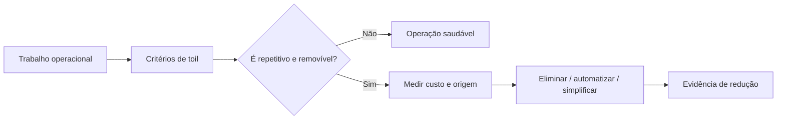

# Capítulo 03 - Eliminando tarefas penosas

## Objetivos de aprendizagem

- Definir **toil** com critérios operacionais claros.
- Separar trabalho operacional saudável de carga repetitiva que deve ser removida por engenharia.
- Medir, priorizar e reduzir toil sem apenas transferir trabalho para outra equipe.

## Síntese

**Toil** é trabalho manual, repetitivo, reativo, sem valor durável e que cresce junto com o serviço. O problema não é toda atividade operacional; investigar um incidente, participar de um lançamento crítico ou executar uma migração rara pode gerar aprendizado e melhorar o sistema. O problema aparece quando a equipe gasta energia recorrente em ações que deveriam ser eliminadas por automação, mudança de design, melhor ownership ou simplificação.

Em uma frase: **toil consome capacidade de engenharia hoje e aumenta o custo de operar amanhã**.

## Por que isso importa

SRE só funciona se a equipe mantém tempo real para engenharia. Quando alertas repetitivos, tickets manuais, aprovações operacionais, deploys frágeis e correções temporárias ocupam a agenda, a equipe deixa de melhorar o serviço e passa a apenas mantê-lo respirando. Isso cria um ciclo ruim: pouco tempo para engenharia gera mais toil, e mais toil reduz ainda mais o tempo para engenharia.

O livro de SRE do Google trata toil como algo que precisa ser **identificado, medido e limitado**. O Workbook reforça a mesma disciplina ao conectar redução de toil com automação, ownership e melhoria contínua.

## Conceitos essenciais

### **Critérios de toil**

Um trabalho tende a ser **toil** quando combina várias destas características:

- é manual;
- é repetitivo;
- é reativo;
- não produz valor durável;
- cresce linearmente com uso, tráfego ou quantidade de serviços;
- poderia ser automatizado ou eliminado por mudança de design.

Um ticket chato não é automaticamente toil. Um procedimento raro, de alto risco e cheio de aprendizado pode ser operação legítima. A classificação deve observar o padrão ao longo do tempo.

### **Trabalho operacional saudável**

**Trabalho operacional saudável** mantém contato da equipe com a realidade de produção. Plantão bem calibrado, revisão de incidentes, suporte a lançamentos importantes e análise de comportamento real do serviço ajudam SREs a construir sistemas melhores.

O limite é a repetição sem aprendizado. Se a equipe executa a mesma intervenção toda semana, o sistema está pedindo engenharia.

### **Limite de carga operacional**

Um **limite de carga operacional** protege a capacidade de engenharia. A regra prática popularizada em SRE é reservar parte significativa do tempo para trabalho de engenharia, evitando que a equipe vire apenas uma fila de suporte.

Esse limite precisa ter consequência. Quando a carga reativa ultrapassa o combinado, a equipe deve renegociar prioridade, devolver responsabilidade, automatizar, remover escopo ou atacar causa raiz.

### **Medição de toil**

Toil invisível não entra em prioridade. A equipe precisa medir volume, tempo gasto, frequência, origem, serviço afetado e possibilidade de remoção. Tickets, alertas, tarefas manuais, solicitações recorrentes e operações de release devem ser classificados com critérios consistentes.

Uma métrica útil não é apenas "horas de toil". Também importa saber quais fontes geram mais repetição e qual redução teria maior retorno.

Uma auditoria prática deve registrar também **dono atual**, **dono correto**,
risco de erro humano, dependência de pessoa específica e evidência esperada de
redução. Sem ownership, a equipe pode apenas mover toil de SRE para
desenvolvimento, suporte ou plataforma.

### **Automação versus eliminação**

Nem todo toil deve ser automatizado. Às vezes a resposta correta é remover uma feature, simplificar um fluxo, mudar ownership, corrigir um bug, alterar arquitetura ou deixar de oferecer uma operação manual.

Automatizar uma rotina ruim pode cristalizar um processo errado. A primeira pergunta deve ser: "esse trabalho ainda precisa existir?".

### **Plataforma interna e self-service**

Plataformas internas podem reduzir toil quando oferecem caminhos seguros de self-service: criação de ambiente, deploy, rollback, dashboards, segredos, configuração, escalabilidade e diagnóstico. O ganho aparece quando equipes conseguem resolver tarefas comuns sem abrir tickets para SRE.

Self-service sem guardrails pode apenas distribuir risco. Um bom caminho automatizado precisa de validação, limites, auditoria e documentação.

O portal interno também precisa de suporte e métricas. Se ninguém consegue usar
o fluxo sem ajuda informal, a plataforma virou uma interface nova para o mesmo
trabalho manual.

## Aplicação prática

Faça uma auditoria de toil em uma equipe ou serviço:

- Colete tickets, páginas de plantão, solicitações manuais e tarefas recorrentes dos últimos 30 dias.
- Classifique cada item como operação saudável, toil, incidente, melhoria ou suporte pontual.
- Estime tempo gasto, frequência e equipe solicitante.
- Identifique dono atual, dono correto e risco de transferir toil sem removê-lo.
- Escolha as três maiores fontes por custo mensal.
- Para cada fonte, decida entre eliminar, automatizar, transferir ownership, simplificar ou aceitar conscientemente.
- Defina uma métrica de acompanhamento para provar redução.

## Aprofundamento prático

Para reduzir **toil**, trabalhe com amostras reais. Pegue 30 dias de tickets, páginas de plantão e solicitações manuais. Não classifique pela irritação que a tarefa causa; classifique pelos critérios do livro: manual, repetitiva, reativa, sem valor durável e com tendência de crescer junto com o serviço.

Exemplo: uma equipe recebe dez pedidos por semana para criar tópicos de mensageria. Se cada pedido exige abrir ticket, esperar aprovação, executar comando manual e colar o resultado, há toil. A solução madura pode ser um fluxo self-service com validação de nomes, limites de quota, aprovação automática para casos seguros, trilha de auditoria e rollback.

Procedimento recomendado:

1. Agrupe tarefas por origem: alerta, ticket, release, acesso, configuração, dados ou suporte.
2. Estime custo mensal em horas e risco operacional.
3. Pergunte se a tarefa deve existir. Eliminar vem antes de automatizar.
4. Para o que sobrar, defina automação idempotente e observável.
5. Meça redução de volume depois da mudança.

Matriz útil:

| Tarefa | Frequência | Causa provável | Melhor resposta |
| --- | --- | --- | --- |
| Reiniciar worker travado | Semanal | Bug ou timeout ruim | Corrigir causa e adicionar recuperação segura |
| Criar recurso padrão | Diária | Falta de self-service | Plataforma interna com guardrails |
| Aprovar deploy trivial | Diária | Processo excessivo | Política automática baseada em risco |

Campos adicionais para a planilha:

| Campo | Pergunta |
| --- | --- |
| Dono atual | Quem recebe a interrupção hoje? |
| Dono correto | Quem tem contexto e autonomia para resolver a causa? |
| Risco | O que pode dar errado quando a tarefa é feita manualmente? |
| Evidência | Qual número deve cair depois da melhoria? |

Uma redução real aparece como menos interrupções, menos tickets repetidos e mais tempo reservado para engenharia.

## Tradução para ferramentas modernas

**Ferramentas típicas:** Backstage templates, Terraform, Crossplane, Pulumi, GitOps, policy-as-code, automações de IAM e portais internos de self-service.

**Exemplo avançado:** transforme pedidos repetitivos de criação de recursos em um fluxo self-service com validação, quotas, aprovação automática para casos seguros, trilha de auditoria e rollback.

**Cuidado de projeto:** automatizar toil sem remover causa raiz pode apenas acelerar um processo ruim.

## Exemplos e ferramentas do livro

**Toil** cresce quando trabalho operacional repetitivo acompanha o tamanho do
serviço. Ferramentas como **Prodtest** aparecem como exemplo de detecção
automática de inconsistências. A conexão é direta: uma ferramenta desse tipo
reduz toil quando troca inspeção manual por validação contínua de estado.

Em um ambiente atual, o equivalente pode ser uma suíte de health checks,
testes de prontidão, políticas de plataforma, validações GitOps ou automações
que verificam drift entre estado desejado e estado real.

## Diagrama de apoio

## Erros comuns

- Chamar todo trabalho desagradável de toil.
- Medir toil apenas por sensação, sem dados de tickets, alertas e tempo gasto.
- Automatizar uma rotina ruim sem questionar se ela deveria existir.
- Transferir toil para outra equipe e chamar isso de melhoria.
- Criar self-service sem limites, auditoria ou documentação.
- Aceitar que plantão e tickets consumam todo o tempo de engenharia.

## Perguntas para revisão

1. Quais tarefas crescem linearmente com usuários, tráfego ou número de serviços?
2. Qual fonte de toil consome mais horas por mês?
3. O trabalho deve ser eliminado, automatizado, simplificado ou assumido por outra equipe?
4. Que métrica mostrará que a redução de toil realmente aconteceu?

## Exercícios

### Compreensão

Explique por que toil não é sinônimo de "trabalho chato".

### Aplicação

Crie uma tabela com cinco tarefas operacionais recorrentes, classificando frequência, tempo gasto, dono atual, causa raiz e ação proposta.

### Análise

Escolha uma automação existente e avalie se ela removeu toil ou apenas acelerou um processo que deveria ser redesenhado.

## Relação com práticas atuais

Em ambientes cloud native, toil aparece em aprovações manuais, ajustes repetitivos de infraestrutura, solicitações de acesso, deploys assistidos, runbooks executados à mão, alertas ruidosos e tarefas de suporte que poderiam ser self-service. **Platform engineering**, GitOps, infraestrutura como código e catálogos internos ajudam quando reduzem dependência humana e preservam guardrails. DORA também reforça que capacidades técnicas e organizacionais só melhoram desempenho quando reduzem atrito real no fluxo de entrega.

## Recursos complementares

- **Google SRE Book - Eliminating Toil:** <https://sre.google/sre-book/eliminating-toil/>
- **Site Reliability Workbook - Eliminating Toil:** <https://sre.google/workbook/eliminating-toil/>
- **Google Cloud Architecture Framework - Operational excellence:** <https://docs.cloud.google.com/architecture/framework/operational-excellence>
- **AWS Well-Architected Operational Excellence Pillar:** <https://docs.aws.amazon.com/wellarchitected/latest/operational-excellence-pillar/welcome.html>
- **DORA - Capabilities:** <https://dora.dev/capabilities/>

## Fechamento

Guarde a ideia principal: **toil precisa ser tratado como dívida operacional mensurável, não como preço inevitável de operar produção**.

Próximo: [Capítulo 04 - Monitorando sistemas distribuídos](capitulo-04.md).

## Referências

- Beyer, B.; Jones, C.; Petoff, J.; Murphy, N. R. (eds.). **Site Reliability Engineering: How Google Runs Production Systems**. O'Reilly Media / Google, 2016. <https://sre.google/sre-book/>
- Beyer, B.; Murphy, N. R.; Rensin, D.; Kawahara, K.; Thorne, S. (eds.). **The Site Reliability Workbook**. O'Reilly Media / Google, 2018. <https://sre.google/workbook/>
- Google SRE. **Eliminating Toil**. <https://sre.google/sre-book/eliminating-toil/>
- Google SRE. **Eliminating Toil - Workbook**. <https://sre.google/workbook/eliminating-toil/>
- Google Cloud. **Architecture Framework - Operational excellence**. <https://docs.cloud.google.com/architecture/framework/operational-excellence>
- AWS. **Operational Excellence Pillar**. <https://docs.aws.amazon.com/wellarchitected/latest/operational-excellence-pillar/welcome.html>
- DORA. **Capabilities**. <https://dora.dev/capabilities/>
- PDF local usado como fonte primária em português: `../Engenharia de Confiabilidade do Google ( etc.).pdf`.
