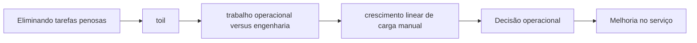

# Capítulo 03 - Eliminando tarefas penosas

## Objetivos de aprendizagem

- Explicar o problema de confiabilidade tratado pelo tema.
- Reconhecer onde o tema aparece em um serviço real.
- Aplicar o conceito em uma decisão operacional ou de engenharia.

## Síntese

Tarefas penosas como atividades operacionais que não geram valor durável, exigem intervenção humana e crescem com o tamanho do sistema. Nem todo trabalho operacional é ruim, mas toil excessivo rouba tempo de engenharia e impede evolução. A prática de SRE exige medir, limitar e substituir esse trabalho por automação, ferramentas ou mudanças de design.

Em uma frase: **Toil é trabalho manual, repetitivo, reativo e escalável linearmente com o serviço; deve ser reduzido por engenharia.**

## Por que isso importa

Sem **toil**, a equipe tende a discutir confiabilidade por opinião: um grupo pede mais velocidade, outro pede mais estabilidade, e ninguém consegue explicar qual risco está sendo aceito. A decisão melhora quando o risco vira critério técnico, mensurável e negociável.

## Conceitos essenciais

### **toil**

**toil**: É trabalho manual, repetitivo, reativo e sem aprendizado durável. O problema não é fazer operação; o problema é repetir a mesma operação até ela consumir a capacidade de engenharia.

Uma forma simples de aplicar isso é: Classificar tickets recentes como toil ou engenharia.

### **trabalho operacional versus engenharia**

**trabalho operacional versus engenharia**: Trabalho operacional mantém o serviço funcionando agora. Engenharia muda o sistema para reduzir trabalho futuro, eliminar repetição ou tornar falhas menos prováveis.

No dia a dia, isso aparece quando a equipe precisa calcular horas mensais gastas em tarefas repetitivas.

### **crescimento linear de carga manual**

**crescimento linear de carga manual**: É trabalho humano que cresce junto com tráfego, número de usuários ou quantidade de serviços. Se nada mudar, a equipe precisa crescer linearmente para manter o mesmo nível de operação.

Esse conceito fica concreto quando a equipe consegue escolher uma tarefa de alto volume para automatizar primeiro.

### **limite de carga operacional**

**limite de carga operacional**: É uma barreira explícita para impedir que a equipe vire apenas suporte reativo. Quando o limite é ultrapassado, o sistema precisa devolver trabalho ao produto, automatizar ou reduzir escopo.

Uma forma simples de aplicar isso é: Classificar tickets recentes como toil ou engenharia.

### **automação como investimento**

**automação como investimento**: É investimento para remover repetição, reduzir variação humana e tornar a operação mais rápida. Boa automação é idempotente, observável e segura para repetir.

No dia a dia, isso aparece quando a equipe precisa calcular horas mensais gastas em tarefas repetitivas.

## Aplicação prática

Para evitar burocracia, escolha um serviço concreto e execute uma ação pequena:

- Classificar tickets recentes como toil ou engenharia.
- Calcular horas mensais gastas em tarefas repetitivas.
- Escolher uma tarefa de alto volume para automatizar primeiro.

Depois da ação, procure uma evidência simples de melhoria: menos alertas
irrelevantes, recuperação mais rápida, dependência mais clara, deploy menos
arriscado, métrica mais confiável ou decisão mais fácil de explicar.

## Diagrama de apoio

## Erros comuns

- Chamar todo trabalho chato de toil.
- Automatizar uma rotina ruim sem remover a causa do trabalho repetitivo.
- Aceitar que plantão e tickets consumam todo o tempo de engenharia.

## Perguntas para revisão

1. Qual risco operacional **toil** ajuda a reduzir?
2. Que evidência mostraria que a prática foi aplicada com sucesso?
3. Como esse conceito mudaria uma decisão de release, plantão, arquitetura ou priorização?

## Exercícios

### Compreensão

Explique a ideia central em até cinco linhas, usando um serviço real como exemplo.

### Aplicação

Escolha um serviço real e execute uma das ações práticas.

### Análise

Liste duas formas de aplicar esse conceito de maneira superficial e explique o
risco de cada uma.

## Relação com práticas atuais

Em plataformas cloud native, **toil** costuma aparecer em tickets repetitivos, ajustes manuais de infraestrutura, aprovações operacionais e alertas que não geram decisão. Engenharia de plataforma, GitOps e automações idempotentes são úteis quando removem a causa do trabalho manual, não apenas aceleram uma rotina ruim.

## Recursos complementares

- **Livro oficial online do Google SRE:** <https://sre.google/sre-book/>
- **The Site Reliability Workbook:** <https://sre.google/workbook/>
- **Google SRE Book - Eliminating Toil:** <https://sre.google/sre-book/eliminating-toil/>
- **Site Reliability Workbook - Eliminating Toil:** <https://sre.google/workbook/eliminating-toil/>

## Fechamento

Guarde a ideia principal: **Toil é trabalho manual, repetitivo, reativo e escalável linearmente com o serviço; deve ser reduzido por engenharia.**

Próximo: [Capítulo 04 - Monitorando sistemas distribuídos](capitulo-04.md).

## Referências

- Beyer, B.; Jones, C.; Petoff, J.; Murphy, N. R. (eds.). **Site Reliability Engineering: How Google Runs Production Systems**. O'Reilly Media / Google, 2016. <https://sre.google/sre-book/>
- Beyer, B.; Murphy, N. R.; Rensin, D.; Kawahara, K.; Thorne, S. (eds.). **The Site Reliability Workbook**. O'Reilly Media / Google, 2018. <https://sre.google/workbook/>
- **Google SRE Book - Eliminating Toil:** <https://sre.google/sre-book/eliminating-toil/>
- **Site Reliability Workbook - Eliminating Toil:** <https://sre.google/workbook/eliminating-toil/>
- **Google Cloud Well-Architected Framework:** <https://docs.cloud.google.com/architecture/framework>
- **AWS Well-Architected Reliability Pillar:** <https://docs.aws.amazon.com/wellarchitected/latest/reliability-pillar/welcome.html>
- PDF local usado como fonte primária em português: `../Engenharia de Confiabilidade do Google ( etc.).pdf`.
