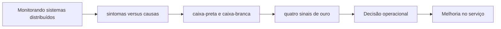

# Capítulo 04 - Monitorando sistemas distribuídos

## Objetivos de aprendizagem

- Explicar o problema de confiabilidade tratado pelo tema.
- Reconhecer onde o tema aparece em um serviço real.
- Aplicar o conceito em uma decisão operacional ou de engenharia.

## Síntese

Causas de sintomas, monitoração caixa-preta de caixa-branca e apresenta os quatro sinais de ouro: latência, tráfego, erros e saturação. Um bom sistema de monitoração deve acionar pessoas apenas quando há necessidade de julgamento humano imediato. O restante deve virar dashboard, ticket, log ou automação, reduzindo fadiga de alerta.

Em uma frase: **Monitoração deve alertar sobre sintomas relevantes para usuários e apoiar diagnóstico sem criar ruído.**

## Por que isso importa

Sem **sintomas versus causas**, a equipe tende a discutir confiabilidade por opinião: um grupo pede mais velocidade, outro pede mais estabilidade, e ninguém consegue explicar qual risco está sendo aceito. A decisão melhora quando o risco vira critério técnico, mensurável e negociável.

## Conceitos essenciais

### **sintomas versus causas**

**sintomas versus causas**: Sintomas descrevem o que o usuário percebe; causas explicam por que o sistema chegou lá. Alertas devem priorizar sintomas, enquanto dashboards e investigação ajudam a chegar às causas.

Uma forma simples de aplicar isso é: Revisar alertas e remover os que não exigem ação imediata.

### **caixa-preta e caixa-branca**

**caixa-preta e caixa-branca**: Monitoração caixa-preta observa o serviço por fora, como o usuário perceberia. Monitoração caixa-branca usa sinais internos, como filas, saturação, erros e dependências, para diagnóstico.

No dia a dia, isso aparece quando a equipe precisa criar um painel com latência, tráfego, erros e saturação.

### **quatro sinais de ouro**

**quatro sinais de ouro**: São latência, tráfego, erros e saturação. Eles formam uma base mínima para entender saúde de serviços online.

Esse conceito fica concreto quando a equipe consegue distinguir métricas de usuário de métricas internas.

### **alertas acionáveis**

**alertas acionáveis**: São alertas que exigem ação humana imediata e clara. Se uma notificação não muda uma decisão agora, ela deve virar dashboard, ticket, automação ou revisão assíncrona.

Uma forma simples de aplicar isso é: Revisar alertas e remover os que não exigem ação imediata.

### **cauda de latência**

**cauda de latência**: É o tempo percebido para concluir uma operação. Em confiabilidade, caudas como p95 e p99 costumam importar mais que médias.

No dia a dia, isso aparece quando a equipe precisa criar um painel com latência, tráfego, erros e saturação.

## Aplicação prática

Para evitar burocracia, escolha um serviço concreto e execute uma ação pequena:

- Revisar alertas e remover os que não exigem ação imediata.
- Criar um painel com latência, tráfego, erros e saturação.
- Distinguir métricas de usuário de métricas internas.

Depois da ação, procure uma evidência simples de melhoria: menos alertas
irrelevantes, recuperação mais rápida, dependência mais clara, deploy menos
arriscado, métrica mais confiável ou decisão mais fácil de explicar.

## Diagrama de apoio

## Erros comuns

- Alertar sobre causas internas sem impacto real para usuários.
- Construir dashboards enormes que não ajudam diagnóstico.
- Usar média de latência e esconder caudas relevantes como p95 ou p99.

## Perguntas para revisão

1. Qual risco operacional **sintomas versus causas** ajuda a reduzir?
2. Que evidência mostraria que a prática foi aplicada com sucesso?
3. Como esse conceito mudaria uma decisão de release, plantão, arquitetura ou priorização?

## Exercícios

### Compreensão

Explique a ideia central em até cinco linhas, usando um serviço real como exemplo.

### Aplicação

Escolha um serviço real e execute uma das ações práticas.

### Análise

Liste duas formas de aplicar esse conceito de maneira superficial e explique o
risco de cada uma.

## Relação com práticas atuais

A prática atual combina monitoração e **observabilidade**. Métricas continuam essenciais para SLOs e alertas; logs e traces ajudam a investigar sistemas distribuídos. OpenTelemetry consolidou uma linguagem comum para instrumentar aplicações sem prender a equipe a uma única ferramenta.

## Recursos complementares

- **Livro oficial online do Google SRE:** <https://sre.google/sre-book/>
- **The Site Reliability Workbook:** <https://sre.google/workbook/>
- **Google SRE Book - Monitoring Distributed Systems:** <https://sre.google/sre-book/monitoring-distributed-systems/>
- **Site Reliability Workbook - Monitoring:** <https://sre.google/workbook/monitoring/>
- **OpenTelemetry - Signals:** <https://opentelemetry.io/docs/concepts/signals/>
- **OpenTelemetry Signals:** <https://opentelemetry.io/docs/concepts/signals/>

## Fechamento

Guarde a ideia principal: **Monitoração deve alertar sobre sintomas relevantes para usuários e apoiar diagnóstico sem criar ruído.**

Próximo: [Capítulo 05 - Automação operacional e engenharia de release](capitulo-05.md).

## Referências

- Beyer, B.; Jones, C.; Petoff, J.; Murphy, N. R. (eds.). **Site Reliability Engineering: How Google Runs Production Systems**. O'Reilly Media / Google, 2016. <https://sre.google/sre-book/>
- Beyer, B.; Murphy, N. R.; Rensin, D.; Kawahara, K.; Thorne, S. (eds.). **The Site Reliability Workbook**. O'Reilly Media / Google, 2018. <https://sre.google/workbook/>
- **Google SRE Book - Monitoring Distributed Systems:** <https://sre.google/sre-book/monitoring-distributed-systems/>
- **Site Reliability Workbook - Monitoring:** <https://sre.google/workbook/monitoring/>
- **OpenTelemetry - Signals:** <https://opentelemetry.io/docs/concepts/signals/>
- **Google Cloud Well-Architected Framework:** <https://docs.cloud.google.com/architecture/framework>
- **AWS Well-Architected Reliability Pillar:** <https://docs.aws.amazon.com/wellarchitected/latest/reliability-pillar/welcome.html>
- PDF local usado como fonte primária em português: `../Engenharia de Confiabilidade do Google ( etc.).pdf`.
