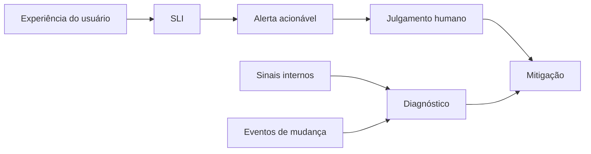

# Capítulo 04 - Monitorando sistemas distribuídos

## Objetivos de aprendizagem

- Projetar monitoração a partir de **sintomas de usuário**, não apenas de causas internas.
- Usar **latência**, **tráfego**, **erros** e **saturação** como sinais mínimos de saúde.
- Separar página urgente, diagnóstico, dashboard, ticket e análise histórica.

## Síntese

Monitoração confiável não é coletar todas as métricas possíveis. Ela transforma comportamento de produção em decisões: acordar alguém, abrir um ticket, iniciar automação, investigar uma tendência ou ajustar um SLO. Em sistemas distribuídos, a dificuldade está em separar o que o usuário percebe do que a infraestrutura revela internamente.

Em uma frase: **monitoração boa alerta sobre impacto real e fornece contexto suficiente para investigar sem criar ruído**.

## Por que isso importa

Um sistema pode ter milhares de métricas e ainda não responder à pergunta básica: o usuário está conseguindo usar o serviço? Alertas baseados apenas em CPU, memória, filas ou exceções internas podem acordar pessoas sem impacto real. Por outro lado, sinais de usuário sem contexto interno deixam a equipe cega durante o diagnóstico.

O SRE Book propõe a separação entre sintomas e causas, caixa-preta e caixa-branca, além dos quatro sinais de ouro. O Workbook aprofunda práticas de alertas ligados a SLOs e redução de fadiga.

## Conceitos essenciais

### **Sintomas versus causas**

**Sintomas** descrevem o comportamento percebido pelo usuário: erro no checkout, resposta lenta, dado atrasado, indisponibilidade parcial. **Causas** explicam por que isso aconteceu: CPU saturada, fila acumulada, deploy ruim, dependência lenta, erro de configuração.

Páginas de plantão devem priorizar sintomas ou risco claro de violação de SLO. Causas internas são valiosas para diagnóstico, mas nem toda causa interna deve acordar alguém.

### **Caixa-preta e caixa-branca**

**Monitoração caixa-preta** observa o serviço de fora, como um usuário ou cliente faria. Ela detecta indisponibilidade, latência e falhas de jornada. **Monitoração caixa-branca** usa sinais internos exportados pelo sistema: filas, caches, saturação, erros, dependências, estado de workers e eventos de deploy.

A combinação é mais forte que qualquer uma isolada. Caixa-preta responde "o serviço funciona?"; caixa-branca ajuda a responder "por que não?".

### **Quatro sinais de ouro**

Os **quatro sinais de ouro** são:

- **latência:** quanto tempo uma operação demora, incluindo caudas como p95 e p99;
- **tráfego:** quanto trabalho o serviço recebe;
- **erros:** proporção e tipo de falhas;
- **saturação:** quão perto o sistema está de um limite crítico.

Esses sinais não cobrem tudo, mas formam uma base forte para serviços online. Para pipelines e dados, a equipe também deve medir frescor, completude, atraso e corretude.

### **SLI como contrato de medição**

Um **SLI** traduz uma experiência em uma métrica calculável. Disponibilidade pode ser taxa de requisições bem-sucedidas; latência pode ser percentil por janela; frescor pode ser idade máxima de dados; durabilidade pode ser perda aceitável de eventos.

Sem SLI claro, dashboards viram coleção de gráficos. Com SLI claro, a equipe sabe qual sinal sustenta decisões de alerta, release e priorização.

### **Alertas acionáveis**

**Alertas acionáveis** exigem ação humana imediata. Uma página deve indicar impacto, serviço, severidade, janela, primeiro diagnóstico e runbook. Se o sinal não exige decisão agora, ele deve virar ticket, dashboard, relatório ou automação.

Esse critério reduz fadiga de alerta e melhora confiança no sistema de monitoração.

### **Observabilidade**

**Observabilidade** amplia a investigação usando métricas, logs, traces e eventos. OpenTelemetry consolidou uma linguagem comum para instrumentar sistemas sem depender de uma ferramenta única.

Métricas são fortes para alertas e tendências; logs ajudam a explicar eventos discretos; traces mostram caminho distribuído; eventos de deploy e configuração conectam mudança com comportamento.

## Aplicação prática

Revise a monitoração de uma jornada crítica:

- Defina o que o usuário espera concluir.
- Escolha 1 ou 2 SLIs que representem essa experiência.
- Separe sinais de página, sinais de ticket e sinais apenas diagnósticos.
- Verifique se latência usa percentis, não apenas média.
- Adicione eventos de deploy/configuração aos dashboards principais.
- Remova ou rebaixe alertas que não exigem ação imediata.
- Garanta que cada página tenha dono, severidade e runbook.

## Aprofundamento prático

Monitoração prática começa por uma pergunta: que sintoma do usuário exige ação agora? Para uma API, a resposta costuma envolver taxa de sucesso, latência de cauda, tráfego e saturação. Para um pipeline, envolve atraso, completude e corretude. Métricas internas ajudam diagnóstico, mas não devem virar página urgente sem impacto claro.

Procedimento recomendado:

1. Separe sinais de página, ticket, dashboard e auditoria.
2. Use percentis de latência, principalmente p95 e p99, em vez de média.
3. Anote eventos de deploy e configuração nos painéis principais.
4. Crie runbook para cada alerta que acorda alguém.
5. Remova alertas que ninguém sabe responder.

Exemplo de regra Prometheus orientada a SLO:

```yaml
alert: CheckoutHighErrorRate
expr: |
  sum(rate(http_requests_total{service="checkout",status=~"5.."}[5m]))
  /
  sum(rate(http_requests_total{service="checkout"}[5m])) > 0.02
for: 10m
labels:
  severity: page
annotations:
  summary: "Checkout com erro alto para usuários"
  runbook: "https://runbooks.example/checkout-erros"
```

Essa regra ainda precisa ser adaptada ao SLO real, mas mostra a forma correta: taxa, janela, serviço, severidade e runbook. Alertas baseados só em CPU ou memória devem ser justificados por relação clara com impacto ou risco iminente.

## Diagrama de apoio



## Erros comuns

- Alertar sobre CPU, memória ou fila sem impacto de usuário ou risco de SLO.
- Usar média de latência e esconder p95, p99 ou outliers relevantes.
- Criar dashboards grandes sem pergunta operacional clara.
- Tratar logs como substituto de métricas para alertas de disponibilidade.
- Não registrar eventos de deploy, rollback e configuração nos painéis.
- Manter alertas que ninguém sabe como responder.

## Perguntas para revisão

1. Que sintoma de usuário justifica acordar alguém?
2. Qual SLI representa melhor a jornada crítica do serviço?
3. Quais sinais ajudam diagnóstico, mas não deveriam paginar a equipe?
4. Os dashboards mostram eventos de mudança junto com métricas de saúde?

## Exercícios

### Compreensão

Explique a diferença entre sintoma, causa, SLI e métrica interna.

### Aplicação

Desenhe um painel mínimo para uma API com latência p95/p99, tráfego, erros, saturação e eventos de deploy.

### Análise

Escolha três alertas existentes e decida se cada um deve ser página, ticket, dashboard ou removido.

## Relação com práticas atuais

Plataformas modernas combinam monitoração baseada em SLO, OpenTelemetry, traces distribuídos, logs estruturados, eventos de deploy, sintéticos externos e análise de burn rate. O risco atual não é falta de ferramenta; é excesso de sinais sem uma pergunta operacional. A prática madura começa pelo usuário, define SLIs e usa telemetria para sustentar decisões.

## Recursos complementares

- **Google SRE Book - Monitoring Distributed Systems:** <https://sre.google/sre-book/monitoring-distributed-systems/>
- **Site Reliability Workbook - Monitoring:** <https://sre.google/workbook/monitoring/>
- **Site Reliability Workbook - Alerting on SLOs:** <https://sre.google/workbook/alerting-on-slos/>
- **OpenTelemetry - Signals:** <https://opentelemetry.io/docs/concepts/signals/>
- **Google Cloud Architecture Framework - Operational excellence:** <https://docs.cloud.google.com/architecture/framework/operational-excellence>
- **AWS Well-Architected Reliability - Monitoring:** <https://docs.aws.amazon.com/wellarchitected/latest/reliability-pillar/monitor-workload-resources.html>

## Fechamento

Guarde a ideia principal: **monitoração existe para melhorar decisão operacional, não para provar que a equipe coleta muitas métricas**.

Próximo: [Capítulo 05 - Automação operacional e engenharia de release](capitulo-05.md).

## Referências

- Beyer, B.; Jones, C.; Petoff, J.; Murphy, N. R. (eds.). **Site Reliability Engineering: How Google Runs Production Systems**. O'Reilly Media / Google, 2016. <https://sre.google/sre-book/>
- Beyer, B.; Murphy, N. R.; Rensin, D.; Kawahara, K.; Thorne, S. (eds.). **The Site Reliability Workbook**. O'Reilly Media / Google, 2018. <https://sre.google/workbook/>
- Google SRE. **Monitoring Distributed Systems**. <https://sre.google/sre-book/monitoring-distributed-systems/>
- Google SRE. **Monitoring - Workbook**. <https://sre.google/workbook/monitoring/>
- Google SRE. **Alerting on SLOs**. <https://sre.google/workbook/alerting-on-slos/>
- OpenTelemetry. **Signals**. <https://opentelemetry.io/docs/concepts/signals/>
- Google Cloud. **Architecture Framework - Operational excellence**. <https://docs.cloud.google.com/architecture/framework/operational-excellence>
- AWS. **Monitor workload resources**. <https://docs.aws.amazon.com/wellarchitected/latest/reliability-pillar/monitor-workload-resources.html>
- PDF local usado como fonte primária em português: `../Engenharia de Confiabilidade do Google ( etc.).pdf`.
