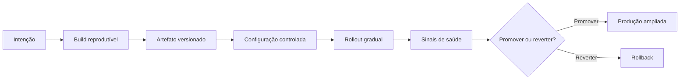

# Capítulo 05 - Automação operacional e engenharia de release

## Objetivos de aprendizagem

- Explicar como **automação confiável** reduz trabalho manual e risco de mudança.
- Relacionar estado desejado, builds reprodutíveis, configuração, rollout e rollback.
- Avaliar se um pipeline de release é auditável, repetível e seguro para produção.

## Síntese

Automação em SRE não é apenas escrever scripts. O objetivo é transformar intenção operacional em sistemas que validam pré-condições, executam mudanças de forma repetível, observam resultado e permitem recuperação. **Engenharia de release** aplica o mesmo raciocínio ao caminho até produção: builds reprodutíveis, artefatos versionados, configuração controlada, rollouts graduais e rollback claro.

Em uma frase: **automação e release engineering formam a cadeia que leva mudanças para produção com controle, evidência e reversibilidade**.

## Por que isso importa

Grande parte dos incidentes nasce em mudança: deploy, configuração, migração, dependência, capacidade ou rotina operacional executada de forma diferente do esperado. Automação confiável reduz variação humana; engenharia de release reduz ambiguidade sobre o que foi construído, testado, implantado e revertido.

## Conceitos essenciais

### **Automação idempotente**

**Automação idempotente** é segura para repetir. Se uma rotina falha no meio e precisa rodar de novo, ela não deve duplicar efeito, corromper estado ou depender de memória humana para saber onde parou.

Esse princípio vale para scripts, controladores, jobs, runbooks executáveis, migrações e correções automáticas.

### **Estado desejado**

**Estado desejado** descreve como o sistema deve estar. Automação madura compara estado atual com estado desejado, calcula a diferença e reconcilia o ambiente. Essa lógica aparece em controladores Kubernetes, GitOps, infraestrutura como código e plataformas internas.

O ganho é reduzir passos manuais e tornar a operação mais auditável: a pergunta deixa de ser "quem clicou onde?" e passa a ser "qual estado declaramos e o que reconciliou?".

### **Builds reprodutíveis**

**Builds reprodutíveis** reduzem surpresa entre desenvolvimento, teste e produção. Entradas devem ser declaradas, dependências devem ser controladas e o artefato promovido precisa ser rastreável.

Sem isso, a equipe não sabe se está implantando o que testou. Investigar incidentes também fica mais difícil porque o artefato real pode depender de estado externo ou passos não registrados.

### **Separação entre construir, configurar e implantar**

Construir software, configurar comportamento e implantar em produção são decisões diferentes. Misturar tudo em um processo opaco aumenta risco: uma mudança simples de configuração pode virar build nova; um deploy pode carregar parâmetro inesperado; um rollback pode voltar código mas manter configuração quebrada.

Separar essas etapas melhora revisão, auditoria e recuperação.

### **Rollout, canário e rollback**

**Rollout** é a liberação gradual de uma mudança. **Canário** limita exposição inicial para detectar regressões com menor impacto. **Rollback** precisa ser exercitado antes da crise, não descoberto durante o incidente.

Essas práticas dependem de sinais confiáveis: taxa de erro, latência, saturação, eventos de negócio e feedback de usuários. Sem observabilidade da mudança, rollout gradual vira apenas deploy lento.

### **Observabilidade da mudança**

Toda automação que muda produção precisa deixar rastros: quem pediu, qual versão, qual configuração, quais validações passaram, qual impacto foi observado e como reverter. Logs, métricas, traces, eventos de deploy e anotações em dashboards ajudam a conectar causa e efeito.

### **Automação como produto interno**

Automação operacional madura deve ser tratada como **produto interno**: tem usuários, contrato, documentação, suporte, métricas de adoção e caminho de evolução. Um script que só uma pessoa entende reduz um tipo de trabalho manual, mas cria dependência humana em outro ponto.

Plataformas internas, controladores Kubernetes, GitOps e infraestrutura como código seguem esse princípio quando tornam o estado desejado revisável, versionado e auditável.

### **Segurança da cadeia de entrega**

**Cadeia de entrega** inclui código, dependências, build, artefato, configuração, permissões, ambiente e processo de promoção. Se qualquer elo é opaco, a equipe perde rastreabilidade e aumenta o risco de implantar algo diferente do que foi testado.

Práticas como artefatos imutáveis, assinaturas, SBOMs, segregação de permissões e revisão de configuração não pertencem apenas à segurança; elas também sustentam confiabilidade.

## Aplicação prática

Escolha um pipeline ou rotina operacional e revise:

- O artefato é versionado e rastreável?
- As entradas da build são declaradas?
- Configuração e código podem ser revertidos separadamente?
- O rollout tem fases e critérios objetivos?
- O rollback foi testado recentemente?
- A automação registra o que fez e expõe falhas?
- Há evidência de que a versão implantada é a mesma que foi testada?
- Uma pessoa nova conseguiria operar o fluxo usando documentação e sinais existentes?

## Diagrama de apoio

## Erros comuns

- Confundir script com automação confiável.
- Automatizar uma rotina ruim sem entender causa e pré-condições.
- Depender de uma pessoa para construir, promover ou reverter releases.
- Misturar build, configuração e deploy em um processo sem rastreabilidade.
- Fazer canário sem métrica que indique sucesso ou falha.
- Criar rollback que volta código, mas não considera configuração, schema, dados ou feature flags.
- Tratar pipeline verde como prova de confiabilidade quando não há validação pós-deploy.

## Perguntas para revisão

1. Qual parte do caminho para produção ainda depende de ação manual frágil?
2. O rollback atual reverte código, configuração e dados na ordem correta?
3. Que sinal provaria que um rollout deve parar antes de atingir todos os usuários?
4. O pipeline registra mudança, aprovação, artefato, configuração e impacto observado?

## Exercícios

### Compreensão

Explique por que automação idempotente é diferente de "script que roda rápido".

### Aplicação

Desenhe o caminho de uma mudança desde commit até produção e marque onde há validação, aprovação, rollout e rollback.

### Análise

Escolha um incidente causado por mudança e identifique qual etapa da cadeia deveria ter detectado ou limitado o impacto.

## Relação com práticas atuais

Em ambientes modernos, essa cadeia aparece em CI/CD, GitOps, Kubernetes, infraestrutura como código, feature flags, canários, progressive delivery, SBOMs e assinatura de artefatos. A tecnologia muda, mas o princípio permanece: mudanças confiáveis precisam ser pequenas, rastreáveis, observáveis e reversíveis. DORA descreve **continuous delivery** como a capacidade de liberar mudanças sob demanda de forma rápida, segura e sustentável; os capítulos de SRE sobre automação e release engineering dão a base operacional para isso.

## Recursos complementares

- **Google SRE Book - The Evolution of Automation at Google:** <https://sre.google/sre-book/automation-at-google/>
- **Google SRE Book - Release Engineering:** <https://sre.google/sre-book/release-engineering/>
- **Site Reliability Workbook - Canarying Releases:** <https://sre.google/workbook/canarying-releases/>
- **DORA - Continuous Delivery:** <https://dora.dev/capabilities/continuous-delivery/>
- **AWS Well-Architected Reliability - Change Management:** <https://docs.aws.amazon.com/wellarchitected/latest/reliability-pillar/change-management.html>
- **Google Cloud Deploy - Canary deployment strategy:** <https://docs.cloud.google.com/deploy/docs/deployment-strategies/canary>

## Fechamento

Guarde a ideia principal: **boa automação expressa intenção e engenharia de release torna a mudança segura para chegar a produção**.

Próximo: [Capítulo 06 - Simplicidade](capitulo-06.md).

## Referências

- Beyer, B.; Jones, C.; Petoff, J.; Murphy, N. R. (eds.). **Site Reliability Engineering: How Google Runs Production Systems**. O'Reilly Media / Google, 2016. <https://sre.google/sre-book/>
- Beyer, B.; Murphy, N. R.; Rensin, D.; Kawahara, K.; Thorne, S. (eds.). **The Site Reliability Workbook**. O'Reilly Media / Google, 2018. <https://sre.google/workbook/>
- Google SRE. **The Evolution of Automation at Google**. <https://sre.google/sre-book/automation-at-google/>
- Google SRE. **Release Engineering**. <https://sre.google/sre-book/release-engineering/>
- Google SRE. **Canarying Releases**. <https://sre.google/workbook/canarying-releases/>
- DORA. **Continuous Delivery**. <https://dora.dev/capabilities/continuous-delivery/>
- AWS. **Reliability Pillar - Change Management**. <https://docs.aws.amazon.com/wellarchitected/latest/reliability-pillar/change-management.html>
- Google Cloud. **Use a canary deployment strategy**. <https://docs.cloud.google.com/deploy/docs/deployment-strategies/canary>
- PDF local usado como fonte primária em português: `../Engenharia de Confiabilidade do Google ( etc.).pdf`.
