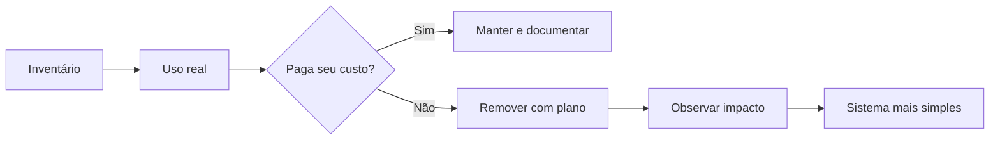

# Capítulo 06 - Simplicidade

## Objetivos de aprendizagem

- Explicar por que **simplicidade** é uma prática de confiabilidade, não apenas preferência estética.
- Identificar complexidade acidental em código, arquitetura, APIs, configuração e operação.
- Planejar remoções seguras de funcionalidade, dependências e caminhos operacionais.

## Síntese

Sistemas simples são mais fáceis de entender, operar, alterar e recuperar. Cada feature, dependência, flag, exceção, integração, modo de operação e linha de código adiciona superfície de falha. **Simplicidade** não significa ausência de capacidade; significa construir apenas a complexidade que paga seu custo e remover o restante de forma deliberada.

Em uma frase: **simplicidade reduz o número de estados que podem surpreender a equipe em produção**.

## Por que isso importa

Falhas graves muitas vezes atravessam caminhos pouco usados: configuração antiga, feature quase abandonada, fallback não testado, integração legada, flag esquecida, API permissiva demais ou dependência que ninguém mais domina. Durante incidentes, complexidade vira atraso cognitivo. Durante releases, vira incerteza. Durante onboarding, vira conhecimento tribal.

O SRE Book defende simplicidade como requisito de confiabilidade porque sistemas complexos exigem mais operação, mais testes, mais coordenação e mais memória institucional.

## Conceitos essenciais

### **Complexidade essencial e acidental**

**Complexidade essencial** vem do problema real: regras de negócio, requisitos de consistência, escala, segurança, latência ou disponibilidade. **Complexidade acidental** vem de decisões acumuladas que já não pagam seu custo: abstrações prematuras, duplicidade, compatibilidade infinita, opções raras, dependências esquecidas.

SRE deve atacar primeiro a complexidade acidental, porque ela aumenta risco sem entregar valor proporcional.

### **Linhas de código negativas**

**Linhas de código negativas** representam valor criado pela remoção. Menos código pode significar menos testes, menos estados, menos caminhos de rollback, menos alertas e menos combinações de configuração.

Remover com segurança exige telemetria, inventário de uso, plano de rollback e comunicação. Simplicidade madura não é apagar no escuro.

### **APIs mínimas**

**APIs mínimas** reduzem estados inválidos e acoplamento. Uma API muito flexível pode parecer poderosa, mas cada opção cria combinações que precisam ser documentadas, testadas, monitoradas e suportadas.

Uma boa interface torna o caminho correto fácil e os caminhos perigosos difíceis.

### **Configuração como risco**

Configuração dinâmica dá velocidade, mas também cria estados difíceis de reproduzir. Flags, parâmetros, overrides regionais e regras de roteamento devem ter dono, validade, documentação, padrão seguro e estratégia de remoção.

Configuração sem ciclo de vida vira código invisível.

### **Dependências e modos de falha**

Cada dependência adiciona latência, disponibilidade, contrato, credenciais, limites, modo de falha e processo de suporte. A pergunta não é apenas "a dependência funciona?", mas "o serviço continua compreensível quando ela falha?".

Reduzir dependências críticas pode ser mais valioso que adicionar mecanismos de compensação em cima de uma arquitetura confusa.

### **Simplicidade em releases**

Mudanças pequenas e compreensíveis reduzem tempo de diagnóstico e rollback. Releases que misturam refatoração, feature, migração, alteração de configuração e mudança de dependência aumentam ambiguidade.

Simplicidade de release aparece quando a equipe consegue responder rapidamente: o que mudou, qual hipótese, como pausar, como reverter e que métrica prova segurança.

## Aplicação prática

Faça uma revisão de simplicidade em um serviço:

- Liste features, flags, endpoints, jobs e dependências pouco usadas.
- Identifique configurações sem dono ou sem data de revisão.
- Procure APIs com opções raras, estados inválidos ou comportamento implícito.
- Escolha uma remoção pequena e reversível.
- Defina métrica para provar baixo uso e segurança da remoção.
- Planeje comunicação, rollback e janela de observação.

## Aprofundamento prático

**Simplicidade** precisa de inventário. Serviços ficam complexos por acúmulo: flags antigas, endpoints quase sem uso, dependências herdadas, exceções regionais, scripts especiais e configurações que ninguém remove. Cada item aumenta o número de estados que a equipe precisa entender durante incidente.

Procedimento recomendado:

1. Liste endpoints, jobs, flags, dependências e modos especiais.
2. Marque último uso, dono, risco e plano de remoção.
3. Escolha uma remoção pequena, reversível e mensurável.
4. Comunique consumidores conhecidos antes de desligar.
5. Observe sinais de erro e suporte após a remoção.

Exemplo de inventário:

| Item | Evidência de uso | Risco | Ação |
| --- | --- | --- | --- |
| Flag `legacy_checkout` | 0,2% do tráfego | Caminho não testado | Desativar por coorte e remover |
| Endpoint `/v1/export` | Dois clientes internos | Alto custo de suporte | Migrar clientes e aposentar |
| Job manual de reconciliação | Sem dono claro | Pode duplicar efeitos | Substituir por workflow idempotente |

Remoção segura também é engenharia. Ela deve ter telemetria, rollback e critério de sucesso, como qualquer release.

Para flags, adicione uma regra de ciclo de vida: toda flag deve ter dono, data
de criação, condição de remoção e data de revisão. Flags permanentes precisam
ser tratadas como configuração de produto, não como experimento esquecido.

## Tradução para ferramentas modernas

**Ferramentas típicas:** catálogos de serviço, mapas de dependência, OpenRewrite, feature flag management, OpenFeature, static analysis, fitness functions de arquitetura e scorecards.

**Exemplo avançado:** faça uma campanha de remoção de flags antigas: medir uso, avisar donos, desativar por coorte, observar erro e remover código morto.

**Cuidado de projeto:** simplicidade sem telemetria vira aposta. Remoção segura precisa de evidência de uso e plano de retorno.

## Diagrama de apoio

## Erros comuns

- Confundir simplicidade com falta de ambição técnica.
- Adicionar plataforma ou abstração antes de remover complexidade existente.
- Manter compatibilidade sem prazo para caminhos quase não usados.
- Criar flags e nunca removê-las.
- Ignorar configuração como fonte de comportamento complexo.
- Fazer grandes limpezas sem telemetria, rollback e comunicação.

## Perguntas para revisão

1. Que parte do serviço poucos entendem e muitos têm medo de alterar?
2. Que feature, flag ou integração tem baixo uso e alto custo operacional?
3. Qual remoção pequena reduziria risco sem afetar usuários relevantes?
4. Como provar que a remoção foi segura?

## Exercícios

### Compreensão

Explique a diferença entre complexidade essencial e complexidade acidental usando um serviço real.

### Aplicação

Escolha uma feature pouco usada e escreva um plano de remoção com métrica de uso, comunicação e rollback.

### Análise

Analise um incidente passado e identifique como complexidade de configuração, dependência ou release aumentou tempo de recuperação.

## Relação com práticas atuais

Microsserviços, Kubernetes, service mesh, múltiplas clouds, feature flags e observabilidade rica podem melhorar operação, mas também podem multiplicar estados e pontos de falha. A recomendação prática é reduzir complexidade antes de adicionar mais plataforma. DORA associa desempenho de entrega a capacidades como arquitetura fracamente acoplada e entrega contínua; essas capacidades dependem de sistemas compreensíveis, testáveis e reversíveis.

## Recursos complementares

- **Google SRE Book - Simplicity:** <https://sre.google/sre-book/simplicity/>
- **Site Reliability Workbook - Simplicity:** <https://sre.google/workbook/simplicity/>
- **DORA - Loosely Coupled Architecture:** <https://dora.dev/capabilities/loosely-coupled-architecture/>
- **DORA - Continuous Delivery:** <https://dora.dev/capabilities/continuous-delivery/>
- **OpenFeature:** <https://openfeature.dev/docs/reference/intro/>
- **Google Cloud Architecture Framework - Operational excellence:** <https://docs.cloud.google.com/architecture/framework/operational-excellence>
- **AWS Well-Architected Operational Excellence Pillar:** <https://docs.aws.amazon.com/wellarchitected/latest/operational-excellence-pillar/welcome.html>

## Fechamento

Guarde a ideia principal: **simplicidade é uma defesa operacional contra surpresa, ambiguidade e recuperação lenta**.

Próximo: [Capítulo 07 - Alertas acionáveis e plantão saudável](capitulo-07.md).

## Referências

- Beyer, B.; Jones, C.; Petoff, J.; Murphy, N. R. (eds.). **Site Reliability Engineering: How Google Runs Production Systems**. O'Reilly Media / Google, 2016. <https://sre.google/sre-book/>
- Beyer, B.; Murphy, N. R.; Rensin, D.; Kawahara, K.; Thorne, S. (eds.). **The Site Reliability Workbook**. O'Reilly Media / Google, 2018. <https://sre.google/workbook/>
- Google SRE. **Simplicity**. <https://sre.google/sre-book/simplicity/>
- Google SRE. **Simplicity - Workbook**. <https://sre.google/workbook/simplicity/>
- DORA. **Loosely Coupled Architecture**. <https://dora.dev/capabilities/loosely-coupled-architecture/>
- DORA. **Continuous Delivery**. <https://dora.dev/capabilities/continuous-delivery/>
- OpenFeature. **Introduction**. <https://openfeature.dev/docs/reference/intro/>
- Google Cloud. **Architecture Framework - Operational excellence**. <https://docs.cloud.google.com/architecture/framework/operational-excellence>
- AWS. **Operational Excellence Pillar**. <https://docs.aws.amazon.com/wellarchitected/latest/operational-excellence-pillar/welcome.html>
- PDF local usado como fonte primária em português: `../Engenharia de Confiabilidade do Google ( etc.).pdf`.
