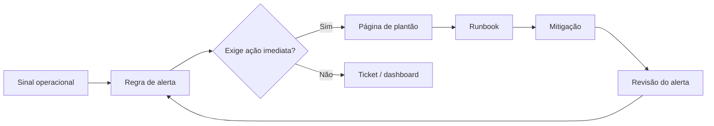

# Capítulo 07 - Alertas acionáveis e plantão saudável

## Objetivos de aprendizagem

- Explicar como **alertas acionáveis** determinam a qualidade do **plantão**.
- Diferenciar página urgente, ticket, dashboard e investigação assíncrona.
- Projetar uma rotina de plantão sustentável, com runbooks, escalonamento e carga manejável.

## Síntese

Alertas e plantão não são práticas independentes. Um alerta ruim interrompe pessoas, reduz confiança no sistema de monitoração e degrada a qualidade da resposta. Um plantão saudável depende de sinais que representem impacto real, regras bem modeladas, documentação útil, volume suportável e segurança para tomar decisões em produção.

Em uma frase: **alertas só devem acordar pessoas quando exigem julgamento humano imediato, e o plantão precisa ser desenhado para responder bem sem destruir a equipe**.

## Por que isso importa

Equipes não falham apenas por falta de métricas; elas falham porque são interrompidas por sinais ruins, sem contexto, sem runbook e sem critério de urgência. A consequência é fadiga de alerta, resposta lenta, decisões defensivas e perda de confiança. SRE trata detecção e plantão juntos porque a experiência operacional começa no sinal que chama uma pessoa.

## Conceitos essenciais

### **Séries temporais**

**Séries temporais** registram valores ao longo do tempo: latência, erros, tráfego, saturação, filas, idade de dados ou taxa de sucesso. Elas são a base de muitos alertas porque permitem observar tendência, taxa e mudança de comportamento.

Um valor instantâneo raramente basta. Regras úteis consideram janela, agregação, taxa de variação e impacto para o usuário.

### **Alertas acionáveis**

**Alertas acionáveis** exigem ação humana imediata e clara. Se a notificação não muda uma decisão naquele momento, ela não deve paginar alguém; deve virar ticket, dashboard, relatório ou investigação assíncrona.

A pergunta prática é simples: "quem recebe esse alerta sabe o que fazer agora?". Se a resposta for não, o alerta ainda não está pronto.

### **Página, ticket e dashboard**

Nem todo sinal tem a mesma urgência. **Página** é interrupção imediata. **Ticket** é trabalho que precisa ser planejado. **Dashboard** é apoio para análise. Misturar esses canais destrói prioridade.

Separar canais preserva atenção humana para problemas que realmente precisam de julgamento durante a janela de impacto.

### **Qualidade dos alertas**

Qualidade de alerta envolve precisão, contexto, runbook, dono, severidade e relação com SLO. Um alerta bom descreve impacto, escopo provável, primeiro diagnóstico e caminho de mitigação.

Alertas devem ser revisados como código operacional. Se um alerta dispara muito e não gera ação útil, ele está ensinando a equipe a ignorar o sistema.

### **Plantão sustentável**

**Plantão sustentável** equilibra volume, complexidade, treinamento, remuneração ou reconhecimento, segurança psicológica e tempo de recuperação. A escala não pode depender de heroísmo contínuo.

Um rodízio saudável tem carga previsível, handoff claro, apoio de escalonamento e critérios para tirar uma pessoa da linha de frente quando a pressão acumulada fica alta.

### **Runbooks e escalonamento**

**Runbooks** reduzem incerteza inicial: o que verificar, onde olhar, como mitigar, quando escalar e quais riscos evitar. **Escalonamento** define quando envolver especialistas, liderança, suporte ou times dependentes.

Runbook bom não substitui pensamento. Ele remove passos repetitivos para que a pessoa possa usar julgamento onde ele realmente importa.

## Aplicação prática

Escolha os dez alertas que mais interromperam a equipe nas últimas semanas:

- Classifique cada um como página, ticket, dashboard ou remoção.
- Verifique se cada página tem impacto de usuário ou risco claro de SLO.
- Adicione dono, runbook, severidade e primeiro passo de mitigação.
- Meça páginas por turno e interrupções fora do horário esperado.
- Defina uma regra para revisar alertas ruidosos após incidentes ou semanas ruins de plantão.

## Diagrama de apoio

## Erros comuns

- Acordar pessoas por sintomas sem impacto real ou risco iminente.
- Criar alertas sem dono, runbook ou critério de severidade.
- Usar o mesmo canal para urgência, melhoria planejada e curiosidade operacional.
- Medir plantão apenas por cobertura, sem medir carga e qualidade das interrupções.
- Aceitar fadiga de alerta como custo inevitável de operar produção.

## Perguntas para revisão

1. Quais alertas atuais realmente exigem julgamento humano imediato?
2. Qual volume de páginas por turno ainda é sustentável para a equipe?
3. Que informação mínima precisa aparecer em uma página para acelerar a mitigação?

## Exercícios

### Compreensão

Explique a diferença entre página, ticket e dashboard usando exemplos de produção.

### Aplicação

Reescreva um alerta ruidoso para incluir impacto, condição, janela, severidade, dono e runbook.

### Análise

Avalie um rodízio de plantão e identifique o maior risco: excesso de volume, falta de prática, falta de runbook, escalonamento confuso ou ausência de recuperação.

## Relação com práticas atuais

Em ambientes modernos, alertas costumam ser ligados a SLOs, burn rate, sintomas de usuário, traces, logs e eventos de deploy. Ferramentas de incident management ajudam com escalonamento e calendário, mas a saúde do plantão ainda depende de disciplina editorial nos alertas: poucas páginas, alto sinal, contexto claro e revisão contínua.

## Recursos complementares

- **Google SRE Book - Practical Alerting:** <https://sre.google/sre-book/practical-alerting/>
- **Google SRE Book - Being On-Call:** <https://sre.google/sre-book/being-on-call/>
- **Site Reliability Workbook - On-Call:** <https://sre.google/workbook/on-call/>
- **Site Reliability Workbook - Alerting on SLOs:** <https://sre.google/workbook/alerting-on-slos/>
- **OpenTelemetry Signals:** <https://opentelemetry.io/docs/concepts/signals/>

## Fechamento

Guarde a ideia principal: **a qualidade do plantão começa na qualidade do alerta que interrompe a pessoa**.

Próximo: [Capítulo 08 - Resolvendo problemas de modo eficiente](capitulo-08.md).

## Referências

- Beyer, B.; Jones, C.; Petoff, J.; Murphy, N. R. (eds.). **Site Reliability Engineering: How Google Runs Production Systems**. O'Reilly Media / Google, 2016. <https://sre.google/sre-book/>
- Beyer, B.; Murphy, N. R.; Rensin, D.; Kawahara, K.; Thorne, S. (eds.). **The Site Reliability Workbook**. O'Reilly Media / Google, 2018. <https://sre.google/workbook/>
- Google SRE. **Practical Alerting from Time-Series Data**. <https://sre.google/sre-book/practical-alerting/>
- Google SRE. **Being On-Call**. <https://sre.google/sre-book/being-on-call/>
- Google SRE. **On-Call**. <https://sre.google/workbook/on-call/>
- Google SRE. **Alerting on SLOs**. <https://sre.google/workbook/alerting-on-slos/>
- PDF local usado como fonte primária em português: `../Engenharia de Confiabilidade do Google ( etc.).pdf`.
