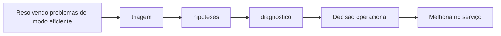

# Capítulo 08 - Resolvendo problemas de modo eficiente

## Objetivos de aprendizagem

- Identificar como **triagem** aparece em produção.
- Aplicar o procedimento do tema em uma jornada, mudança, incidente ou dependência real.
- Produzir um artefato prático: métrica, política, checklist, runbook ou plano de melhoria.

## Síntese

Uma abordagem disciplinada para investigar falhas: entender o relato, triar, analisar, diagnosticar, testar e tratar. A prática valoriza evidências, experimentos pequenos e a eliminação de hipóteses. Resultados negativos são úteis porque reduzem o espaço de busca e evitam mudanças aleatórias em produção.

Em uma frase: **Troubleshooting eficaz combina método, hipóteses testáveis e aprendizado com resultados negativos.**

## Por que isso importa

**triagem** importa porque serviços reais falham sob mudança, carga, dependências lentas, estado distribuído e comportamento humano. A equipe reduz surpresa quando transforma esse risco em rotina operacional clara, sinais confiáveis e decisões treinadas antes da crise.

## Conceitos essenciais

### **triagem**

**triagem**: É separar o que é urgente, importante e incerto. Uma boa triagem evita investigar detalhes enquanto usuários continuam impactados.

Uma forma simples de aplicar isso é: Registrar hipóteses antes de executar correções.

### **hipóteses**

**hipóteses**: É uma explicação testável para o problema. Hipóteses boas podem ser confirmadas ou descartadas rapidamente.

No dia a dia, isso aparece quando a equipe precisa separar mitigacao imediata de correção definitiva.

### **diagnóstico**

**diagnóstico**: É formar e testar hipóteses sobre a causa do problema. Ele deve ser guiado por evidências, não por tentativa aleatória.

Esse conceito fica concreto quando a equipe consegue manter linha do tempo durante uma investigação.

### **experimentos controlados**

**experimentos controlados**: É uma prática que transforma uma preocupação operacional em decisão concreta. Ela aparece quando a equipe precisa escolher entre aceitar risco, automatizar, simplificar, melhorar observabilidade, mudar o processo de release ou corrigir a causa raiz de um problema recorrente.

Uma forma simples de aplicar isso é: Registrar hipóteses antes de executar correções.

### **resultados negativos**

**resultados negativos**: É uma prática que transforma uma preocupação operacional em decisão concreta. Ela aparece quando a equipe precisa escolher entre aceitar risco, automatizar, simplificar, melhorar observabilidade, mudar o processo de release ou corrigir a causa raiz de um problema recorrente.

No dia a dia, isso aparece quando a equipe precisa separar mitigacao imediata de correção definitiva.

## Aplicação prática

Escolha um serviço concreto e transforme o tema em uma ação verificável:

- Registrar hipóteses antes de executar correções.
- Separar mitigacao imediata de correção definitiva.
- Manter linha do tempo durante uma investigação.

Depois da ação, registre a evidência de melhoria: menos alertas irrelevantes,
recuperação mais rápida, dependência mais clara, deploy menos arriscado, métrica
mais confiável ou decisão mais fácil de explicar.

## Aprofundamento prático

**Troubleshooting** eficiente evita tentativa aleatória em produção. O método do livro pode ser aplicado como um ciclo: entender o relato, triar impacto, formular hipóteses, testar com mudança pequena e registrar resultado. Resultado negativo não é perda de tempo; ele elimina caminhos falsos.

Procedimento recomendado:

1. Escreva o sintoma em termos observáveis: quem é afetado, desde quando, em qual operação.
2. Monte uma linha do tempo com deploys, mudanças de configuração e eventos externos.
3. Liste hipóteses concorrentes antes de agir.
4. Teste a hipótese que reduz mais incerteza com menor risco.
5. Separe mitigação imediata de correção definitiva.

Exemplo de registro durante investigação:

| Hora | Observação | Hipótese | Teste | Resultado |
| --- | --- | --- | --- | --- |
| 10:05 | p99 subiu só em checkout | dependência lenta | trace por operação | confirmado em gateway |
| 10:12 | erros aumentam após retry | amplificação | reduzir tentativas no cliente | erro estabilizou |

A disciplina protege contra a pressão de "mexer em alguma coisa". Em incidente, mudança sem hipótese pode piorar o estado e apagar evidências.

## Tradução para ferramentas modernas

**Ferramentas típicas:** OpenTelemetry traces, Jaeger, Grafana Tempo, Honeycomb, kubectl, cloud audit logs, histórico de feature flags e timelines de incidentes.

**Exemplo avançado:** durante uma degradação intermitente, monte linha do tempo com deploys, flags, p95/p99, traces por rota e erros por dependência antes de alterar produção.

**Cuidado de projeto:** mudança sem hipótese durante troubleshooting pode ocultar evidência e piorar a falha.

## Diagrama de apoio

## Erros comuns

- Aplicar a prática como checklist sem conectar a risco real do serviço.
- Criar documentação ou automação sem validar durante incidentes ou mudanças reais.
- Medir apenas sinais internos e esquecer o impacto percebido pelo usuário.

## Perguntas para revisão

1. Qual risco operacional **triagem** ajuda a reduzir?
2. Que evidência mostraria que a prática foi aplicada com sucesso?
3. Como esse conceito mudaria uma decisão de release, plantão, arquitetura ou priorização?

## Exercícios

### Compreensão

Explique a ideia central em até cinco linhas, usando um serviço real como exemplo.

### Aplicação

Escolha um serviço real e execute uma das ações práticas.

### Análise

Liste duas formas de aplicar esse conceito de maneira superficial e explique o
risco de cada uma.

## Relação com práticas atuais

Em ambientes atuais, este tema aparece em revisões de serviço, plataformas internas, pipelines, dashboards, políticas de rollout e práticas de cloud native. A tecnologia muda; o princípio continua sendo tornar risco, responsabilidade e evidência visíveis.

## Recursos complementares

- **Livro oficial online do Google SRE:** <https://sre.google/sre-book/>
- **The Site Reliability Workbook:** <https://sre.google/workbook/>
- **Google SRE Book - Effective Troubleshooting:** <https://sre.google/sre-book/effective-troubleshooting/>

## Fechamento

Guarde a ideia principal: **Troubleshooting eficaz combina método, hipóteses testáveis e aprendizado com resultados negativos.**

Próximo: [Capítulo 09 - Resposta a incidentes e aprendizado operacional](capitulo-09.md).

## Referências

- Beyer, B.; Jones, C.; Petoff, J.; Murphy, N. R. (eds.). **Site Reliability Engineering: How Google Runs Production Systems**. O'Reilly Media / Google, 2016. <https://sre.google/sre-book/>
- Beyer, B.; Murphy, N. R.; Rensin, D.; Kawahara, K.; Thorne, S. (eds.). **The Site Reliability Workbook**. O'Reilly Media / Google, 2018. <https://sre.google/workbook/>
- **Google SRE Book - Effective Troubleshooting:** <https://sre.google/sre-book/effective-troubleshooting/>
- **Google Cloud Well-Architected Framework:** <https://docs.cloud.google.com/architecture/framework>
- **AWS Well-Architected Reliability Pillar:** <https://docs.aws.amazon.com/wellarchitected/latest/reliability-pillar/welcome.html>
- PDF local usado como fonte primária em português: `../Engenharia de Confiabilidade do Google ( etc.).pdf`.
