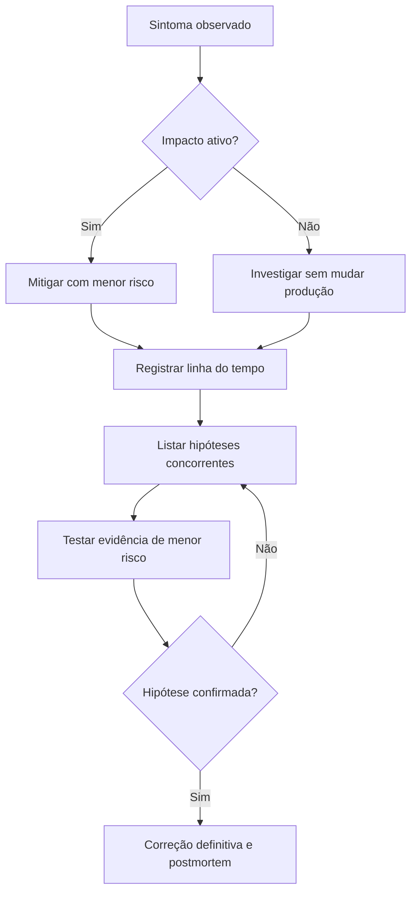

# Capítulo 08 - Resolvendo problemas de modo eficiente

## Objetivos de aprendizagem

- Conduzir troubleshooting com triagem, hipóteses, evidências e linha do tempo.
- Separar mitigação imediata, diagnóstico de causa provável e correção definitiva.
- Registrar uma investigação de forma que outra pessoa consiga auditar o raciocínio.

## Síntese

Uma abordagem disciplinada para investigar falhas: entender o relato, triar, analisar, diagnosticar, testar e tratar. A prática valoriza evidências, experimentos pequenos e a eliminação de hipóteses. Resultados negativos são úteis porque reduzem o espaço de busca e evitam mudanças aleatórias em produção.

Em uma frase: **Troubleshooting eficaz combina método, hipóteses testáveis e aprendizado com resultados negativos.**

## Por que isso importa

**Triagem** importa porque incidentes pressionam a equipe a agir rápido, mesmo
quando as evidências ainda são incompletas. Sem método, a resposta vira tentativa
aleatória: alguém reinicia serviço, altera configuração, aumenta capacidade ou
desfaz deploy sem saber qual hipótese está testando. Isso pode piorar a falha e
apagar sinais úteis.

Troubleshooting profissional reduz incerteza de forma controlada. A equipe
observa o sintoma, preserva evidências, cria hipóteses concorrentes, testa a
mudança de menor risco e registra o resultado.

## Conceitos essenciais

### **triagem**

**triagem**: É separar o que é urgente, importante e incerto. Uma boa triagem evita investigar detalhes enquanto usuários continuam impactados.

Na primeira triagem, pergunte: há impacto de usuário agora? O impacto está
aumentando? Existe mitigação segura? Quais mudanças recentes podem ter relação?
Essa etapa decide se o foco imediato é mitigar ou investigar.

### **hipóteses**

**hipóteses**: É uma explicação testável para o problema. Hipóteses boas podem ser confirmadas ou descartadas rapidamente.

No dia a dia, isso aparece quando a equipe precisa separar mitigação imediata de correção definitiva.

### **diagnóstico**

**diagnóstico**: É formar e testar hipóteses sobre a causa do problema. Ele deve ser guiado por evidências, não por tentativa aleatória.

Esse conceito fica concreto quando a equipe consegue manter linha do tempo durante uma investigação.

### **experimentos controlados**

**experimentos controlados**: São testes pequenos e deliberados para reduzir incerteza sem piorar o estado de produção. Um bom experimento tem hipótese, sinal esperado, limite de risco e critério para parar.

Uma forma simples de aplicar isso é: Registrar hipóteses antes de executar correções.

### **resultados negativos**

**resultados negativos**: São testes que descartam uma hipótese. Eles são úteis porque reduzem o espaço de busca e impedem que a equipe insista em uma explicação errada.

No dia a dia, isso aparece quando a equipe precisa separar mitigação imediata de correção definitiva.

## Aplicação prática

Use o `checkout-api` ou um serviço real e faça uma investigação estruturada:

- Descreva o sintoma em termos observáveis: quem, quando, onde e qual impacto.
- Monte uma linha do tempo com deploys, flags, mudanças de configuração e eventos externos.
- Liste pelo menos três hipóteses concorrentes.
- Para cada hipótese, defina evidência esperada e teste de menor risco.
- Registre mitigação, resultado do teste e decisão seguinte.
- Separe ações definitivas que devem entrar no postmortem ou backlog.

Depois da ação, registre a evidência de melhoria: menos alertas irrelevantes,
recuperação mais rápida, dependência mais clara, deploy menos arriscado, métrica
mais confiável ou decisão mais fácil de explicar.

## Aprofundamento prático

**Troubleshooting** eficiente evita tentativa aleatória em produção. O método do livro pode ser aplicado como um ciclo: entender o relato, triar impacto, formular hipóteses, testar com mudança pequena e registrar resultado. Resultado negativo não é perda de tempo; ele elimina caminhos falsos.

Procedimento recomendado:

1. Escreva o sintoma em termos observáveis: quem é afetado, desde quando, em qual operação.
2. Monte uma linha do tempo com deploys, mudanças de configuração e eventos externos.
3. Liste hipóteses concorrentes antes de agir.
4. Teste a hipótese que reduz mais incerteza com menor risco.
5. Separe mitigação imediata de correção definitiva.

Exemplo de registro durante investigação:

| Hora | Observação | Hipótese | Evidência esperada | Teste seguro | Resultado |
| --- | --- | --- | --- | --- | --- |
| 10:05 | p99 subiu só em checkout | dependência de pagamento lenta | traces concentrados no provedor | filtrar traces por rota e dependência | confirmado em gateway |
| 10:12 | erros aumentam após retry | retry storm amplificando falha | mais tentativas por requisição e fila crescendo | reduzir tentativas no cliente canário | erro estabilizou |
| 10:20 | erro cai após pausar rollout | regressão de versão | erro maior na versão nova | manter pausa e comparar versões | provável regressão no deploy |

A disciplina protege contra a pressão de "mexer em alguma coisa". Em incidente, mudança sem hipótese pode piorar o estado e apagar evidências.

## Tradução para ferramentas modernas

**Ferramentas típicas:** OpenTelemetry traces, Jaeger, Grafana Tempo, Honeycomb, kubectl, cloud audit logs, histórico de feature flags e timelines de incidentes.

**Exemplo avançado:** durante uma degradação intermitente, monte linha do tempo com deploys, flags, p95/p99, traces por rota e erros por dependência antes de alterar produção.

**Cuidado de projeto:** mudança sem hipótese durante troubleshooting pode ocultar evidência e piorar a falha.

## Diagrama de apoio

## Erros comuns

- Executar comandos em produção sem hipótese explícita.
- Confundir mitigação que reduz impacto com correção definitiva.
- Ignorar mudanças recentes, flags e eventos externos na linha do tempo.
- Procurar uma única causa raiz quando o incidente tem várias condições contribuintes.
- Apagar evidências ao reiniciar, limpar fila ou substituir instâncias sem registro.

## Perguntas para revisão

1. Qual sintoma prova que usuários estão impactados?
2. Que hipóteses concorrentes explicam o mesmo sintoma?
3. Qual teste reduz mais incerteza com menor risco?
4. Que mudança recente precisa entrar na linha do tempo?
5. O que foi mitigação e o que ainda exige correção definitiva?

## Exercícios

### Compreensão

Explique por que resultado negativo é útil durante troubleshooting.

### Aplicação

Monte uma linha do tempo para uma degradação do `checkout-api` com deploy,
feature flag, aumento de p99, retries e mitigação.

### Análise

Receba este sintoma: "checkout com p99 alto e aumento de erro após deploy".
Liste três hipóteses, a evidência esperada para cada uma e o teste de menor
risco.

## Relação com práticas atuais

Em ambientes atuais, troubleshooting usa traces distribuídos, logs estruturados,
métricas de SLO, eventos de deploy, histórico de feature flags, audit logs e
timelines de incidente. A prática madura não é abrir todas as ferramentas ao
mesmo tempo; é formular hipóteses e buscar o sinal que mais reduz incerteza.

## Recursos complementares

- **Livro oficial online do Google SRE:** <https://sre.google/sre-book/>
- **The Site Reliability Workbook:** <https://sre.google/workbook/>
- **Google SRE Book - Effective Troubleshooting:** <https://sre.google/sre-book/effective-troubleshooting/>

## Fechamento

Guarde a ideia principal: **Troubleshooting eficaz combina método, hipóteses testáveis e aprendizado com resultados negativos.**

Próximo: [Capítulo 09 - Resposta a incidentes e aprendizado operacional](capitulo-09.md).

## Referências

- Beyer, B.; Jones, C.; Petoff, J.; Murphy, N. R. (eds.). **Site Reliability Engineering: How Google Runs Production Systems**. O'Reilly Media / Google, 2016. <https://sre.google/sre-book/>
- Beyer, B.; Murphy, N. R.; Rensin, D.; Kawahara, K.; Thorne, S. (eds.). **The Site Reliability Workbook**. O'Reilly Media / Google, 2018. <https://sre.google/workbook/>
- **Google SRE Book - Effective Troubleshooting:** <https://sre.google/sre-book/effective-troubleshooting/>
- **Google Cloud Well-Architected Framework:** <https://docs.cloud.google.com/architecture/framework>
- **AWS Well-Architected Reliability Pillar:** <https://docs.aws.amazon.com/wellarchitected/latest/reliability-pillar/welcome.html>
- PDF local usado como fonte primária em português: `../Engenharia de Confiabilidade do Google ( etc.).pdf`.
