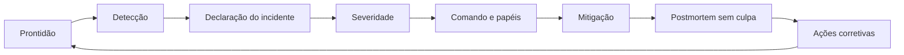

# Capítulo 09 - Resposta a incidentes e aprendizado operacional

## Objetivos de aprendizagem

- Explicar como **prontidão**, **coordenação** e **postmortem sem culpa** formam um ciclo único.
- Definir papéis, comunicação e documentação para incidentes severos.
- Transformar falhas em melhorias rastreáveis de confiabilidade.

## Síntese

Incidentes não começam no momento em que alguém é acordado. A qualidade da resposta depende de treinamento, runbooks, histórico de falhas, simulações, papéis claros e comunicação preparada. Durante a crise, **comando de incidente**, delegação e um documento vivo reduzem ambiguidade. Depois da mitigação, **postmortems sem culpa** convertem o evento em aprendizado, ações corretivas e memória operacional.

Em uma frase: **resposta a incidentes é um ciclo de preparação, coordenação e aprendizado, não apenas reação durante a crise**.

## Por que isso importa

Sem processo explícito, incidentes viram improviso. Pessoas competentes podem trabalhar em paralelo, repetir diagnóstico, comunicar mensagens conflitantes ou aplicar correções arriscadas sem visão comum. A disciplina de SRE reduz esse caos ao tornar visíveis o estado do incidente, as decisões tomadas, os donos de cada frente e as ações que impedem recorrência.

## Conceitos essenciais

### **Prontidão antes da crise**

**Prontidão operacional** combina runbooks, treinamento, simulações, revisão de incidentes anteriores e perguntas do tipo "e se?". A equipe não precisa prever todos os modos de falha, mas precisa treinar como pensar sob pressão.

Uma boa preparação reduz tempo de triagem e evita que a primeira decisão relevante aconteça no pior momento possível.

### **Resposta a emergência**

**Resposta a emergência** prioriza mitigação, segurança do serviço e redução de impacto. A causa raiz pode esperar quando usuários estão afetados; o primeiro objetivo é estabilizar o sistema de forma controlada.

Correções emergenciais devem ser registradas. Sem registro, a mitigação vira uma mudança invisível que pode gerar novo risco depois.

### **Comando de incidente**

**Comando de incidente** separa coordenação de execução técnica. Uma pessoa mantém visão do estado geral, define prioridades, remove bloqueios e garante comunicação. Outras pessoas investigam, mitigam, comunicam com stakeholders ou acompanham métricas.

Essa separação impede que todos tentem resolver o mesmo problema enquanto ninguém cuida da coordenação.

### **Comunicação durante crise**

**Comunicação de incidente** precisa ser objetiva: impacto, escopo, ações em andamento, próximos marcos e nível de incerteza. Mensagens claras reduzem pressão externa e ajudam equipes dependentes a tomar decisões.

Comunicação boa não exige certeza absoluta. Ela exige honestidade sobre o que se sabe, o que ainda está sendo investigado e quando haverá nova atualização.

### **Documento vivo**

Um **documento vivo de incidente** registra linha do tempo, hipóteses, comandos executados, decisões, donos e próximos passos. Ele reduz perda de contexto em handoffs e serve como base para o postmortem.

O documento não deve virar burocracia paralela. Ele precisa ajudar a operação em tempo real.

### **Postmortem sem culpa**

**Postmortem sem culpa** investiga condições sistêmicas, não culpados. O foco é entender por que as decisões pareciam razoáveis no momento, quais sinais estavam ausentes e quais defesas falharam.

A saída concreta deve incluir ações corretivas com dono, prazo e critério de conclusão. Sem isso, o postmortem vira narrativa, não melhoria.

## Aplicação prática

Escolha um incidente recente ou simulado e execute uma revisão curta:

- Classifique severidade, por exemplo SEV1, SEV2 ou SEV3, com base em impacto e urgência.
- Defina quando o incidente deveria ter sido declarado.
- Liste os papéis mínimos: comando, investigação, comunicação e registro.
- Recrie uma linha do tempo com eventos, decisões e mudanças.
- Escreva uma atualização interna e uma atualização externa para status page.
- Identifique uma lacuna de prontidão que poderia ser treinada antes da próxima crise.
- Escreva duas ações corretivas com dono e evidência de conclusão.

## Aprofundamento prático

Resposta a incidentes precisa separar coordenação de execução técnica. Quando todos investigam ao mesmo tempo sem comando, a equipe perde linha do tempo, duplica ações e comunica mal. Um processo simples com papéis explícitos costuma ser suficiente para reduzir caos.

Procedimento recomendado:

1. Declare incidente quando houver impacto relevante, incerteza alta ou necessidade de coordenação.
2. Nomeie comandante do incidente, líder técnico e responsável por comunicação.
3. Defina severidade e revise se ela ainda está correta durante a resposta.
4. Mantenha documento vivo com estado, decisões, hipóteses e próximos passos.
5. Defina cadência de atualização para stakeholders e status page.
6. Faça handoff explícito quando trocar responsáveis.

Taxonomia simples de severidade:

| Severidade | Quando usar | Comunicação |
| --- | --- | --- |
| SEV1 | Impacto amplo, perda crítica de função ou risco alto ao negócio. | Atualizações frequentes, liderança e status externo quando aplicável. |
| SEV2 | Degradação relevante, workaround parcial ou impacto limitado. | Atualizações internas regulares e comunicação externa se o usuário perceber. |
| SEV3 | Problema localizado, baixo impacto ou risco controlado. | Registro, dono e acompanhamento assíncrono. |

Modelo mínimo de documento vivo:

```markdown
# Incidente: checkout indisponível
Status atual: mitigando / monitorando / resolvido
Impacto: 35% das tentativas de pagamento falham
Comandante: nome
Linha do tempo:
- 14:02 alerta de erro alto
- 14:08 rollout pausado
Próxima atualização: 14:30
```

Depois da mitigação, o postmortem deve explicar condições sistêmicas e gerar ações com dono, prazo e evidência de conclusão.

Modelo de action item:

| Campo | Exemplo |
| --- | --- |
| Ação | Adicionar alerta de burn rate para checkout |
| Dono | Equipe de checkout |
| Prazo | 14 dias |
| Critério de conclusão | Alerta revisado em simulado e linkado ao runbook |
| Risco reduzido | Detecção tardia de aumento de erro |

## Tradução para ferramentas modernas

**Ferramentas típicas:** incident.io, FireHydrant, PagerDuty Incident Workflows, Slack/Teams war rooms, Statuspage, Google Docs e templates de postmortem.

**Exemplo avançado:** modele um incidente SEV1 com comandante, líder técnico, comunicação interna, status page, documento vivo, atualizações a cada 30 minutos, mitigação e postmortem com ações rastreáveis.

**Cuidado de projeto:** ferramenta de incidente não substitui papéis claros nem autoridade para decidir.

## Exemplos e ferramentas do livro

O livro traz exemplos de **emergências induzidas por testes, mudanças e
processos**, além de artefatos como documento de estado do incidente e
postmortem. Esses exemplos mostram que incidente não é apenas falha técnica:
ele envolve coordenação, comunicação e aprendizado.

O equivalente prático no curso é usar template de incidente, canal de
comunicação, comandante do incidente, linha do tempo e postmortem sem culpa
com ações rastreáveis.

## Diagrama de apoio



## Erros comuns

- Declarar incidente tarde demais por medo de "exagerar".
- Fazer todos investigarem tecnicamente sem alguém coordenando.
- Não definir severidade ou manter severidade errada por conveniência.
- Comunicar certeza quando ainda há hipótese.
- Atualizar stakeholders sem próxima atualização definida.
- Escrever postmortem sem ações rastreáveis.
- Fechar action items sem evidência de que o risco foi reduzido.
- Tratar culpa individual como substituto de correção sistêmica.

## Perguntas para revisão

1. Quais sinais indicam que um problema deve virar incidente formal?
2. Quem coordena, quem investiga e quem comunica durante uma crise severa?
3. Qual severidade seria aplicada a uma falha parcial do checkout?
4. O que precisa aparecer em uma atualização de status page?
5. Como a equipe prova que um postmortem reduziu risco real?

## Exercícios

### Compreensão

Explique a diferença entre mitigação, resolução definitiva e ação corretiva de postmortem.

### Aplicação

Crie um template mínimo de documento vivo para incidentes com linha do tempo, papéis, impacto, decisões e próximos passos.

### Análise

Escolha um incidente conhecido e identifique qual parte do ciclo falhou: prontidão, detecção, coordenação, mitigação ou aprendizado.

### Simulação

Conduza um SEV1 fictício do `checkout-api`: defina papéis, severidade, mensagem
interna, status externo, mitigação, encerramento e três action items.

## Relação com práticas atuais

Ferramentas modernas de incident management, status pages, chatops e automação de escalonamento ajudam, mas a confiabilidade continua dependendo de papéis claros, comunicação disciplinada e aprendizado rastreável. Em organizações maduras, postmortems alimentam backlog de confiabilidade, testes de falha, ajustes de SLO, treinamento de plantão e revisão periódica de action items.

## Recursos complementares

- **Google SRE Book - Emergency Response:** <https://sre.google/sre-book/emergency-response/>
- **Google SRE Book - Managing Incidents:** <https://sre.google/sre-book/managing-incidents/>
- **Google SRE Book - Postmortem Culture:** <https://sre.google/sre-book/postmortem-culture/>
- **Site Reliability Workbook - Incident Response:** <https://sre.google/workbook/incident-response/>
- **Site Reliability Workbook - Postmortem Culture:** <https://sre.google/workbook/postmortem-culture/>

## Fechamento

Guarde a ideia principal: **incidentes melhoram a organização quando a resposta é coordenada e o aprendizado vira mudança verificável**.

Próximo: [Capítulo 10 - Monitorando interrupções de serviço](capitulo-10.md).

## Referências

- Beyer, B.; Jones, C.; Petoff, J.; Murphy, N. R. (eds.). **Site Reliability Engineering: How Google Runs Production Systems**. O'Reilly Media / Google, 2016. <https://sre.google/sre-book/>
- Beyer, B.; Murphy, N. R.; Rensin, D.; Kawahara, K.; Thorne, S. (eds.). **The Site Reliability Workbook**. O'Reilly Media / Google, 2018. <https://sre.google/workbook/>
- Google SRE. **Emergency Response**. <https://sre.google/sre-book/emergency-response/>
- Google SRE. **Managing Incidents**. <https://sre.google/sre-book/managing-incidents/>
- Google SRE. **Postmortem Culture**. <https://sre.google/sre-book/postmortem-culture/>
- Google SRE. **Incident Response**. <https://sre.google/workbook/incident-response/>
- PDF local usado como fonte primária em português: `../Engenharia de Confiabilidade do Google ( etc.).pdf`.
