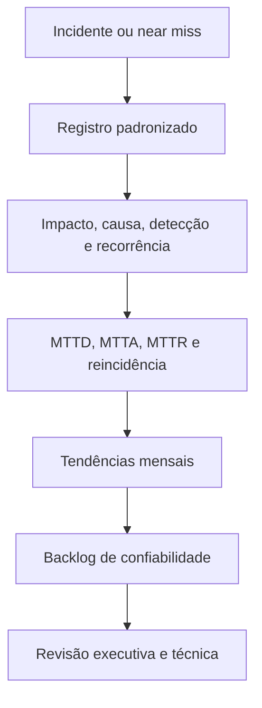

# Capítulo 10 - Monitorando interrupções de serviço

## Objetivos de aprendizagem

- Registrar incidentes e quase-incidentes com campos consistentes.
- Analisar tendências por impacto, detecção, recorrência, causa contribuinte e tempo de resposta.
- Transformar dados históricos em backlog de confiabilidade.

## Síntese

Mecanismos para registrar, agregar, rotular e analisar interrupções. A ideia é que uma organização só melhora confiabilidade de forma deliberada quando conhece sua linha de base e consegue acompanhar tendências. Classificar interrupções também revela causas recorrentes e prioridades de engenharia.

Em uma frase: **Medir interrupções ao longo do tempo cria base objetiva para melhorar confiabilidade.**

## Por que isso importa

**registro de interrupções** importa porque serviços reais falham sob mudança, carga, dependências lentas, estado distribuído e comportamento humano. A equipe reduz surpresa quando transforma esse risco em rotina operacional clara, sinais confiáveis e decisões treinadas antes da crise.

Sem histórico confiável, a organização prioriza o incidente mais recente ou o
mais ruidoso. Com histórico, a equipe consegue ver padrões: incidentes por
configuração, detecção tardia pelo usuário, rollback lento, dependência externa,
alerta ausente ou reincidência da mesma falha.

## Conceitos essenciais

### **registro de interrupções**

**registro de interrupções**: É perda ou degradação relevante de serviço. Registrar interrupções permite medir tendência, impacto e causas recorrentes.

Uma forma simples de aplicar isso é montar um catálogo de incidentes dos últimos meses.

Inclua também quase-incidentes, ou **near misses**: eventos que poderiam ter
afetado usuários, mas foram contidos por sorte, detecção rápida ou barreira de
segurança. Eles mostram fragilidades antes de virarem indisponibilidade.

### **agregação**

**agregação**: É combinar eventos ou métricas para enxergar padrões. Sem agregação, a equipe vê casos isolados e perde tendências.

No dia a dia, isso aparece quando a equipe precisa classificar interrupções por causa e impacto.

Agregação boa evita conclusões apressadas. Um mês com poucos incidentes longos
e outro com muitos incidentes curtos podem exigir respostas diferentes.

### **rotulagem**

**rotulagem**: É classificar interrupções com critérios consistentes, como impacto, causa contribuinte, forma de detecção, serviço afetado e recorrência. Bons rótulos permitem comparar eventos sem transformar a análise em julgamento subjetivo.

Esse conceito fica concreto quando a equipe consegue criar indicador mensal de confiabilidade percebida.

### **análise de tendências**

**análise de tendências**: É transformar dados operacionais em entendimento. A análise procura padrões, correlações e causas prováveis, não apenas números bonitos.

Uma forma simples de aplicar isso é montar um catálogo de incidentes dos últimos meses.

Métricas úteis incluem **MTTA** (tempo até reconhecer ou assumir o incidente),
**MTTD** (tempo até detectar), **MTTR** (tempo até mitigar ou restaurar),
reincidência, detecção pelo usuário, incidentes por mudança e ações corretivas
em atraso.

### **linha de base**

**linha de base**: É o estado normal usado para comparar melhorias ou regressões. Sem baseline, a equipe não sabe se está melhorando.

No dia a dia, isso aparece quando a equipe precisa classificar interrupções por causa e impacto.

## Aplicação prática

Use o `checkout-api` ou um serviço real e monte um catálogo mensal:

- Montar catálogo de incidentes dos últimos meses.
- Classificar interrupções por causa e impacto.
- Criar indicador mensal de confiabilidade percebida.
- Incluir quase-incidentes e detecções feitas por usuários antes da equipe.
- Calcular MTTD, MTTA, MTTR e taxa de reincidência quando houver dados.
- Gerar três prioridades de backlog com base nos padrões encontrados.

Depois da ação, registre a evidência de melhoria: menos alertas irrelevantes,
recuperação mais rápida, dependência mais clara, deploy menos arriscado, métrica
mais confiável ou decisão mais fácil de explicar.

## Aprofundamento prático

Monitorar interrupções de serviço cria memória quantitativa. Sem um catálogo consistente, a organização lembra do incidente mais recente e esquece padrões recorrentes. A prática combina agregação, rotulagem e análise; em um ambiente moderno, isso vira base para revisão mensal de confiabilidade.

Procedimento recomendado:

1. Registre todo incidente com início, fim, duração, impacto e serviços afetados.
2. Classifique causa inicial, causa contribuinte, detecção, mitigação e recorrência.
3. Separe indisponibilidade total, degradação parcial, atraso de dados e erro silencioso.
4. Agregue por produto, dependência, tipo de mudança e horário.
5. Use tendências para priorizar trabalho, não para culpar equipes.

Indicadores recomendados:

| Indicador | Pergunta que responde |
| --- | --- |
| MTTD | Quanto tempo levamos para perceber o problema? |
| MTTA | Quanto tempo até alguém assumir a resposta? |
| MTTR | Quanto tempo até reduzir impacto ou restaurar o serviço? |
| Reincidência | O mesmo modo de falha voltou? |
| Detecção pelo usuário | O usuário percebeu antes da equipe? |
| Ações atrasadas | O aprendizado virou melhoria real? |

Campos mínimos:

| Campo | Uso |
| --- | --- |
| Impacto ao usuário | Evita medir só sintomas internos |
| Detecção | Mostra se usuário percebe antes da equipe |
| Modo de falha | Agrupa problemas repetidos |
| Tempo para mitigar | Mede capacidade de resposta |
| Ação preventiva | Conecta interrupção a melhoria |
| Near miss | Mostra risco antes de virar incidente real |

O resultado esperado é uma lista curta de padrões: por exemplo, incidentes por configuração, por dependência externa, por sobrecarga ou por rollback não exercitado.

## Tradução para ferramentas modernas

**Ferramentas típicas:** bases de incidentes, BigQuery, Looker, Grafana, Jira, ServiceNow, exports de incident.io, PagerDuty analytics e scorecards de confiabilidade.

**Exemplo avançado:** crie um relatório mensal de interrupções por serviço, causa, tempo de detecção, tempo de mitigação, reincidência e ação corretiva pendente.

**Cuidado de projeto:** métrica de incidente deve orientar investimento; se vira ranking punitivo, as equipes param de reportar bem.

## Exemplos e ferramentas do livro

**Escalator** e **Outalator** aparecem como ferramentas para registrar,
agregar, rotular e analisar interrupções. Elas mostram que incidentes devem
virar base histórica, não apenas memória informal.

Fora do Google, essa função pode ser implementada com incident.io, PagerDuty,
Opsgenie, ServiceNow, Jira, GitHub Issues, planilhas controladas ou uma base
interna. O requisito técnico é manter campos consistentes: impacto, duração,
serviço, causa, detecção, mitigação e ações preventivas.

## Diagrama de apoio

## Erros comuns

- Registrar apenas SEV1 e perder padrões de degradação menor.
- Ignorar near misses porque "não virou incidente".
- Usar MTTR como ranking punitivo de equipes.
- Misturar tempo até mitigação com tempo até correção definitiva.
- Não acompanhar se ações corretivas foram concluídas.

## Perguntas para revisão

1. Quais incidentes foram detectados por usuários antes da equipe?
2. Qual modo de falha mais se repetiu nos últimos meses?
3. O MTTR mede mitigação ou correção definitiva no seu relatório?
4. Quais near misses deveriam entrar no backlog?
5. Que tendência mudaria prioridade de engenharia?

## Exercícios

### Compreensão

Explique a diferença entre incidente, degradação parcial e near miss.

### Aplicação

Crie uma tabela mensal de incidentes do `checkout-api` com impacto, detecção,
MTTD, MTTA, MTTR, causa contribuinte e ação corretiva.

### Análise

Compare dois relatórios: um com poucos incidentes longos e outro com muitos
incidentes curtos. Que decisões de confiabilidade cada cenário sugere?

## Relação com práticas atuais

A prática moderna combina dados de ferramentas de incidente, status pages,
alertas, traces, deploys, tickets e postmortems. O objetivo não é gerar um
painel bonito; é criar uma memória operacional que ajude a decidir onde investir
engenharia de confiabilidade.

## Recursos complementares

- **Livro oficial online do Google SRE:** <https://sre.google/sre-book/>
- **The Site Reliability Workbook:** <https://sre.google/workbook/>
- **Google SRE Book - Tracking Outages:** <https://sre.google/sre-book/tracking-outages/>
- **OpenTelemetry Signals:** <https://opentelemetry.io/docs/concepts/signals/>
- **DORA metrics:** <https://dora.dev/guides/dora-metrics-four-keys/>

## Fechamento

Guarde a ideia principal: **Medir interrupções ao longo do tempo cria base objetiva para melhorar confiabilidade.**

Próximo: [Capítulo 11 - Testes voltados a confiabilidade](capitulo-11.md).

## Referências

- Beyer, B.; Jones, C.; Petoff, J.; Murphy, N. R. (eds.). **Site Reliability Engineering: How Google Runs Production Systems**. O'Reilly Media / Google, 2016. <https://sre.google/sre-book/>
- Beyer, B.; Murphy, N. R.; Rensin, D.; Kawahara, K.; Thorne, S. (eds.). **The Site Reliability Workbook**. O'Reilly Media / Google, 2018. <https://sre.google/workbook/>
- **Google SRE Book - Tracking Outages:** <https://sre.google/sre-book/tracking-outages/>
- DORA. **DORA metrics: the four keys**. <https://dora.dev/guides/dora-metrics-four-keys/>
- **Google Cloud Well-Architected Framework:** <https://docs.cloud.google.com/architecture/framework>
- **AWS Well-Architected Reliability Pillar:** <https://docs.aws.amazon.com/wellarchitected/latest/reliability-pillar/welcome.html>
- PDF local usado como fonte primária em português: `../Engenharia de Confiabilidade do Google ( etc.).pdf`.
