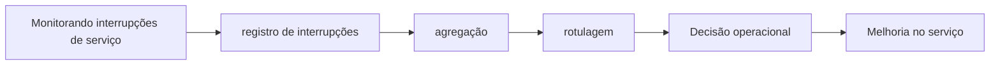

# Capítulo 10 - Monitorando interrupções de serviço

## Objetivos de aprendizagem

- Explicar o problema de confiabilidade tratado pelo tema.
- Reconhecer onde o tema aparece em um serviço real.
- Aplicar o conceito em uma decisão operacional ou de engenharia.

## Síntese

Mecanismos para registrar, agregar, rotular e analisar interrupções. A ideia é que uma organização so melhora confiabilidade de forma deliberada quando conhece sua linha de base e consegue acompanhar tendências. Classificar interrupções também revela causas recorrentes e prioridades de engenharia.

Em uma frase: **Medir interrupções ao longo do tempo cria base objetiva para melhorar confiabilidade.**

## Por que isso importa

**registro de interrupções** importa porque serviços reais falham sob mudança, carga, dependências lentas, estado distribuído e comportamento humano. A equipe reduz surpresa quando transforma esse risco em rotina operacional clara, sinais confiáveis e decisões treinadas antes da crise.

## Conceitos essenciais

### **registro de interrupções**

**registro de interrupções**: É perda ou degradação relevante de serviço. Registrar interrupções permite medir tendência, impacto e causas recorrentes.

Uma forma simples de aplicar isso é: Montar catalogo de incidentes dos ultimos meses.

### **agregação**

**agregação**: É combinar eventos ou métricas para enxergar padrões. Sem agregação, a equipe vê casos isolados e perde tendências.

No dia a dia, isso aparece quando a equipe precisa classificar interrupções por causa e impacto.

### **rotulagem**

**rotulagem**: É uma prática que transforma uma preocupação operacional em decisão concreta. Ela aparece quando a equipe precisa escolher entre aceitar risco, automatizar, simplificar, melhorar observabilidade, mudar o processo de release ou corrigir a causa raiz de um problema recorrente.

Esse conceito fica concreto quando a equipe consegue criar indicador mensal de confiabilidade percebida.

### **análise de tendências**

**análise de tendências**: É transformar dados operacionais em entendimento. A análise procura padrões, correlações e causas prováveis, não apenas números bonitos.

Uma forma simples de aplicar isso é: Montar catalogo de incidentes dos ultimos meses.

### **linha de base**

**linha de base**: É o estado normal usado para comparar melhorias ou regressões. Sem baseline, a equipe não sabe se está melhorando.

No dia a dia, isso aparece quando a equipe precisa classificar interrupções por causa e impacto.

## Aplicação prática

Para evitar burocracia, escolha um serviço concreto e execute uma ação pequena:

- Montar catalogo de incidentes dos ultimos meses.
- Classificar interrupções por causa e impacto.
- Criar indicador mensal de confiabilidade percebida.

Depois da ação, procure uma evidência simples de melhoria: menos alertas
irrelevantes, recuperação mais rápida, dependência mais clara, deploy menos
arriscado, métrica mais confiável ou decisão mais fácil de explicar.

## Diagrama de apoio

## Erros comuns

- Aplicar a prática como checklist sem conectar a risco real do serviço.
- Criar documentação ou automação sem validar durante incidentes ou mudanças reais.
- Medir apenas sinais internos e esquecer o impacto percebido pelo usuário.

## Perguntas para revisão

1. Qual risco operacional **registro de interrupções** ajuda a reduzir?
2. Que evidência mostraria que a prática foi aplicada com sucesso?
3. Como esse conceito mudaria uma decisão de release, plantão, arquitetura ou priorização?

## Exercícios

### Compreensão

Explique a ideia central em até cinco linhas, usando um serviço real como exemplo.

### Aplicação

Escolha um serviço real e execute uma das ações práticas.

### Análise

Liste duas formas de aplicar esse conceito de maneira superficial e explique o
risco de cada uma.

## Relação com práticas atuais

A prática moderna usa métricas, logs e traces com contexto compartilhado. Alertas devem representar impacto ou risco real para o usuário; o restante deve virar dashboard, análise assíncrona ou automação.

## Recursos complementares

- **Livro oficial online do Google SRE:** <https://sre.google/sre-book/>
- **The Site Reliability Workbook:** <https://sre.google/workbook/>
- **Google SRE Book - Tracking Outages:** <https://sre.google/sre-book/tracking-outages/>
- **OpenTelemetry Signals:** <https://opentelemetry.io/docs/concepts/signals/>

## Fechamento

Guarde a ideia principal: **Medir interrupções ao longo do tempo cria base objetiva para melhorar confiabilidade.**

Próximo: [Capítulo 11 - Testes voltados a confiabilidade](capitulo-11.md).

## Referências

- Beyer, B.; Jones, C.; Petoff, J.; Murphy, N. R. (eds.). **Site Reliability Engineering: How Google Runs Production Systems**. O'Reilly Media / Google, 2016. <https://sre.google/sre-book/>
- Beyer, B.; Murphy, N. R.; Rensin, D.; Kawahara, K.; Thorne, S. (eds.). **The Site Reliability Workbook**. O'Reilly Media / Google, 2018. <https://sre.google/workbook/>
- **Google SRE Book - Tracking Outages:** <https://sre.google/sre-book/tracking-outages/>
- **Google Cloud Well-Architected Framework:** <https://docs.cloud.google.com/architecture/framework>
- **AWS Well-Architected Reliability Pillar:** <https://docs.aws.amazon.com/wellarchitected/latest/reliability-pillar/welcome.html>
- PDF local usado como fonte primária em português: `../Engenharia de Confiabilidade do Google ( etc.).pdf`.
