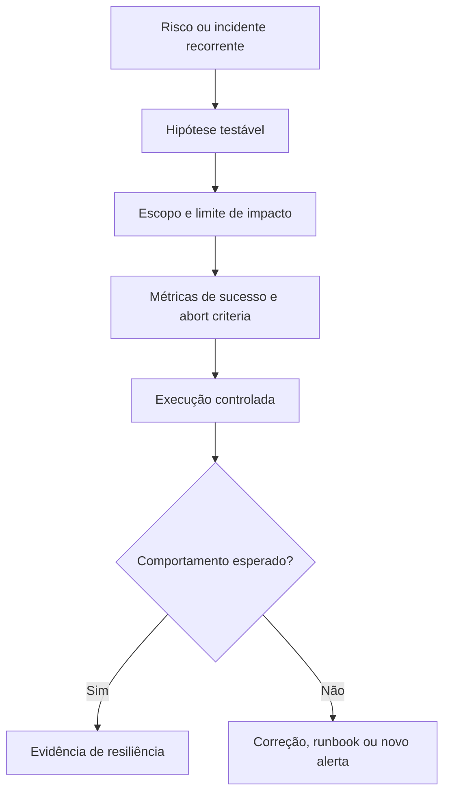

# Capítulo 11 - Testes voltados a confiabilidade

## Objetivos de aprendizagem

- Diferenciar testes funcionais, contrato, carga, rollback, desastre, sondas e chaos engineering.
- Planejar testes de confiabilidade com hipótese, escopo, métrica de sucesso e critério de abortar.
- Transformar incidentes reais em testes regressivos e validações de produção.

## Síntese

Confiabilidade exige testes além dos testes tradicionais de software. Em sistemas distribuídos, é necessário validar comportamento sob falhas, rollouts, integração, carga e recuperação. Testar em escala exige ambientes, ferramentas e sondas que aproximem o sistema das condições reais de produção.

Em uma frase: **Confiabilidade precisa ser testada em build, integração, produção controlada e cenários de desastre.**

## Por que isso importa

Testes tradicionais verificam lógica esperada, mas confiabilidade falha nas
bordas: dependência lenta, fila acumulada, retry excessivo, rollback quebrado,
schema incompatível, backup que não restaura, região indisponível ou sonda que
não representa o usuário. SRE testa essas condições antes que elas apareçam em
incidente real.

## Conceitos essenciais

### **testes tradicionais**

**Testes tradicionais** validam comportamento funcional: unidade, integração,
contrato e fluxo principal. Eles continuam necessários, mas não bastam para
provar confiabilidade sob falha.

Uma forma simples de aplicar isso é adicionar testes de comportamento sob
dependência indisponível, timeout e resposta inválida.

### **testes em produção**

**Testes em produção** validam o sistema real com escopo controlado. Podem usar
canários, sintéticos, shadow traffic, feature flags ou sondas. Eles exigem
limite de impacto, observabilidade e rollback.

No dia a dia, isso aparece quando a equipe precisa planejar um teste de rollback.

### **testes de desastre**

**Testes de desastre** verificam recuperação sob falhas graves: perda de zona,
restauração de backup, indisponibilidade de dependência crítica, perda de quorum
ou falha de pipeline. O objetivo é medir capacidade de resposta, não provar
coragem.

Esse conceito fica concreto quando a equipe consegue criar uma sonda de produção para fluxo crítico.

### **sondas**

**sondas**: São verificações ativas que simulam comportamentos importantes. Elas detectam problemas que métricas internas podem não revelar.

Uma forma simples de aplicar isso é: Adicionar testes de comportamento sob dependência indisponivel.

### **falha esperada em testes**

**Falha esperada em testes** é o comportamento aceitável quando algo quebra de
forma planejada. Um bom teste define antes o que deve acontecer: fallback,
degradação, erro claro, rollback, bloqueio de promoção ou abertura de alerta.

No dia a dia, isso aparece quando a equipe precisa planejar um teste de rollback.


## Aplicação prática

Use o `checkout-api` ou um serviço real e monte um plano de teste:

- Adicionar testes de comportamento sob dependência indisponível.
- Planejar um teste de rollback.
- Criar uma sonda de produção para fluxo crítico.
- Escrever hipótese, escopo, métrica de sucesso e critério de abortar.
- Definir quem pode iniciar, pausar e encerrar o teste.

Depois da ação, registre a evidência de melhoria: menos alertas irrelevantes,
recuperação mais rápida, dependência mais clara, deploy menos arriscado, métrica
mais confiável ou decisão mais fácil de explicar.

## Aprofundamento prático

Testes de confiabilidade validam comportamento sob falha, não apenas lógica feliz. Um serviço pode passar em testes unitários e falhar quando a dependência fica lenta, quando a fila atrasa, quando o banco retorna erro transitório ou quando rollback encontra schema incompatível.

Procedimento recomendado:

1. Liste dependências críticas e seus modos de falha: erro, latência, indisponibilidade, dado inválido.
2. Crie testes para timeout, retry, fallback, degradação e rollback.
3. Execute sondas de produção controladas para jornadas críticas.
4. Planeje testes de desastre com escopo pequeno e abort criteria.
5. Transforme incidentes reais em testes regressivos.

Exemplo de matriz:

| Falha simulada | Comportamento esperado | Sinal de aprovação |
| --- | --- | --- |
| Gateway lento | timeout e fallback | p95 limitado e erro controlado |
| Banco replica indisponível | leitura em rota alternativa | taxa de sucesso preservada |
| Deploy ruim | canário bloqueia promoção | rollback automático ou manual exercitado |

O teste útil precisa ter hipótese. "Vamos quebrar algo" é espetáculo; "vamos provar que checkout degrada sem derrubar catálogo" é engenharia.

Modelo de experimento:

```yaml
experiment: payment-provider-latency
hypothesis: "checkout mantém erro abaixo de 2% quando provedor de pagamento fica lento"
scope: "5% do tráfego canário por 20 minutos"
steady_state:
  - "checkout_success_rate >= 98%"
  - "p95 <= 1200ms"
abort_if:
  - "erro >= 5% por 5 minutos"
  - "fila de pagamentos cresce acima de 10000 mensagens"
rollback: "desativar flag payment_provider_fault"
owner: "SRE de plantão e time de checkout"
```

## Tradução para ferramentas modernas

**Ferramentas típicas:** k6, Locust, Playwright, Pact, LitmusChaos, Gremlin, Chaos Mesh, fault injection de service mesh e testes de restauração.

**Exemplo avançado:** antes de um lançamento crítico, teste dependência lenta, erro 503, rollback, schema incompatível, perda de zona e restauração de backup em ambiente controlado.

**Cuidado de projeto:** chaos engineering sem hipótese e critério de abortar vira demonstração arriscada, não engenharia.

## Diagrama de apoio



## Erros comuns

- Fazer chaos engineering sem hipótese e sem critério de abortar.
- Testar só caminho feliz e assumir que rollback funcionará.
- Executar teste de desastre sem comunicação e dono de decisão.
- Medir apenas CPU ou memória e ignorar experiência do usuário.
- Não transformar incidentes reais em testes regressivos.

## Perguntas para revisão

1. Que falha real do serviço ainda não tem teste?
2. Qual hipótese o experimento quer provar?
3. Qual sinal define sucesso e qual sinal manda abortar?
4. O rollback do teste já foi exercitado?
5. Que incidente passado deveria virar teste regressivo?

## Exercícios

### Compreensão

Explique a diferença entre teste funcional, teste de carga, teste de rollback,
teste de desastre e chaos engineering.

### Aplicação

Escreva um experimento para o `checkout-api` simulando dependência de pagamento
lenta, com hipótese, escopo, steady state, abort criteria e rollback.

### Análise

Avalie se um teste em produção é aceitável. Liste risco ao usuário, limite de
impacto, sinais de parada e comunicação necessária.

## Relação com práticas atuais

Rollouts graduais, canários, feature flags, testes de contrato, sintéticos,
fault injection e validações automatizadas reduzem o raio de impacto de
mudanças. A prática só funciona quando há métricas de saúde, critérios de
promoção, rollback exercitado e responsabilidade clara sobre o teste.

## Recursos complementares

- **Livro oficial online do Google SRE:** <https://sre.google/sre-book/>
- **The Site Reliability Workbook:** <https://sre.google/workbook/>
- **Google SRE Book - Testing for Reliability:** <https://sre.google/sre-book/testing-reliability/>
- **Site Reliability Workbook - Canarying Releases:** <https://sre.google/workbook/canarying-releases/>
- **Kubernetes Probes:** <https://kubernetes.io/docs/concepts/workloads/pods/probes/>
- **LitmusChaos:** <https://litmuschaos.io/docs/>

## Fechamento

Guarde a ideia principal: **Confiabilidade precisa ser testada em build, integração, produção controlada e cenários de desastre.**

Próximo: [Capítulo 12 - Engenharia de software em SRE](capitulo-12.md).

## Referências

- Beyer, B.; Jones, C.; Petoff, J.; Murphy, N. R. (eds.). **Site Reliability Engineering: How Google Runs Production Systems**. O'Reilly Media / Google, 2016. <https://sre.google/sre-book/>
- Beyer, B.; Murphy, N. R.; Rensin, D.; Kawahara, K.; Thorne, S. (eds.). **The Site Reliability Workbook**. O'Reilly Media / Google, 2018. <https://sre.google/workbook/>
- **Google SRE Book - Testing for Reliability:** <https://sre.google/sre-book/testing-reliability/>
- Kubernetes. **Liveness, Readiness, and Startup Probes**. <https://kubernetes.io/docs/concepts/workloads/pods/probes/>
- LitmusChaos. **Documentation**. <https://litmuschaos.io/docs/>
- **Google Cloud Well-Architected Framework:** <https://docs.cloud.google.com/architecture/framework>
- **AWS Well-Architected Reliability Pillar:** <https://docs.aws.amazon.com/wellarchitected/latest/reliability-pillar/welcome.html>
- PDF local usado como fonte primária em português: `../Engenharia de Confiabilidade do Google ( etc.).pdf`.
