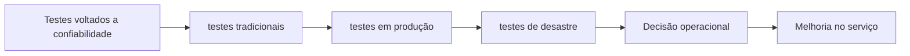

# Capítulo 11 - Testes voltados a confiabilidade

## Objetivos de aprendizagem

- Explicar o problema de confiabilidade tratado pelo tema.
- Reconhecer onde o tema aparece em um serviço real.
- Aplicar o conceito em uma decisão operacional ou de engenharia.

## Síntese

O capítulo amplia a visão de testes além dos testes tradicionais de software. Em sistemas distribuídos, e necessário validar comportamento sob falhas, rollouts, integração, carga e recuperação. Testar em escala exige ambientes, ferramentas e sondas que aproximem o sistema das condições reais de produção.

Em uma frase: **Confiabilidade precisa ser testada em build, integração, produção controlada e cenários de desastre.**

## Por que isso importa

**testes tradicionais** importa porque serviços reais falham sob mudança, carga, dependências lentas, estado distribuído e comportamento humano. A equipe reduz surpresa quando transforma esse risco em rotina operacional clara, sinais confiáveis e decisões treinadas antes da crise.

## Conceitos essenciais

### **testes tradicionais**

**testes tradicionais**: É uma forma controlada de descobrir se o sistema se comporta como esperado. Para confiabilidade, testes precisam incluir falhas, carga e recuperação.

Uma forma simples de aplicar isso é: Adicionar testes de comportamento sob dependência indisponivel.

### **testes em produção**

**testes em produção**: É uma forma controlada de descobrir se o sistema se comporta como esperado. Para confiabilidade, testes precisam incluir falhas, carga e recuperação.

No dia a dia, isso aparece quando a equipe precisa planejar um teste de rollback.

### **testes de desastre**

**testes de desastre**: É uma forma controlada de descobrir se o sistema se comporta como esperado. Para confiabilidade, testes precisam incluir falhas, carga e recuperação.

Esse conceito fica concreto quando a equipe consegue criar uma sonda de produção para fluxo crítico.

### **sondas**

**sondas**: São verificações ativas que simulam comportamentos importantes. Elas detectam problemas que métricas internas podem não revelar.

Uma forma simples de aplicar isso é: Adicionar testes de comportamento sob dependência indisponivel.

### **falha esperada em testes**

**falha esperada em testes**: É uma forma controlada de descobrir se o sistema se comporta como esperado. Para confiabilidade, testes precisam incluir falhas, carga e recuperação.

No dia a dia, isso aparece quando a equipe precisa planejar um teste de rollback.

## Aplicação prática

Para evitar burocracia, escolha um serviço concreto e execute uma ação pequena:

- Adicionar testes de comportamento sob dependência indisponivel.
- Planejar um teste de rollback.
- Criar uma sonda de produção para fluxo crítico.

Depois da ação, procure uma evidência simples de melhoria: menos alertas
irrelevantes, recuperação mais rápida, dependência mais clara, deploy menos
arriscado, métrica mais confiável ou decisão mais fácil de explicar.

## Diagrama de apoio

## Erros comuns

- Aplicar a prática como checklist sem conectar a risco real do serviço.
- Criar documentação ou automação sem validar durante incidentes ou mudanças reais.
- Medir apenas sinais internos e esquecer o impacto percebido pelo usuário.

## Perguntas para revisão

1. Qual risco operacional **testes tradicionais** ajuda a reduzir?
2. Que evidência mostraria que a prática foi aplicada com sucesso?
3. Como esse conceito mudaria uma decisão de release, plantão, arquitetura ou priorização?

## Exercícios

### Compreensão

Explique a ideia central em até cinco linhas, usando um serviço real como exemplo.

### Aplicação

Escolha um serviço real e execute uma das ações práticas.

### Análise

Liste duas formas de aplicar esse conceito de maneira superficial e explique o
risco de cada uma.

## Relação com práticas atuais

Rollouts graduais, canários, feature flags e validações automatizadas reduzem o raio de impacto de mudanças. A prática só funciona quando há métricas de saúde, critérios de promoção e rollback exercitado.

## Recursos complementares

- **Livro oficial online do Google SRE:** <https://sre.google/sre-book/>
- **The Site Reliability Workbook:** <https://sre.google/workbook/>
- **Google SRE Book - Testing for Reliability:** <https://sre.google/sre-book/testing-reliability/>
- **Site Reliability Workbook - Canarying Releases:** <https://sre.google/workbook/canarying-releases/>

## Fechamento

Guarde a ideia principal: **Confiabilidade precisa ser testada em build, integração, produção controlada e cenários de desastre.**

Próximo: [Capítulo 12 - Engenharia de software em SRE](capitulo-12.md).

## Referências

- Beyer, B.; Jones, C.; Petoff, J.; Murphy, N. R. (eds.). **Site Reliability Engineering: How Google Runs Production Systems**. O'Reilly Media / Google, 2016. <https://sre.google/sre-book/>
- Beyer, B.; Murphy, N. R.; Rensin, D.; Kawahara, K.; Thorne, S. (eds.). **The Site Reliability Workbook**. O'Reilly Media / Google, 2018. <https://sre.google/workbook/>
- **Google SRE Book - Testing for Reliability:** <https://sre.google/sre-book/testing-reliability/>
- **Google Cloud Well-Architected Framework:** <https://docs.cloud.google.com/architecture/framework>
- **AWS Well-Architected Reliability Pillar:** <https://docs.aws.amazon.com/wellarchitected/latest/reliability-pillar/welcome.html>
- PDF local usado como fonte primária em português: `../Engenharia de Confiabilidade do Google ( etc.).pdf`.
