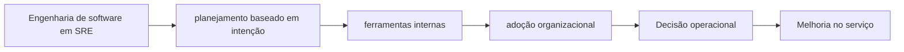

# Capítulo 12 - Engenharia de software em SRE

## Objetivos de aprendizagem

- Identificar como **planejamento baseado em intenção** aparece em produção.
- Aplicar o procedimento do tema em uma jornada, mudança, incidente ou dependência real.
- Produzir um artefato prático: métrica, política, checklist, runbook ou plano de melhoria.

## Síntese

Um exemplo importante usa um estudo de caso de planejamento de capacidade baseado em intenção para mostrar SRE como engenharia de software, não apenas operação. A equipe identifica um problema recorrente, modela requisitos, constrói ferramenta, promove adoção e aprende com dinâmicas organizacionais. O ponto central é reservar tempo e cultura para projetos de engenharia dentro de SRE.

Em uma frase: **SRE também constrói sistemas de software para resolver problemas operacionais estruturais.**

## Por que isso importa

**planejamento baseado em intenção** importa porque serviços reais falham sob mudança, carga, dependências lentas, estado distribuído e comportamento humano. A equipe reduz surpresa quando transforma esse risco em rotina operacional clara, sinais confiáveis e decisões treinadas antes da crise.

## Conceitos essenciais

### **planejamento baseado em intenção**

**planejamento baseado em intenção**: É transformar intenção, demanda e restrições em capacidade e ações. Em SRE, planejamento ruim vira incidente futuro.

Uma forma simples de aplicar isso é: Escolher um problema operacional que mereça produto interno.

### **ferramentas internas**

**ferramentas internas**: São produtos criados para reduzir esforço operacional recorrente. Elas precisam de adoção, manutenção e integração ao fluxo real da equipe.

No dia a dia, isso aparece quando a equipe precisa definir usuários e requisitos de uma ferramenta de SRE.

### **adoção organizacional**

**adoção organizacional**: É o uso efetivo da prática ou ferramenta pela organização. Sem adoção, a solução existe no repositório, mas não muda confiabilidade.

Esse conceito fica concreto quando a equipe consegue medir adoção e redução de carga após entrega.

### **tempo para desenvolvimento**

**tempo para desenvolvimento**: É uma prática que transforma uma preocupação operacional em decisão concreta. Ela aparece quando a equipe precisa escolher entre aceitar risco, automatizar, simplificar, melhorar observabilidade, mudar o processo de release ou corrigir a causa raiz de um problema recorrente.

Uma forma simples de aplicar isso é: Escolher um problema operacional que mereça produto interno.

### **cultura de engenharia**

**cultura de engenharia**: É uma prática que transforma uma preocupação operacional em decisão concreta. Ela aparece quando a equipe precisa escolher entre aceitar risco, automatizar, simplificar, melhorar observabilidade, mudar o processo de release ou corrigir a causa raiz de um problema recorrente.

No dia a dia, isso aparece quando a equipe precisa definir usuários e requisitos de uma ferramenta de SRE.


## Aplicação prática

Escolha um serviço concreto e transforme o tema em uma ação verificável:

- Escolher um problema operacional que mereça produto interno.
- Definir usuários e requisitos de uma ferramenta de SRE.
- Medir adoção e redução de carga após entrega.

Depois da ação, registre a evidência de melhoria: menos alertas irrelevantes,
recuperação mais rápida, dependência mais clara, deploy menos arriscado, métrica
mais confiável ou decisão mais fácil de explicar.

## Aprofundamento prático

SRE também constrói software. O estudo de caso de planejamento de capacidade baseado em intenção mostra uma lição transportável: ferramentas internas devem nascer de um problema operacional recorrente, não da vontade de criar plataforma. Uma ferramenta só reduz risco quando altera o fluxo real das equipes.

Procedimento recomendado:

1. Defina o usuário da ferramenta: SRE, desenvolvedor, gestor de capacidade ou plantão.
2. Escreva a decisão que a ferramenta precisa melhorar.
3. Modele entradas, validações, saídas e integrações.
4. Entregue um fluxo mínimo e acompanhe adoção.
5. Meça redução de toil, incidentes evitados ou tempo de planejamento.

Exemplo de contrato de intenção:

```yaml
service: recommendation
intent:
  expected_traffic_qps: 12000
  growth_30d: "25%"
  regions: ["sa-east1", "us-east1"]
  criticality: high
expected_output:
  recommended_capacity: true
  risks: true
  approvals: ["sre", "produto"]
```

A técnica de desenvolvimento importante é tratar a ferramenta como produto: documentação, testes, telemetria, suporte e backlog. Caso contrário, ela vira mais um sistema interno abandonado.

## Tradução para ferramentas modernas

**Ferramentas típicas:** Backstage, Port, Humanitec, internal developer platforms, catálogos de serviço, capacity planners, policy engines e workflow automation.

**Exemplo avançado:** construa uma ferramenta interna que receba intenção de crescimento, criticidade e regiões, calcule capacidade recomendada e abra mudanças controladas para revisão.

**Cuidado de projeto:** produto interno sem adoção, suporte e métricas vira mais um sistema a operar.

## Exemplos e ferramentas do livro

O estudo de caso de **planejamento de capacidade baseado em intenção** mostra
uma ferramenta interna nascida de uma decisão operacional recorrente. A
ferramenta não é o ponto principal; o ponto é transformar essa decisão em
produto de engenharia, com usuários, requisitos, validações, adoção e métricas
de resultado.

Em ambientes atuais, esse padrão aparece em portais internos de
desenvolvedores, plataformas de capacidade, catálogos de serviço,
autoscaling guiado por política, ferramentas de previsão de demanda e
workflows de aprovação automatizada.

## Diagrama de apoio



## Erros comuns

- Aplicar a prática como checklist sem conectar a risco real do serviço.
- Criar documentação ou automação sem validar durante incidentes ou mudanças reais.
- Medir apenas sinais internos e esquecer o impacto percebido pelo usuário.

## Perguntas para revisão

1. Qual risco operacional **planejamento baseado em intenção** ajuda a reduzir?
2. Que evidência mostraria que a prática foi aplicada com sucesso?
3. Como esse conceito mudaria uma decisão de release, plantão, arquitetura ou priorização?

## Exercícios

### Compreensão

Explique a ideia central em até cinco linhas, usando um serviço real como exemplo.

### Aplicação

Escolha um serviço real e execute uma das ações práticas.

### Análise

Liste duas formas de aplicar esse conceito de maneira superficial e explique o
risco de cada uma.

## Relação com práticas atuais

Em ambientes atuais, este tema aparece em revisões de serviço, plataformas internas, pipelines, dashboards, políticas de rollout e práticas de cloud native. A tecnologia muda; o princípio continua sendo tornar risco, responsabilidade e evidência visíveis.

## Recursos complementares

- **Livro oficial online do Google SRE:** <https://sre.google/sre-book/>
- **The Site Reliability Workbook:** <https://sre.google/workbook/>
- **Google SRE Book - Software Engineering in SRE:** <https://sre.google/sre-book/software-engineering-in-sre/>

## Fechamento

Guarde a ideia principal: **SRE também constrói sistemas de software para resolver problemas operacionais estruturais.**

Próximo: [Capítulo 13 - Distribuição de carga na borda e no datacenter](capitulo-13.md).

## Referências

- Beyer, B.; Jones, C.; Petoff, J.; Murphy, N. R. (eds.). **Site Reliability Engineering: How Google Runs Production Systems**. O'Reilly Media / Google, 2016. <https://sre.google/sre-book/>
- Beyer, B.; Murphy, N. R.; Rensin, D.; Kawahara, K.; Thorne, S. (eds.). **The Site Reliability Workbook**. O'Reilly Media / Google, 2018. <https://sre.google/workbook/>
- **Google SRE Book - Software Engineering in SRE:** <https://sre.google/sre-book/software-engineering-in-sre/>
- **Google Cloud Well-Architected Framework:** <https://docs.cloud.google.com/architecture/framework>
- **AWS Well-Architected Reliability Pillar:** <https://docs.aws.amazon.com/wellarchitected/latest/reliability-pillar/welcome.html>
- PDF local usado como fonte primária em português: `../Engenharia de Confiabilidade do Google ( etc.).pdf`.
