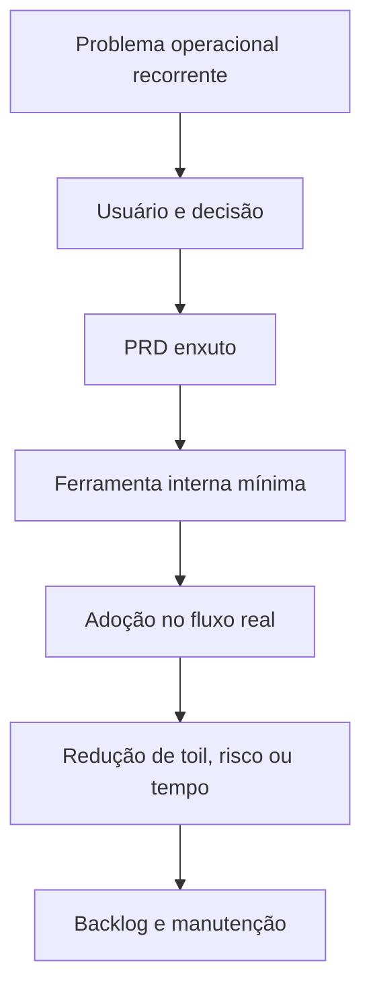

# Capítulo 12 - Engenharia de software em SRE

## Objetivos de aprendizagem

- Explicar quando um problema operacional merece uma solução de software.
- Tratar ferramentas internas de SRE como produtos com usuários, SLO, suporte e backlog.
- Escrever um PRD enxuto para uma ferramenta que reduz toil ou melhora decisão operacional.

## Síntese

Um exemplo importante usa um estudo de caso de planejamento de capacidade baseado em intenção para mostrar SRE como engenharia de software, não apenas operação. A equipe identifica um problema recorrente, modela requisitos, constrói ferramenta, promove adoção e aprende com dinâmicas organizacionais. O ponto central é reservar tempo e cultura para projetos de engenharia dentro de SRE.

Em uma frase: **SRE também constrói sistemas de software para resolver problemas operacionais estruturais.**

## Por que isso importa

Planejamento baseado em intenção importa porque ferramentas internas só geram
valor quando melhoram uma decisão real. Uma equipe pode criar automação bonita
e ainda assim não reduzir risco, se a ferramenta não tiver usuário claro,
entrada confiável, saída acionável e integração com o fluxo de trabalho.

SRE como engenharia de software significa escolher problemas operacionais
recorrentes e resolvê-los com produto interno sustentável, não com scripts sem
dono.

## Conceitos essenciais

### **planejamento baseado em intenção**

**planejamento baseado em intenção**: É transformar intenção, demanda e restrições em capacidade e ações. Em SRE, planejamento ruim vira incidente futuro.

Uma forma simples de aplicar isso é: Escolher um problema operacional que mereça produto interno.

### **ferramentas internas**

**ferramentas internas**: São produtos criados para reduzir esforço operacional recorrente. Elas precisam de adoção, manutenção e integração ao fluxo real da equipe.

No dia a dia, isso aparece quando a equipe precisa definir usuários e requisitos de uma ferramenta de SRE.

Uma ferramenta interna madura tem documentação, telemetria, suporte, ciclo de
vida, teste, ownership e SLO próprio. Se ela falha, alguém precisa saber quem é
afetado e como recuperar.

### **adoção organizacional**

**adoção organizacional**: É o uso efetivo da prática ou ferramenta pela organização. Sem adoção, a solução existe no repositório, mas não muda confiabilidade.

Esse conceito fica concreto quando a equipe consegue medir adoção e redução de carga após entrega.

### **tempo para desenvolvimento**

**tempo para desenvolvimento**: É a capacidade reservada para construir soluções duráveis, não apenas responder operação. Sem esse espaço, a equipe de SRE fica presa a tickets, plantão e correções temporárias.

Uma forma simples de aplicar isso é: Escolher um problema operacional que mereça produto interno.

### **cultura de engenharia**

**cultura de engenharia**: É o hábito de resolver causas sistêmicas com software, dados, revisão e manutenção contínua. Ela exige tratar ferramentas internas como produtos reais, com usuários, documentação, testes, telemetria e backlog.

No dia a dia, isso aparece quando a equipe precisa definir usuários e requisitos de uma ferramenta de SRE.


## Aplicação prática

Escolha um problema recorrente do `checkout-api` ou de um serviço real e escreva
um PRD enxuto:

- Escolher um problema operacional que mereça produto interno.
- Definir usuários e requisitos de uma ferramenta de SRE.
- Medir adoção e redução de carga após entrega.
- Definir SLO da ferramenta, suporte, riscos e custo de manutenção.
- Explicar qual decisão operacional fica melhor com a ferramenta.

Depois da ação, registre a evidência de melhoria: menos alertas irrelevantes,
recuperação mais rápida, dependência mais clara, deploy menos arriscado, métrica
mais confiável ou decisão mais fácil de explicar.

## Aprofundamento prático

SRE também constrói software. O estudo de caso de planejamento de capacidade baseado em intenção mostra uma lição transportável: ferramentas internas devem nascer de um problema operacional recorrente, não da vontade de criar plataforma. Uma ferramenta só reduz risco quando altera o fluxo real das equipes.

Procedimento recomendado:

1. Defina o usuário da ferramenta: SRE, desenvolvedor, gestor de capacidade ou plantão.
2. Escreva a decisão que a ferramenta precisa melhorar.
3. Modele entradas, validações, saídas e integrações.
4. Entregue um fluxo mínimo e acompanhe adoção.
5. Meça redução de toil, incidentes evitados ou tempo de planejamento.

Exemplo de contrato de intenção:

```yaml
service: recommendation
intent:
  expected_traffic_qps: 12000
  growth_30d: "25%"
  regions: ["sa-east1", "us-east1"]
  criticality: high
expected_output:
  recommended_capacity: true
  risks: true
  approvals: ["sre", "produto"]
```

A técnica de desenvolvimento importante é tratar a ferramenta como produto: documentação, testes, telemetria, suporte e backlog. Caso contrário, ela vira mais um sistema interno abandonado.

Modelo de PRD enxuto:

| Campo | Pergunta |
| --- | --- |
| Usuário | Quem usa a ferramenta e em que momento? |
| Problema | Que risco, toil ou decisão ruim ela reduz? |
| Decisão melhorada | O que a pessoa decidirá melhor depois da ferramenta? |
| Entrada | Quais dados ou intenções são necessários? |
| Saída | Que recomendação, automação ou evidência será entregue? |
| SLO da ferramenta | Qual disponibilidade, latência ou frescor ela precisa ter? |
| Métrica de adoção | Como saberemos que ela entrou no fluxo real? |
| Custo de manutenção | Quem mantém e qual dívida operacional ela cria? |

## Tradução para ferramentas modernas

**Ferramentas típicas:** Backstage, Port, Humanitec, internal developer platforms, catálogos de serviço, capacity planners, policy engines e workflow automation.

**Exemplo avançado:** construa uma ferramenta interna que receba intenção de crescimento, criticidade e regiões, calcule capacidade recomendada e abra mudanças controladas para revisão.

**Cuidado de projeto:** produto interno sem adoção, suporte e métricas vira mais um sistema a operar.

## Exemplos e ferramentas do livro

O estudo de caso de **planejamento de capacidade baseado em intenção** mostra
uma ferramenta interna nascida de uma decisão operacional recorrente. A
ferramenta não é o ponto principal; o ponto é transformar essa decisão em
produto de engenharia, com usuários, requisitos, validações, adoção e métricas
de resultado.

Em ambientes atuais, esse padrão aparece em portais internos de
desenvolvedores, plataformas de capacidade, catálogos de serviço,
autoscaling guiado por política, ferramentas de previsão de demanda e
workflows de aprovação automatizada.

## Diagrama de apoio



## Erros comuns

- Criar ferramenta porque a tecnologia é interessante, não porque há problema recorrente.
- Entregar portal interno sem medir adoção.
- Não definir suporte, ownership e SLO da própria ferramenta.
- Automatizar decisão que ainda não foi entendida.
- Criar produto interno que reduz toil de um time e aumenta toil de outro.

## Perguntas para revisão

1. Que problema operacional se repete com frequência suficiente para merecer software?
2. Quem é o usuário da ferramenta e que decisão ele precisa tomar?
3. Que métrica provará adoção real?
4. Qual SLO a ferramenta interna precisa cumprir?
5. Que custo de manutenção a solução cria?

## Exercícios

### Compreensão

Explique por que ferramenta interna deve ser tratada como produto, não apenas
como script.

### Aplicação

Escreva um PRD enxuto para uma ferramenta que recomende capacidade do
`checkout-api` a partir de tráfego esperado, criticidade e histórico de SLO.

### Análise

Avalie uma ferramenta interna existente: qual decisão ela melhora, qual é sua
adoção real e qual toil ela criou ou removeu?

## Relação com práticas atuais

Em ambientes atuais, esse tema aparece em platform engineering, portais internos,
catálogos de serviço, fluxos self-service, policy engines e workflow automation.
A métrica relevante não é quantidade de ferramentas criadas; é redução de toil,
maior autonomia, menor tempo de entrega, melhor decisão operacional e satisfação
dos usuários da plataforma.

## Recursos complementares

- **Livro oficial online do Google SRE:** <https://sre.google/sre-book/>
- **The Site Reliability Workbook:** <https://sre.google/workbook/>
- **Google SRE Book - Software Engineering in SRE:** <https://sre.google/sre-book/software-engineering-in-sre/>
- **DORA - Platform Engineering:** <https://dora.dev/capabilities/platform-engineering/>
- **Backstage:** <https://backstage.io/docs/overview/what-is-backstage>

## Fechamento

Guarde a ideia principal: **SRE também constrói sistemas de software para resolver problemas operacionais estruturais.**

Próximo: [Capítulo 13 - Distribuição de carga na borda e no datacenter](capitulo-13.md).

## Referências

- Beyer, B.; Jones, C.; Petoff, J.; Murphy, N. R. (eds.). **Site Reliability Engineering: How Google Runs Production Systems**. O'Reilly Media / Google, 2016. <https://sre.google/sre-book/>
- Beyer, B.; Murphy, N. R.; Rensin, D.; Kawahara, K.; Thorne, S. (eds.). **The Site Reliability Workbook**. O'Reilly Media / Google, 2018. <https://sre.google/workbook/>
- **Google SRE Book - Software Engineering in SRE:** <https://sre.google/sre-book/software-engineering-in-sre/>
- DORA. **Platform Engineering Capability**. <https://dora.dev/capabilities/platform-engineering/>
- Backstage. **What is Backstage?** <https://backstage.io/docs/overview/what-is-backstage>
- **Google Cloud Well-Architected Framework:** <https://docs.cloud.google.com/architecture/framework>
- **AWS Well-Architected Reliability Pillar:** <https://docs.aws.amazon.com/wellarchitected/latest/reliability-pillar/welcome.html>
- PDF local usado como fonte primária em português: `../Engenharia de Confiabilidade do Google ( etc.).pdf`.
