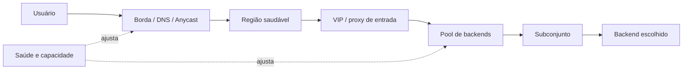

# Capítulo 13 - Distribuição de carga na borda e no datacenter

## Objetivos de aprendizagem

- Explicar como **balanceamento de carga** protege experiência do usuário e capacidade interna.
- Relacionar borda, entrada de tráfego, backends, saúde e topologia.
- Avaliar decisões de roteamento com base em latência, capacidade, falha e sobrecarga.

## Síntese

Distribuição de carga não é apenas dividir requisições igualmente. Na borda, o sistema precisa levar usuários a pontos de entrada saudáveis, próximos e capazes. Dentro do datacenter, clientes e proxies precisam escolher backends considerando saúde, custo, conexões, subconjuntos e sinais de saturação. O objetivo é usar capacidade disponível sem concentrar risco em uma região, VIP, proxy ou conjunto pequeno de instâncias.

Em uma frase: **balanceamento confiável direciona tráfego para destinos saudáveis, próximos e capazes, da borda aos backends internos**.

## Por que isso importa

Uma requisição real atravessa várias decisões de roteamento. Se a borda ignora falha regional, usuários continuam indo para um destino ruim. Se o balanceamento interno ignora saúde ou saturação, o sistema amplifica latência, erros e cascatas. A confiabilidade melhora quando cada camada conhece seus sinais e limita o impacto de destinos degradados.

## Conceitos essenciais

### **Balanceamento global**

**Balanceamento global** decide para onde enviar usuários antes de a requisição entrar no serviço. DNS, anycast, endereços virtuais e proxies globais podem considerar proximidade, disponibilidade regional, capacidade e políticas de failover.

O objetivo não é achar o caminho perfeito para cada requisição; é evitar decisões obviamente ruins em escala.

### **Entrada de tráfego**

Pontos de entrada como **VIPs**, load balancers e proxies precisam absorver volume, terminar conexões, aplicar políticas e encaminhar tráfego sem se tornarem gargalos invisíveis.

Falhas nessa camada costumam parecer falha total do serviço, mesmo quando os backends estão saudáveis.

### **Saúde e capacidade**

**Sinais de saúde** indicam se um destino pode receber tráfego. **Sinais de capacidade** indicam quanto tráfego ele deve receber. Um backend vivo pode estar lento, saturado ou incapaz de atender uma classe específica de requisição.

Balanceamento maduro usa esses sinais para reduzir exposição, não apenas para remover instâncias mortas.

### **Subconjuntos de backends**

**Subconjuntos** reduzem custo de conexão e complexidade quando há muitos backends. Em vez de cada cliente falar com todos, cada cliente escolhe um conjunto limitado e bem distribuído.

Subconjuntos mal desenhados podem concentrar carga. A escolha precisa preservar diversidade suficiente para resistir a falhas.

### **Políticas de escolha**

Round robin, pesos, least-loaded e políticas adaptativas são ferramentas. A escolha correta depende de custo por requisição, variância de latência, precisão dos sinais e risco de reação exagerada.

Políticas muito reativas podem oscilar. Políticas muito estáticas podem manter tráfego em destinos ruins.

### **Interação com sobrecarga**

Balanceamento e sobrecarga estão ligados. Quando uma camada tenta "fugir" de instâncias lentas sem limites, pode empurrar carga para destinos ainda saudáveis e derrubá-los também.

Por isso, decisões de roteamento precisam conversar com throttling, prioridades, rejeição explícita e degradação.

## Aplicação prática

Desenhe o caminho de uma requisição crítica:

- Identifique decisões de roteamento na borda, entre regiões e dentro do datacenter.
- Liste quais sinais de saúde e capacidade cada camada usa.
- Verifique se uma região degradada deixa de receber tráfego automaticamente.
- Avalie se clientes internos falam com todos os backends ou com subconjuntos.
- Defina o comportamento esperado quando metade dos backends fica lenta.

## Aprofundamento prático

Balanceamento de carga precisa decidir para onde enviar tráfego quando tudo está saudável e, principalmente, quando algo degrada. O livro separa borda e datacenter; em ambientes atuais, pense em DNS ou Anycast, load balancer gerenciado, ingress, gateway, service mesh e cliente interno.

Procedimento recomendado:

1. Desenhe todas as decisões de roteamento da requisição.
2. Registre health checks, pesos, failover e drenagem de conexão.
3. Verifique se saúde significa "responde rápido e corretamente", não apenas "processo vivo".
4. Teste uma região lenta, uma zona indisponível e um subconjunto de backends degradado.
5. Observe se failover causa sobrecarga no destino restante.

Exemplo de política:

```yaml
load_balancing:
  health_check: "/ready"
  remove_se:
    erro_5xx: "> 5% por 5m"
    latencia_p95: "> 1000ms por 10m"
  drenagem_conexao: 60s
  failover_regional: "somente se capacidade_destino >= demanda_estimada"
```

O ponto prático é evitar roteamento cego. Um backend vivo, mas saturado, pode ser pior do que um backend explicitamente removido do pool.

## Diagrama de apoio



## Erros comuns

- Balancear apenas por quantidade de requisições, ignorando custo e latência.
- Remover instâncias somente quando estão mortas, não quando estão degradadas.
- Criar pools de conexão amplos demais sem necessidade.
- Deixar failover regional depender de intervenção manual.
- Usar política adaptativa sem entender oscilação e realimentação.

## Perguntas para revisão

1. Qual camada decide o primeiro destino de uma requisição de usuário?
2. Que sinal remove ou reduz tráfego para um backend lento, mas ainda vivo?
3. Como o balanceamento evita transformar degradação parcial em falha ampla?

## Exercícios

### Compreensão

Explique a diferença entre balanceamento na borda e balanceamento interno entre backends.

### Aplicação

Mapeie um serviço real e indique onde existem DNS, VIPs, proxies, pools e políticas de escolha.

### Análise

Descreva o que aconteceria se uma região ficasse com latência alta, mas sem falhar completamente.

## Relação com práticas atuais

Em ambientes cloud native, essas decisões aparecem em load balancers gerenciados, service mesh, ingress controllers, gateways globais, health checks, circuit breakers e políticas de roteamento por região. A tecnologia varia, mas a pergunta central permanece: cada camada sabe para onde enviar tráfego quando parte do sistema degrada?

## Recursos complementares

- **Google SRE Book - Load Balancing at the Frontend:** <https://sre.google/sre-book/load-balancing-frontend/>
- **Google SRE Book - Load Balancing in the Datacenter:** <https://sre.google/sre-book/load-balancing-datacenter/>
- **AWS Well-Architected Reliability Pillar:** <https://docs.aws.amazon.com/wellarchitected/latest/reliability-pillar/welcome.html>
- **Google Cloud Architecture Framework:** <https://docs.cloud.google.com/architecture/framework>

## Fechamento

Guarde a ideia principal: **distribuição de carga é uma sequência de decisões de confiabilidade, não apenas um algoritmo de divisão de tráfego**.

Próximo: [Capítulo 14 - Sobrecarga, retentativas e falhas em cascata](capitulo-14.md).

## Referências

- Beyer, B.; Jones, C.; Petoff, J.; Murphy, N. R. (eds.). **Site Reliability Engineering: How Google Runs Production Systems**. O'Reilly Media / Google, 2016. <https://sre.google/sre-book/>
- Beyer, B.; Murphy, N. R.; Rensin, D.; Kawahara, K.; Thorne, S. (eds.). **The Site Reliability Workbook**. O'Reilly Media / Google, 2018. <https://sre.google/workbook/>
- Google SRE. **Load Balancing at the Frontend**. <https://sre.google/sre-book/load-balancing-frontend/>
- Google SRE. **Load Balancing in the Datacenter**. <https://sre.google/sre-book/load-balancing-datacenter/>
- PDF local usado como fonte primária em português: `../Engenharia de Confiabilidade do Google ( etc.).pdf`.
