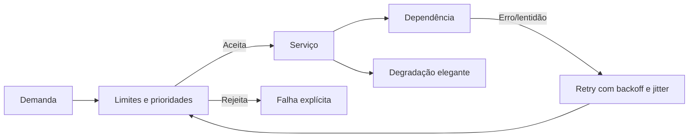

# Capítulo 14 - Sobrecarga, retentativas e falhas em cascata

## Objetivos de aprendizagem

- Explicar como **sobrecarga** pode evoluir para **falha em cascata**.
- Aplicar limites, throttling, prioridades, timeouts, backoff e jitter.
- Projetar degradação explícita para proteger dependências críticas.

## Síntese

Sobrecarga acontece quando a demanda real supera a capacidade útil do sistema. Falhas em cascata acontecem quando respostas locais a esse problema, como retries agressivos, filas sem limite e clientes insistentes, empurram mais carga para dependências já degradadas. SRE trata esses temas juntos porque a prevenção depende de limites claros, rejeição explícita, prioridades, timeouts coerentes, **backoff com jitter** e degradação elegante.

Em uma frase: **um sistema confiável rejeita, reduz ou degrada trabalho antes que a sobrecarga derrube dependências em cadeia**.

## Por que isso importa

Capacidade não é apenas queries por segundo. Duas requisições podem ter custos muito diferentes; um cliente pode consumir recursos desproporcionais; uma fila pode esconder saturação até ser tarde demais. Quando cada componente tenta se salvar sozinho, o efeito combinado pode derrubar o ecossistema inteiro.

## Conceitos essenciais

### **Capacidade real**

**Capacidade real** considera CPU, memória, I/O, conexões, locks, filas, dependências e custo por tipo de requisição. Um serviço pode parecer saudável em média e ainda falhar para uma jornada crítica.

Medir apenas volume costuma esconder saturação. É preciso observar utilização, latência, erros, fila e custo por cliente ou operação.

### **Limites e throttling**

**Limites** definem quanto trabalho será aceito. **Throttling** reduz ou bloqueia demanda antes que o serviço colapse. Esses mecanismos protegem o sistema e tornam o fracasso explícito.

Rejeitar carga de forma controlada é melhor do que aceitar tudo e falhar lentamente para todos.

### **Prioridades**

Nem todo tráfego tem a mesma importância. **Prioridades** permitem preservar operações críticas quando recursos ficam escassos. Requisições administrativas, recomputações, tarefas em lote e fluxos de usuário podem receber tratamentos diferentes.

Sem prioridade, o sistema pode gastar capacidade salvando trabalho secundário enquanto a experiência principal degrada.

### **Retries, backoff e jitter**

**Retries** recuperam falhas transitórias, mas também podem amplificar carga. **Backoff exponencial** aumenta o intervalo entre tentativas; **jitter** espalha as tentativas para evitar ondas sincronizadas.

Retries sem orçamento, sem deadline e sem jitter são uma causa clássica de cascata.

### **Timeouts e filas**

**Timeouts** limitam espera; filas absorvem variação. Os dois precisam ser dimensionados com cuidado. Timeout longo demais prende recursos; curto demais gera retries desnecessários. Fila sem limite transforma atraso em explosão de trabalho acumulado.

O objetivo é falhar cedo quando continuar esperando piora a saúde geral.

### **Degradação elegante**

**Degradação elegante** preserva partes essenciais do serviço quando dependências ou capacidade não estão saudáveis. Exemplos incluem reduzir qualidade de resposta, desativar recursos secundários, servir cache, limitar recomendações ou pausar processamento não crítico.

Degradação deve ser planejada antes do incidente. Improvisar o que desligar durante a crise aumenta risco.

## Aplicação prática

Revise uma dependência crítica do serviço:

- Liste clientes, tipos de requisição e custo aproximado de cada operação.
- Defina limites por cliente ou por classe de tráfego.
- Verifique se retries têm deadline, backoff e jitter.
- Identifique filas sem limite ou sem métrica de idade.
- Escolha um modo de degradação que preserve a jornada principal do usuário.

## Diagrama de apoio

## Erros comuns

- Medir capacidade apenas por QPS médio.
- Fazer retry sem deadline, limite ou jitter.
- Usar filas ilimitadas para esconder saturação.
- Tratar todo tráfego como igualmente crítico.
- Preferir falha lenta e global a rejeição rápida e explícita.

## Perguntas para revisão

1. Que comportamento do cliente poderia amplificar uma falha parcial?
2. Qual tráfego deve ser preservado quando o sistema está saturado?
3. Que limite impede um cliente ou job de derrubar uma dependência compartilhada?

## Exercícios

### Compreensão

Explique por que retries podem melhorar disponibilidade em um caso e causar falha em cascata em outro.

### Aplicação

Desenhe uma política de retry com timeout, deadline, backoff, jitter e limite de tentativas.

### Análise

Escolha um fluxo crítico e defina uma estratégia de degradação que mantenha o serviço parcialmente útil.

## Relação com práticas atuais

Esses controles aparecem em API gateways, service mesh, SDKs de clientes, filas, circuit breakers, políticas de rate limit e mecanismos de autoscaling. Autoscaling ajuda, mas não substitui limites: capacidade nova pode chegar tarde, depender de recursos compartilhados ou amplificar custo durante um evento de carga.

## Recursos complementares

- **Google SRE Book - Handling Overload:** <https://sre.google/sre-book/handling-overload/>
- **Google SRE Book - Addressing Cascading Failures:** <https://sre.google/sre-book/addressing-cascading-failures/>
- **Google Cloud Architecture Framework:** <https://docs.cloud.google.com/architecture/framework>
- **AWS Well-Architected Reliability Pillar:** <https://docs.aws.amazon.com/wellarchitected/latest/reliability-pillar/welcome.html>

## Fechamento

Guarde a ideia principal: **sobrecarga controlada é uma decisão de design; cascata é o preço de deixar cada componente reagir sem limites**.

Próximo: [Capítulo 15 - Administrando estados críticos: consenso distribuído para confiabilidade](capitulo-15.md).

## Referências

- Beyer, B.; Jones, C.; Petoff, J.; Murphy, N. R. (eds.). **Site Reliability Engineering: How Google Runs Production Systems**. O'Reilly Media / Google, 2016. <https://sre.google/sre-book/>
- Beyer, B.; Murphy, N. R.; Rensin, D.; Kawahara, K.; Thorne, S. (eds.). **The Site Reliability Workbook**. O'Reilly Media / Google, 2018. <https://sre.google/workbook/>
- Google SRE. **Handling Overload**. <https://sre.google/sre-book/handling-overload/>
- Google SRE. **Addressing Cascading Failures**. <https://sre.google/sre-book/addressing-cascading-failures/>
- PDF local usado como fonte primária em português: `../Engenharia de Confiabilidade do Google ( etc.).pdf`.
