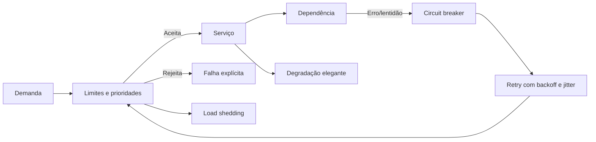

# Capítulo 14 - Sobrecarga, retentativas e falhas em cascata

## Objetivos de aprendizagem

- Explicar como **sobrecarga** pode evoluir para **falha em cascata**.
- Aplicar limites, throttling, prioridades, timeouts, backoff e jitter.
- Projetar degradação explícita para proteger dependências críticas.

## Síntese

Sobrecarga acontece quando a demanda real supera a capacidade útil do sistema. Falhas em cascata acontecem quando respostas locais a esse problema, como retries agressivos, filas sem limite e clientes insistentes, empurram mais carga para dependências já degradadas. SRE trata esses temas juntos porque a prevenção depende de limites claros, rejeição explícita, prioridades, timeouts coerentes, **backoff com jitter** e degradação elegante.

Em uma frase: **um sistema confiável rejeita, reduz ou degrada trabalho antes que a sobrecarga derrube dependências em cadeia**.

## Por que isso importa

Capacidade não é apenas queries por segundo. Duas requisições podem ter custos muito diferentes; um cliente pode consumir recursos desproporcionais; uma fila pode esconder saturação até ser tarde demais. Quando cada componente tenta se salvar sozinho, o efeito combinado pode derrubar o ecossistema inteiro.

## Conceitos essenciais

### **Capacidade real**

**Capacidade real** considera CPU, memória, I/O, conexões, locks, filas, dependências e custo por tipo de requisição. Um serviço pode parecer saudável em média e ainda falhar para uma jornada crítica.

Medir apenas volume costuma esconder saturação. É preciso observar utilização, latência, erros, fila e custo por cliente ou operação.

### **Limites e throttling**

**Limites** definem quanto trabalho será aceito. **Throttling** reduz ou bloqueia demanda antes que o serviço colapse. Esses mecanismos protegem o sistema e tornam o fracasso explícito.

Rejeitar carga de forma controlada é melhor do que aceitar tudo e falhar lentamente para todos.

### **Prioridades**

Nem todo tráfego tem a mesma importância. **Prioridades** permitem preservar operações críticas quando recursos ficam escassos. Requisições administrativas, recomputações, tarefas em lote e fluxos de usuário podem receber tratamentos diferentes.

Sem prioridade, o sistema pode gastar capacidade salvando trabalho secundário enquanto a experiência principal degrada.

### **Retries, backoff e jitter**

**Retries** recuperam falhas transitórias, mas também podem amplificar carga. **Backoff exponencial** aumenta o intervalo entre tentativas; **jitter** espalha as tentativas para evitar ondas sincronizadas.

Retries sem orçamento, sem deadline e sem jitter são uma causa clássica de cascata.

### **Timeouts e filas**

**Timeouts** limitam espera; filas absorvem variação. Os dois precisam ser dimensionados com cuidado. Timeout longo demais prende recursos; curto demais gera retries desnecessários. Fila sem limite transforma atraso em explosão de trabalho acumulado.

O objetivo é falhar cedo quando continuar esperando piora a saúde geral.

### **Degradação elegante**

**Degradação elegante** preserva partes essenciais do serviço quando dependências ou capacidade não estão saudáveis. Exemplos incluem reduzir qualidade de resposta, desativar recursos secundários, servir cache, limitar recomendações ou pausar processamento não crítico.

Degradação deve ser planejada antes do incidente. Improvisar o que desligar durante a crise aumenta risco.

### **Circuit breakers e bulkheads**

**Circuit breakers** interrompem chamadas para uma dependência quando sinais de
erro ou latência indicam que insistir só aumentaria a falha. **Bulkheads**
isolam recursos por cliente, operação ou dependência para que uma parte
degradada não consuma toda a capacidade compartilhada.

Esses padrões não substituem SLO, timeout ou retry bem configurado. Eles são
defesas adicionais para limitar raio de impacto.

### **Load shedding**

**Load shedding** é descartar ou rejeitar trabalho deliberadamente quando aceitar
mais requisições colocaria o serviço em estado pior. Ele deve preservar tráfego
crítico e rejeitar primeiro trabalho de menor valor, como recomputações,
consultas caras ou tarefas em lote.

## Aplicação prática

Revise uma dependência crítica do serviço:

- Liste clientes, tipos de requisição e custo aproximado de cada operação.
- Defina limites por cliente ou por classe de tráfego.
- Verifique se retries têm deadline, backoff e jitter.
- Identifique filas sem limite ou sem métrica de idade.
- Escolha um modo de degradação que preserve a jornada principal do usuário.
- Defina circuit breaker, bulkhead ou load shedding onde uma dependência compartilhada pode derrubar o serviço.

## Aprofundamento prático

Sobrecarga e cascata são problemas de contrato entre cliente e servidor. Se o servidor fica lento e o cliente faz retries agressivos, a falha local vira amplificação. A configuração correta define timeout, deadline total, tentativas, backoff, jitter, limite por cliente e resposta explícita de overload.

Procedimento recomendado:

1. Defina deadline total da operação a partir do SLO.
2. Configure timeout menor que o deadline, deixando tempo para fallback ou resposta.
3. Limite tentativas e use backoff exponencial com jitter.
4. Rejeite carga com código claro, como 429 ou 503, quando o serviço estiver saturado.
5. Separe tráfego crítico de tarefas em lote ou recomputações.

Exemplo de política de cliente:

```yaml
chamada: obter_autorizacao
deadline_total: 1200ms
timeout_por_tentativa: 350ms
max_tentativas: 2
backoff: exponencial
jitter: true
retry_em: ["timeout", "503"]
do_not_retry_on: ["400", "401", "409"]
```

Uma boa regra: se todos os clientes repetirem ao mesmo tempo, a dependência deve continuar protegida. Se isso não for verdade, a política ainda está perigosa.

Teste de retry storm:

| Cenário | O que medir |
| --- | --- |
| Retries sem jitter | Pico de tráfego, erro, p99 e saturação da dependência. |
| Retries com jitter | Distribuição das tentativas e tempo de recuperação. |
| Circuit breaker aberto | Redução de chamadas à dependência e qualidade da resposta degradada. |
| Load shedding ativo | Taxa de rejeição explícita e preservação da jornada principal. |

## Tradução para ferramentas modernas

**Ferramentas típicas:** Envoy, Istio, Linkerd, Resilience4j, Polly, rate limiters, API gateways, filas com DLQ e circuit breakers.

**Exemplo avançado:** defina política de cliente com deadline total, timeout por tentativa, máximo de retries, backoff exponencial, jitter, circuit breaker e limite por cliente.

**Cuidado de projeto:** retries sem orçamento e sem jitter são uma das formas mais rápidas de transformar falha parcial em cascata.

## Diagrama de apoio



## Erros comuns

- Medir capacidade apenas por QPS médio.
- Fazer retry sem deadline, limite ou jitter.
- Usar filas ilimitadas para esconder saturação.
- Tratar todo tráfego como igualmente crítico.
- Compartilhar o mesmo pool de recursos entre tráfego crítico e tarefas baratas de derrubar.
- Manter circuit breaker que abre, mas não tem resposta degradada planejada.
- Preferir falha lenta e global a rejeição rápida e explícita.

## Perguntas para revisão

1. Que comportamento do cliente poderia amplificar uma falha parcial?
2. Qual tráfego deve ser preservado quando o sistema está saturado?
3. Que limite impede um cliente ou job de derrubar uma dependência compartilhada?

## Exercícios

### Compreensão

Explique por que retries podem melhorar disponibilidade em um caso e causar falha em cascata em outro.

### Aplicação

Desenhe uma política de retry com timeout, deadline, backoff, jitter e limite de tentativas.

### Análise

Escolha um fluxo crítico e defina uma estratégia de degradação que mantenha o serviço parcialmente útil.

### Teste

Compare duas políticas para o `checkout-api`: retries sem jitter e retries com
jitter. Descreva o impacto esperado em erro, latência, fila e saturação da
dependência de pagamento.

## Relação com práticas atuais

Esses controles aparecem em API gateways, service mesh, SDKs de clientes, filas, circuit breakers, políticas de rate limit e mecanismos de autoscaling. Autoscaling ajuda, mas não substitui limites: capacidade nova pode chegar tarde, depender de recursos compartilhados ou amplificar custo durante um evento de carga.

Em serviços com custo variável alto, como inferência de IA ou chamadas a APIs
externas pagas, load shedding e rate limits também protegem orçamento. FinOps e
SRE se encontram quando uma política evita que uma degradação vire tanto
incidente quanto explosão de custo.

## Recursos complementares

- **Google SRE Book - Handling Overload:** <https://sre.google/sre-book/handling-overload/>
- **Google SRE Book - Addressing Cascading Failures:** <https://sre.google/sre-book/addressing-cascading-failures/>
- **Google Cloud Architecture Framework:** <https://docs.cloud.google.com/architecture/framework>
- **AWS Well-Architected Reliability Pillar:** <https://docs.aws.amazon.com/wellarchitected/latest/reliability-pillar/welcome.html>
- **Envoy - Outlier Detection:** <https://www.envoyproxy.io/docs/envoy/latest/intro/arch_overview/upstream/outlier>
- **FinOps Framework:** <https://www.finops.org/framework/>

## Fechamento

Guarde a ideia principal: **sobrecarga controlada é uma decisão de design; cascata é o preço de deixar cada componente reagir sem limites**.

Próximo: [Capítulo 15 - Administrando estados críticos: consenso distribuído para confiabilidade](capitulo-15.md).

## Referências

- Beyer, B.; Jones, C.; Petoff, J.; Murphy, N. R. (eds.). **Site Reliability Engineering: How Google Runs Production Systems**. O'Reilly Media / Google, 2016. <https://sre.google/sre-book/>
- Beyer, B.; Murphy, N. R.; Rensin, D.; Kawahara, K.; Thorne, S. (eds.). **The Site Reliability Workbook**. O'Reilly Media / Google, 2018. <https://sre.google/workbook/>
- Google SRE. **Handling Overload**. <https://sre.google/sre-book/handling-overload/>
- Google SRE. **Addressing Cascading Failures**. <https://sre.google/sre-book/addressing-cascading-failures/>
- Envoy. **Outlier detection**. <https://www.envoyproxy.io/docs/envoy/latest/intro/arch_overview/upstream/outlier>
- FinOps Foundation. **FinOps Framework**. <https://www.finops.org/framework/>
- PDF local usado como fonte primária em português: `../Engenharia de Confiabilidade do Google ( etc.).pdf`.
