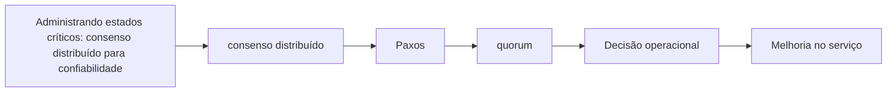

# Capítulo 15 - Administrando estados críticos: consenso distribuído para confiabilidade

## Objetivos de aprendizagem

- Identificar como **consenso distribuído** aparece em produção.
- Aplicar o procedimento do tema em uma jornada, mudança, incidente ou dependência real.
- Produzir um artefato prático: métrica, política, checklist, runbook ou plano de melhoria.

## Síntese

Consenso distribuído é necessário para locks, eleição de líder, configurações, filas confiáveis e máquinas de estado replicadas. Protocolos como Paxos permitem coordenar decisões apesar de falhas, mas trazem custo de latência, quorum, localização de réplicas e monitoração cuidadosa. A confiabilidade do estado depende tanto do algoritmo quanto da implantação.

Em uma frase: **Estado crítico em sistemas distribuídos exige consenso para evitar split-brain e decisões conflitantes.**

## Por que isso importa

**consenso distribuído** importa porque serviços reais falham sob mudança, carga, dependências lentas, estado distribuído e comportamento humano. A equipe reduz surpresa quando transforma esse risco em rotina operacional clara, sinais confiáveis e decisões treinadas antes da crise.

## Conceitos essenciais

### **consenso distribuído**

**consenso distribuído**: É o mecanismo que permite a várias réplicas concordarem sobre uma decisão crítica. Ele evita estados contraditórios em temas como liderança, locks e configuração.

Uma forma simples de aplicar isso é: Identificar estados que não podem divergir.

### **Paxos**

**Paxos**: É uma família de protocolos de consenso. O ponto prático é permitir decisão confiável mesmo quando processos ou máquinas falham.

No dia a dia, isso aparece quando a equipe precisa documentar quorum e localização de réplicas.

### **quorum**

**quorum**: É o conjunto mínimo de réplicas necessário para aceitar uma decisão. Ele equilibra disponibilidade e segurança do estado.

Esse conceito fica concreto quando a equipe consegue monitorar latência e saúde de sistemas de consenso.

### **eleição de líder**

**eleição de líder**: É uma prática que transforma uma preocupação operacional em decisão concreta. Ela aparece quando a equipe precisa escolher entre aceitar risco, automatizar, simplificar, melhorar observabilidade, mudar o processo de release ou corrigir a causa raiz de um problema recorrente.

Uma forma simples de aplicar isso é: Identificar estados que não podem divergir.

### **split-brain**

**split-brain**: É quando partes do sistema acreditam ter autoridade ao mesmo tempo. Pode causar corrupção, perda de dados ou decisões conflitantes.

No dia a dia, isso aparece quando a equipe precisa documentar quorum e localização de réplicas.

## Aplicação prática

Escolha um serviço concreto e transforme o tema em uma ação verificável:

- Identificar estados que não podem divergir.
- Documentar quorum e localização de réplicas.
- Monitorar latência e saúde de sistemas de consenso.

Depois da ação, registre a evidência de melhoria: menos alertas irrelevantes,
recuperação mais rápida, dependência mais clara, deploy menos arriscado, métrica
mais confiável ou decisão mais fácil de explicar.

## Aprofundamento prático

Consenso distribuído deve ser reservado para estado realmente crítico. Locks, eleição de líder, configuração global e filas confiáveis podem precisar de quorum; métricas, caches e dados recomputáveis geralmente não. Usar consenso sem necessidade aumenta latência e complexidade.

Procedimento recomendado:

1. Liste estados que não podem divergir sem causar dano.
2. Defina propriedade de segurança: o que nunca pode acontecer?
3. Documente quorum, localização de réplicas, latência esperada e comportamento em partição.
4. Monitore eleição de líder, perda de quorum, atraso de replicação e saturação.
5. Teste recuperação de nó e perda de zona.

Checklist de desenho:

| Pergunta | Por que importa |
| --- | --- |
| O sistema tolera split-brain? | Se não tolera, precisa de coordenação forte |
| Qual é o quorum mínimo? | Define disponibilidade sob falha |
| Onde ficam as réplicas? | Afeta latência e resiliência regional |
| Como clientes descobrem líder? | Evita escrita no destino errado |

A técnica mais importante é simplicidade: mantenha o estado crítico pequeno, bem documentado e com poucos caminhos de escrita.

## Diagrama de apoio

## Erros comuns

- Aplicar a prática como checklist sem conectar a risco real do serviço.
- Criar documentação ou automação sem validar durante incidentes ou mudanças reais.
- Medir apenas sinais internos e esquecer o impacto percebido pelo usuário.

## Perguntas para revisão

1. Qual risco operacional **consenso distribuído** ajuda a reduzir?
2. Que evidência mostraria que a prática foi aplicada com sucesso?
3. Como esse conceito mudaria uma decisão de release, plantão, arquitetura ou priorização?

## Exercícios

### Compreensão

Explique a ideia central em até cinco linhas, usando um serviço real como exemplo.

### Aplicação

Escolha um serviço real e execute uma das ações práticas.

### Análise

Liste duas formas de aplicar esse conceito de maneira superficial e explique o
risco de cada uma.

## Relação com práticas atuais

Em ambientes atuais, este tema aparece em revisões de serviço, plataformas internas, pipelines, dashboards, políticas de rollout e práticas de cloud native. A tecnologia muda; o princípio continua sendo tornar risco, responsabilidade e evidência visíveis.

## Recursos complementares

- **Livro oficial online do Google SRE:** <https://sre.google/sre-book/>
- **The Site Reliability Workbook:** <https://sre.google/workbook/>
- **Google SRE Book - Managing Critical State:** <https://sre.google/sre-book/managing-critical-state/>

## Fechamento

Guarde a ideia principal: **Estado crítico em sistemas distribuídos exige consenso para evitar split-brain e decisões conflitantes.**

Próximo: [Capítulo 16 - Agendamento distribuído e pipelines confiáveis](capitulo-16.md).

## Referências

- Beyer, B.; Jones, C.; Petoff, J.; Murphy, N. R. (eds.). **Site Reliability Engineering: How Google Runs Production Systems**. O'Reilly Media / Google, 2016. <https://sre.google/sre-book/>
- Beyer, B.; Murphy, N. R.; Rensin, D.; Kawahara, K.; Thorne, S. (eds.). **The Site Reliability Workbook**. O'Reilly Media / Google, 2018. <https://sre.google/workbook/>
- **Google SRE Book - Managing Critical State:** <https://sre.google/sre-book/managing-critical-state/>
- **Google Cloud Well-Architected Framework:** <https://docs.cloud.google.com/architecture/framework>
- **AWS Well-Architected Reliability Pillar:** <https://docs.aws.amazon.com/wellarchitected/latest/reliability-pillar/welcome.html>
- PDF local usado como fonte primária em português: `../Engenharia de Confiabilidade do Google ( etc.).pdf`.
