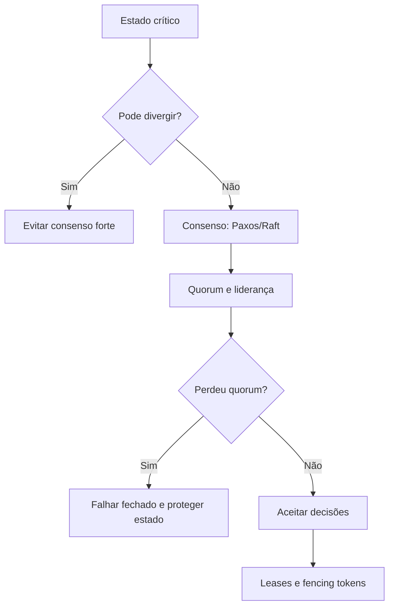

# Capítulo 15 - Administrando estados críticos: consenso distribuído para confiabilidade

## Objetivos de aprendizagem

- Explicar quando estado crítico exige consenso distribuído.
- Relacionar Paxos, Raft, quorum, liderança, leases, fencing e split-brain.
- Criar um runbook de perda de líder ou perda de quorum para um sistema crítico.

## Síntese

Consenso distribuído é necessário para locks, eleição de líder, configurações, filas confiáveis e máquinas de estado replicadas. Protocolos como Paxos permitem coordenar decisões apesar de falhas, mas trazem custo de latência, quorum, localização de réplicas e monitoração cuidadosa. A confiabilidade do estado depende tanto do algoritmo quanto da implantação.

Em uma frase: **Estado crítico em sistemas distribuídos exige consenso para evitar split-brain e decisões conflitantes.**

## Por que isso importa

**Consenso distribuído** importa porque algumas decisões não podem divergir:
quem é o líder, qual configuração está ativa, qual lock foi concedido, qual
operação foi confirmada e qual réplica tem autoridade de escrita. Quando esse
estado diverge, o sistema pode sofrer split-brain, perda de dados ou corrupção.

O custo também é real. Consenso aumenta latência, depende de quorum, sofre com
partições e exige operação cuidadosa. Por isso, deve ser reservado para estado
que realmente precisa de coordenação forte.

## Conceitos essenciais

### **consenso distribuído**

**consenso distribuído**: É o mecanismo que permite a várias réplicas concordarem sobre uma decisão crítica. Ele evita estados contraditórios em temas como liderança, locks e configuração.

Uma forma simples de aplicar isso é: Identificar estados que não podem divergir.

### **Paxos**

**Paxos**: É uma família de protocolos de consenso. O ponto prático é permitir decisão confiável mesmo quando processos ou máquinas falham.

No dia a dia, isso aparece quando a equipe precisa documentar quorum e localização de réplicas.

### **Raft**

**Raft** é outro protocolo de consenso, criado com foco em entendimento e
operação. Ele organiza a replicação em líder, seguidores, termos e log
replicado. Muitos sistemas modernos, como etcd, usam Raft para manter estado
crítico consistente.

Para SRE, o ponto não é implementar Raft, mas saber operar sistemas que dependem
dele: reconhecer perda de líder, perda de quorum, latência de commit e risco de
recuperação incorreta.

### **quorum**

**quorum**: É o conjunto mínimo de réplicas necessário para aceitar uma decisão. Ele equilibra disponibilidade e segurança do estado.

Esse conceito fica concreto quando a equipe consegue monitorar latência e saúde de sistemas de consenso.

### **eleição de líder**

**eleição de líder**: É o mecanismo que escolhe qual réplica tem autoridade para coordenar uma ação. Ela evita que múltiplos nós executem a mesma decisão crítica ao mesmo tempo, mas precisa lidar com latência, partições e perda de quorum.

Uma forma simples de aplicar isso é: Identificar estados que não podem divergir.

### **split-brain**

**split-brain**: É quando partes do sistema acreditam ter autoridade ao mesmo tempo. Pode causar corrupção, perda de dados ou decisões conflitantes.

No dia a dia, isso aparece quando a equipe precisa documentar quorum e localização de réplicas.

### **leases e fencing tokens**

**Leases** concedem autoridade por tempo limitado. **Fencing tokens** ajudam a
impedir que um líder antigo continue escrevendo depois de perder autoridade. O
token mais novo vence; sistemas de armazenamento ou consumidores devem rejeitar
operações com token antigo.

Esses mecanismos reduzem risco em failover, mas dependem de desenho correto. Um
lease mal aplicado pode dar falsa segurança se clientes, relógios e destino de
escrita não validarem autoridade.

## Aplicação prática

Escolha um serviço concreto e transforme o tema em uma ação verificável:

- Identificar estados que não podem divergir.
- Documentar quorum e localização de réplicas.
- Monitorar latência e saúde de sistemas de consenso.
- Descrever o comportamento esperado em perda de líder, perda de quorum e partição de rede.
- Definir quem pode restaurar quorum e quais ações são proibidas sem revisão.

Depois da ação, registre a evidência de melhoria: menos alertas irrelevantes,
recuperação mais rápida, dependência mais clara, deploy menos arriscado, métrica
mais confiável ou decisão mais fácil de explicar.

## Aprofundamento prático

Consenso distribuído deve ser reservado para estado realmente crítico. Locks, eleição de líder, configuração global e filas confiáveis podem precisar de quorum; métricas, caches e dados recomputáveis geralmente não. Usar consenso sem necessidade aumenta latência e complexidade.

Procedimento recomendado:

1. Liste estados que não podem divergir sem causar dano.
2. Defina propriedade de segurança: o que nunca pode acontecer?
3. Documente quorum, localização de réplicas, latência esperada e comportamento em partição.
4. Monitore eleição de líder, perda de quorum, atraso de replicação e saturação.
5. Teste recuperação de nó e perda de zona.

Runbook mínimo para perda de quorum:

| Etapa | Pergunta |
| --- | --- |
| Confirmar impacto | O sistema perdeu leitura, escrita ou apenas eleição de líder? |
| Confirmar topologia | Quantas réplicas existem e onde estão? |
| Evitar dano | Há risco de forçar escrita ou recriar cluster com estado antigo? |
| Restaurar capacidade | Qual réplica tem estado mais recente e evidência de integridade? |
| Validar retorno | O quorum voltou, a liderança estabilizou e clientes reconectaram? |

Checklist de desenho:

| Pergunta | Por que importa |
| --- | --- |
| O sistema tolera split-brain? | Se não tolera, precisa de coordenação forte |
| Qual é o quorum mínimo? | Define disponibilidade sob falha |
| Onde ficam as réplicas? | Afeta latência e resiliência regional |
| Como clientes descobrem líder? | Evita escrita no destino errado |
| Há fencing token? | Evita escrita de líder antigo |
| O que acontece sem quorum? | Define se o sistema falha fechado ou aceita risco |

A técnica mais importante é simplicidade: mantenha o estado crítico pequeno, bem documentado e com poucos caminhos de escrita.

Trade-off CAP na prática: sob partição, sistemas que protegem consistência
tendem a recusar parte das operações; sistemas que priorizam disponibilidade
podem aceitar divergência temporária. Para estado crítico de SRE, a decisão deve
ser explícita. Falhar fechado pode ser melhor que aceitar escrita conflitante.

## Tradução para ferramentas modernas

**Ferramentas típicas:** etcd, ZooKeeper, Consul, CockroachDB, Spanner, PostgreSQL HA, Kubernetes control plane e sistemas de eleição de líder.

**Exemplo avançado:** liste estados que não podem divergir: liderança, locks, configuração global e offsets críticos. Para cada um, documente quorum, latência, perda de zona, fencing, recuperação e comportamento sem quorum.

**Cuidado de projeto:** consenso é caro. Use para estado crítico, não para cache, telemetria ou dados facilmente recomputáveis.

## Exemplos e ferramentas do livro

**Chubby** e **Paxos** são os exemplos principais para estado crítico.
Chubby usa consenso para locks e eleição de líder; Paxos aparece como base
conceitual para decisões distribuídas que não podem divergir.

Em ambientes atuais, a mesma classe de problema aparece em etcd, ZooKeeper,
Consul, bancos distribuídos, control planes de Kubernetes e sistemas de
liderança. A boa prática é limitar consenso ao estado que realmente precisa
dele, porque quorum, latência e recuperação têm custo operacional.

## Diagrama de apoio

## Erros comuns

- Usar consenso para dados que poderiam ser cache ou recomputados.
- Forçar recuperação de cluster sem saber qual réplica tem estado mais recente.
- Confundir disponibilidade de processo com disponibilidade de quorum.
- Não monitorar eleição de líder, latência de commit e falhas de replicação.
- Usar lease sem validar fencing no destino da escrita.

## Perguntas para revisão

1. Que estado do serviço não pode divergir?
2. O sistema deve falhar fechado ou aceitar escrita durante partição?
3. Quantas réplicas podem falhar antes de perder quorum?
4. Como o cliente descobre líder e evita escrever no líder antigo?
5. Que sinal alerta perda de quorum antes de usuários perceberem?

## Exercícios

### Compreensão

Explique a diferença entre perda de líder e perda de quorum.

### Aplicação

Desenhe um cluster etcd de três ou cinco nós e simule perda de uma zona. Diga
se ainda há quorum e que operação deve ser bloqueada.

### Análise

Escreva um runbook curto para perda de líder no control plane Kubernetes ou em
um sistema equivalente de coordenação.

## Relação com práticas atuais

Em ambientes atuais, consenso aparece em control planes Kubernetes, etcd,
locks, bancos distribuídos, service discovery, filas com coordenação e sistemas
de configuração. O SRE não precisa implementar o algoritmo, mas precisa saber
qual estado é crítico, como quorum é formado, que falhas são seguras e quais
procedimentos de recuperação podem destruir dados.

## Recursos complementares

- **Livro oficial online do Google SRE:** <https://sre.google/sre-book/>
- **The Site Reliability Workbook:** <https://sre.google/workbook/>
- **Google SRE Book - Managing Critical State:** <https://sre.google/sre-book/managing-critical-state/>
- **etcd Documentation:** <https://etcd.io/docs/>
- **Raft:** <https://raft.github.io/>
- **Kubernetes Control Plane Components:** <https://kubernetes.io/docs/concepts/overview/components/>

## Fechamento

Guarde a ideia principal: **Estado crítico em sistemas distribuídos exige consenso para evitar split-brain e decisões conflitantes.**

Próximo: [Capítulo 16 - Agendamento distribuído e pipelines confiáveis](capitulo-16.md).

## Referências

- Beyer, B.; Jones, C.; Petoff, J.; Murphy, N. R. (eds.). **Site Reliability Engineering: How Google Runs Production Systems**. O'Reilly Media / Google, 2016. <https://sre.google/sre-book/>
- Beyer, B.; Murphy, N. R.; Rensin, D.; Kawahara, K.; Thorne, S. (eds.). **The Site Reliability Workbook**. O'Reilly Media / Google, 2018. <https://sre.google/workbook/>
- **Google SRE Book - Managing Critical State:** <https://sre.google/sre-book/managing-critical-state/>
- etcd. **Documentation**. <https://etcd.io/docs/>
- Raft. **The Raft Consensus Algorithm**. <https://raft.github.io/>
- Kubernetes. **Control Plane Components**. <https://kubernetes.io/docs/concepts/overview/components/>
- **Google Cloud Well-Architected Framework:** <https://docs.cloud.google.com/architecture/framework>
- **AWS Well-Architected Reliability Pillar:** <https://docs.aws.amazon.com/wellarchitected/latest/reliability-pillar/welcome.html>
- PDF local usado como fonte primária em português: `../Engenharia de Confiabilidade do Google ( etc.).pdf`.
