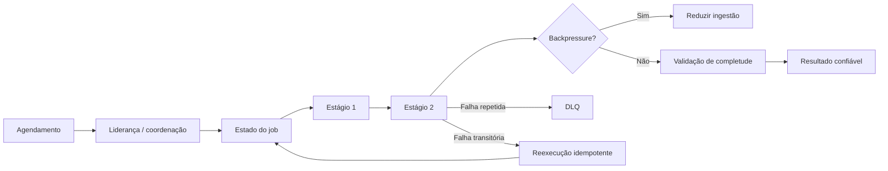

# Capítulo 16 - Agendamento distribuído e pipelines confiáveis

## Objetivos de aprendizagem

- Explicar por que **jobs periódicos** e **pipelines** são sistemas distribuídos com estado.
- Aplicar idempotência, liderança, controle de duplicidade e monitoramento de completude.
- Projetar workflows que toleram atraso, falha parcial e reexecução.

## Síntese

Cron parece simples em uma máquina única, mas se torna um problema distribuído quando há múltiplas réplicas, failover, estado persistente e escala. Pipelines de dados ampliam o mesmo problema: etapas dependentes, carga irregular, reprocessamento, atraso, completude e corretude. A confiabilidade vem de tratar jobs e pipelines como workflows com estado explícito, execução idempotente e sinais de sucesso além de "o processo rodou".

Em uma frase: **agendamento e pipelines confiáveis tornam explícitos estado, liderança, idempotência, atraso e corretude do resultado**.

## Por que isso importa

Muitos serviços dependem de tarefas fora do caminho síncrono: fechamento financeiro, recomputação de índice, expiração de sessão, envio de relatório, compactação, treinamento de modelo, ETL e reconciliação de dados. Quando esses workflows falham silenciosamente, o usuário percebe dados atrasados, incompletos ou incorretos.

## Conceitos essenciais

### **Jobs periódicos como sistemas distribuídos**

Um **job periódico** precisa saber quando deve rodar, se já rodou, se falhou, se pode repetir e quem é responsável por executar. Em escala, essas perguntas exigem estado confiável.

Sem esse controle, a falha comum é dupla: execução duplicada quando há competição entre réplicas ou execução perdida durante failover.

### **Liderança e coordenação**

**Liderança** define qual instância toma decisões de agendamento. Coordenação por consenso ou armazenamento fortemente consistente ajuda a evitar que duas instâncias executem o mesmo trabalho de forma incompatível.

Nem todo job precisa de consenso sofisticado, mas todo job crítico precisa de uma regra clara contra duplicidade perigosa.

### **Idempotência**

**Idempotência** permite repetir uma execução sem causar dano. É uma das propriedades mais importantes para recuperação, porque falhas parciais são comuns: uma etapa pode concluir, registrar metade do estado e cair antes de confirmar sucesso.

Quando idempotência não é possível, a equipe precisa de deduplicação, transações, compensações ou reconciliação explícita.

### **Estado do workflow**

**Estado do workflow** descreve etapas pendentes, em execução, concluídas, atrasadas, falhas ou aguardando dependência. Esse estado deve ser observável e recuperável.

Logs soltos não bastam. A operação precisa saber o que está preso, há quanto tempo e qual impacto isso causa.

### **Pipelines com estágios**

**Pipelines** encadeiam estágios. Cada estágio pode ter volume, latência, dependências e critérios de qualidade diferentes. O sucesso do pipeline depende do resultado final, não apenas da execução de cada processo.

Monitorar apenas "job executou" é frágil. É preciso medir completude, frescor, contagem esperada, validade de dados e atraso por estágio.

### **Thundering herd**

**Thundering herd** ocorre quando muitos jobs ou clientes acordam ao mesmo tempo e criam pico artificial. Agendamentos em horários redondos, retries sincronizados e dependências compartilhadas podem causar esse padrão.

Espalhar horários, usar jitter e limitar concorrência reduz picos desnecessários.

### **Backpressure e DLQ**

**Backpressure** faz uma etapa sinalizar que não consegue receber mais trabalho
sem degradar. **DLQ** (dead letter queue) separa mensagens que falharam
repetidamente para análise e reprocessamento controlado, em vez de travar o
pipeline inteiro.

Sem backpressure, o upstream continua produzindo até transformar atraso em
incidente. Sem DLQ, uma mensagem ruim pode consumir tentativas indefinidamente.

### **Exactly-once como risco de linguagem**

Na prática operacional, "exactly once" costuma depender de várias camadas:
idempotência, deduplicação, transações, checkpoints e reconciliação. O SRE deve
perguntar qual efeito precisa ocorrer uma vez, onde a duplicidade é detectada e
como corrigir divergência depois.

## Aplicação prática

Escolha um job ou pipeline importante:

- Liste estados possíveis: pendente, rodando, concluído, falhou, atrasado e reexecutando.
- Verifique se a execução é idempotente ou se há deduplicação.
- Identifique quem lidera ou coordena execução em caso de múltiplas réplicas.
- Defina métricas de atraso, completude e corretude.
- Adicione jitter ou limites de concorrência se houver picos artificiais.
- Defina backpressure, DLQ e política de reprocessamento.
- Descreva como detectar duplicidade e reconciliar resultado incorreto.

## Aprofundamento prático

Jobs periódicos e pipelines precisam de estado explícito. "O cron rodou" não prova que o resultado foi entregue. A operação precisa saber se o job estava pendente, em execução, concluído, atrasado, falhou, repetiu ou produziu dado incompleto.

Procedimento recomendado:

1. Modele cada job como workflow com identificador único de execução.
2. Torne etapas idempotentes ou implemente deduplicação.
3. Evite horários sincronizados; use jitter e limite de concorrência.
4. Meça idade do dado, completude, contagem esperada e falhas por estágio.
5. Crie reprocessamento seguro para falhas parciais.

Exemplo de estado:

```yaml
pipeline: fechamento_diario
execução: "2026-06-12"
valid_states: [pending, running, completed, failed, delayed]
idempotência: "chave por data e cliente"
alerta:
  atraso: "idade_dado > 2h"
  completude: "linhas_processadas < 99% do esperado"
backpressure:
  pausar_ingestao: "fila > 100000 mensagens"
dlq:
  max_tentativas: 5
  acao: "isolar mensagem e abrir ticket de reprocessamento"
```

O sinal certo não é apenas falha do processo. Um pipeline pode terminar "com sucesso" e ainda entregar dado atrasado ou incompleto.

Checklist de reprocessamento seguro:

| Pergunta | Por que importa |
| --- | --- |
| A execução tem chave idempotente? | Evita duplicar efeito. |
| Existe checkpoint? | Permite retomar sem repetir tudo. |
| Há DLQ? | Isola dados problemáticos. |
| Há reconciliação? | Detecta divergência entre fonte e destino. |
| O usuário vê frescor? | Conecta pipeline à experiência real. |

## Tradução para ferramentas modernas

**Ferramentas típicas:** Airflow, Dagster, Argo Workflows, Temporal, Step Functions, Cloud Composer, Kubernetes CronJobs, Beam, Spark e pipelines de ML.

**Exemplo avançado:** projete um pipeline financeiro com execução idempotente, chave de deduplicação, estado por etapa, backpressure, DLQ, métrica de frescor, completude e reprocessamento seguro.

**Cuidado de projeto:** job que "rodou" não prova que dado correto chegou. Monitore resultado, não apenas execução.

## Exemplos e ferramentas do livro

O livro usa o **cron distribuído do Google** e o **Workflow** para mostrar
que jobs e pipelines precisam de estado explícito. O cron discute liderança,
execução duplicada/perdida e uso de consenso. Workflow discute estágios,
modelo de execução e validação de corretude.

Em ambientes atuais, procure esses padrões em Kubernetes CronJobs, Airflow,
Dagster, Argo Workflows, Step Functions, Cloud Composer, Beam, Spark e
pipelines de ML. A ferramenta muda; as propriedades continuam: idempotência,
reexecução segura, visibilidade de estado, completude e frescor.

## Diagrama de apoio



## Erros comuns

- Considerar job bem-sucedido só porque o processo iniciou.
- Ignorar execução duplicada ou perdida durante failover.
- Criar pipeline sem métrica de frescor, completude ou corretude.
- Usar retries sincronizados que geram thundering herd.
- Prometer exactly-once sem explicar idempotência, deduplicação e reconciliação.
- Não ter DLQ para dados que falham repetidamente.
- Deixar produtor enviar carga sem respeitar saturação do consumidor.
- Depender de intervenção manual para reprocessar falhas frequentes.

## Perguntas para revisão

1. Como a equipe sabe que um job crítico não foi perdido?
2. O que acontece se o mesmo job rodar duas vezes?
3. Qual métrica prova que o pipeline entregou dados corretos e completos?
4. O que acontece com mensagens que falham repetidamente?
5. Como o pipeline sinaliza que precisa reduzir ingestão?

## Exercícios

### Compreensão

Explique por que um cron distribuído precisa de estado e liderança.

### Aplicação

Modele um pipeline com três estágios e defina métricas para atraso, completude e corretude.

Inclua uma DLQ, uma regra de backpressure e uma chave de idempotência.

### Análise

Identifique um workflow que causaria impacto ao usuário mesmo sem derrubar APIs síncronas.

Explique por que "exactly once" pode ser uma promessa perigosa sem
reconciliação.

## Relação com práticas atuais

Hoje esses padrões aparecem em orquestradores de workflow, Kubernetes CronJobs, filas, ferramentas de data engineering, pipelines de ML, GitOps e rotinas de reconciliação. A ferramenta não elimina o problema: jobs críticos ainda precisam de estado visível, reexecução segura, backpressure, DLQ e validação do resultado entregue.

## Recursos complementares

- **Google SRE Book - Distributed Periodic Scheduling with Cron:** <https://sre.google/sre-book/distributed-periodic-scheduling/>
- **Google SRE Book - Data Processing Pipelines:** <https://sre.google/sre-book/data-processing-pipelines/>
- **OpenTelemetry Signals:** <https://opentelemetry.io/docs/concepts/signals/>
- **Temporal Documentation:** <https://docs.temporal.io/>
- **Apache Airflow Documentation:** <https://airflow.apache.org/docs/>

## Fechamento

Guarde a ideia principal: **workflows confiáveis não dependem de sorte no horário de execução; eles têm estado, coordenação e validação explícita**.

Próximo: [Capítulo 17 - Integridade de dados: o que você lê e o que você escreveu](capitulo-17.md).

## Referências

- Beyer, B.; Jones, C.; Petoff, J.; Murphy, N. R. (eds.). **Site Reliability Engineering: How Google Runs Production Systems**. O'Reilly Media / Google, 2016. <https://sre.google/sre-book/>
- Beyer, B.; Murphy, N. R.; Rensin, D.; Kawahara, K.; Thorne, S. (eds.). **The Site Reliability Workbook**. O'Reilly Media / Google, 2018. <https://sre.google/workbook/>
- Google SRE. **Distributed Periodic Scheduling with Cron**. <https://sre.google/sre-book/distributed-periodic-scheduling/>
- Google SRE. **Data Processing Pipelines**. <https://sre.google/sre-book/data-processing-pipelines/>
- Temporal. **Documentation**. <https://docs.temporal.io/>
- Apache Airflow. **Documentation**. <https://airflow.apache.org/docs/>
- PDF local usado como fonte primária em português: `../Engenharia de Confiabilidade do Google ( etc.).pdf`.
