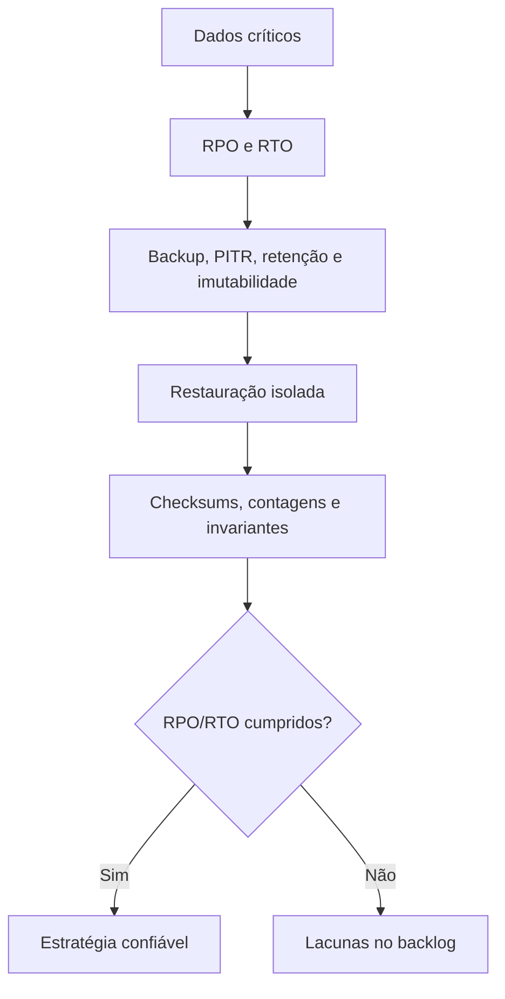

# Capítulo 17 - Integridade de dados: o que você lê e o que você escreveu

## Objetivos de aprendizagem

- Definir RPO, RTO, backup, arquivamento, replicação e restauração testada.
- Detectar corrupção silenciosa, exclusão acidental e replicação de dados ruins.
- Planejar um game day de restauração com validação de integridade.

## Síntese

Integridade de dados exige separar backup, arquivamento, replicação, detecção precoce e recuperação. A prioridade é preservar disponibilidade por meio de integridade de dados verificável. Estratégias robustas combinam defesa em profundidade, remoção soft, backups recuperáveis, replicação, testes de restauração e atitude de "confiar, mas verificar".

Em uma frase: **Backups só têm valor quando a recuperação é confiável, testada e alinhada a integridade percebida pelo usuário.**

## Por que isso importa

**Integridade de dados** importa porque usuários não se importam se havia
backup; eles se importam se o pedido, pagamento, saldo, arquivo ou histórico
continua correto e recuperável. Replicação pode copiar corrupção, backup pode
estar incompleto e restore pode demorar mais que o negócio tolera.

SRE trata dados como parte central da confiabilidade: prevenir, detectar,
recuperar e provar que a recuperação funcionou.

## Conceitos essenciais

### **integridade de dados**

**integridade de dados**: É a garantia de que dados permanecem corretos, completos e recuperáveis. Usuários percebem integridade pelo resultado, não pela arquitetura.

Uma forma simples de aplicar isso é: Testar restauração de um backup real.

### **backup versus arquivamento**

**Backup** existe para recuperação operacional. **Arquivamento** existe para
retenção, auditoria ou consulta histórica. Confundir os dois é perigoso:
arquivo antigo pode não ser restaurável rápido; backup curto pode não cumprir
exigência de retenção.

No dia a dia, isso aparece quando a equipe precisa definir RPO e RTO para dados críticos.

**RPO** define quanta perda de dados é aceitável. **RTO** define em quanto tempo
o serviço ou dado precisa voltar. Sem RPO e RTO, a equipe não sabe se a
estratégia de backup é suficiente.

### **recuperação**

**recuperação**: É restaurar serviço ou dados após falha. A estratégia só é confiável quando é testada e tem objetivo de tempo e perda aceitável.

Esse conceito fica concreto quando a equipe consegue adicionar detecção de exclusão ou corrupção silenciosa.

Recuperação confiável inclui **PITR** (point-in-time recovery), restauração em
ambiente isolado, validação de checksums, comparação de contagens, teste de
invariantes de negócio e registro das lacunas encontradas.

### **replicação**

**replicação**: É manter cópias de dados ou estado. Ela melhora disponibilidade, mas também pode replicar corrupção se não houver detecção e controle.

Uma forma simples de aplicar isso é: Testar restauração de um backup real.

### **defesa em profundidade**

**defesa em profundidade**: É combinar camadas de prevenção, detecção e recuperação. Nenhuma camada isolada deve ser a única proteção de dados críticos.

No dia a dia, isso aparece quando a equipe precisa definir RPO e RTO para dados críticos.

Defesa em profundidade para dados críticos inclui permissões mínimas, retenção,
soft delete, backups imutáveis, Object Lock, detecção de anomalia, restauração
periódica e revisão de acesso. Essa camada também reduz risco de ransomware e
exclusão maliciosa.

## Aplicação prática

Use o `checkout-api` ou um serviço real e execute um game day de restauração:

- Testar restauração de um backup real.
- Definir RPO e RTO para dados críticos.
- Adicionar detecção de exclusão ou corrupção silenciosa.
- Validar dados restaurados com checksums, contagens e invariantes de negócio.
- Registrar RPO/RTO real e lacunas do runbook.

Depois da ação, registre a evidência de melhoria: menos alertas irrelevantes,
recuperação mais rápida, dependência mais clara, deploy menos arriscado, métrica
mais confiável ou decisão mais fácil de explicar.

## Aprofundamento prático

Integridade de dados exige restauração testada. Backup sem exercício de recuperação é uma promessa não verificada. O livro diferencia backup, arquivamento, replicação e recuperação; a prática madura combina prevenção, detecção precoce e teste periódico.

Procedimento recomendado:

1. Classifique dados por criticidade, RPO e RTO.
2. Separe backup de arquivamento e de replicação online.
3. Ative proteção contra exclusão acidental, como soft delete ou retenção.
4. Execute restauração em ambiente isolado e valide consistência.
5. Meça tempo real de recuperação e perda real de dados.

Modelo de exercício:

| Etapa | Evidência |
| --- | --- |
| Escolher snapshot | Identificador e horário registrados |
| Restaurar em ambiente isolado | Banco sobe sem tocar produção |
| Validar dados | Contagens, checksums e consultas críticas |
| Medir RTO/RPO | Tempo e perda comparados com meta |
| Atualizar runbook | Lacunas corrigidas |

Validações mínimas para o `checkout-api`:

| Validação | Exemplo |
| --- | --- |
| Contagem | Total de pedidos por dia antes e depois do restore. |
| Checksum | Hash por lote de pedidos restaurados. |
| Invariante | Pedido pago não pode voltar para estado sem pagamento. |
| Amostragem | Pedidos críticos verificados manualmente. |
| RPO real | Último pedido preservado antes da falha simulada. |
| RTO real | Tempo até serviço consultar dados restaurados. |

A técnica essencial é "confiar, mas verificar": a equipe deve provar que consegue recuperar o dado certo no prazo necessário.

## Tradução para ferramentas modernas

**Ferramentas típicas:** AWS Backup, Velero, pgBackRest, WAL-G, point-in-time recovery, Object Lock, snapshots, backups imutáveis, replicação multi-zona e checksums.

**Exemplo avançado:** execute game day de restauração: escolha snapshot, restaure em ambiente isolado, valide contagens/checksums, meça RTO/RPO real e atualize runbook.

**Cuidado de projeto:** backup não testado é hipótese. A prática confiável é restauração verificada.

## Exemplos e ferramentas do livro

**Colossus**, **Bigtable** e **Spanner** aparecem como exemplos de camadas
de dados com requisitos diferentes de escala, consistência e recuperação. A
lição para integridade de dados é separar replicação, backup, arquivamento e
restauração testada.

Em ambientes atuais, isso se traduz em snapshots, point-in-time recovery,
replicação multi-zona, retenção contra exclusão acidental, checksums,
restaurações periódicas e validações de dados após recuperação.

## Diagrama de apoio

## Erros comuns

- Acreditar que backup existe sem testar restore.
- Confundir replicação com backup.
- Replicar corrupção silenciosa para todas as cópias.
- Definir RPO/RTO sem medir tempo e perda reais.
- Restaurar banco sem validar invariantes de negócio.
- Manter backup sem proteção contra exclusão ou ransomware.

## Perguntas para revisão

1. Qual é o RPO e o RTO dos dados mais críticos do serviço?
2. Quando foi o último restore testado?
3. Como a equipe detecta corrupção silenciosa?
4. O backup está protegido contra exclusão acidental ou maliciosa?
5. Que invariante de negócio prova que o dado restaurado está correto?

## Exercícios

### Compreensão

Explique a diferença entre backup, arquivamento, replicação e PITR.

### Aplicação

Planeje um game day de restauração para o `checkout-api`, incluindo snapshot,
ambiente isolado, validação, RPO/RTO real e atualização de runbook.

### Análise

Analise um cenário de corrupção silenciosa replicada. Que sinais poderiam
detectar o problema antes do restore?

## Relação com práticas atuais

Em ambientes atuais, integridade de dados inclui PITR, snapshots, backups
imutáveis, restauração automatizada, validação por checksum, proteção contra
ransomware, trilhas de auditoria e controles de acesso. A tecnologia muda, mas
o princípio permanece: dado crítico só está protegido quando a recuperação foi
testada e a corretude foi verificada.

## Recursos complementares

- **Livro oficial online do Google SRE:** <https://sre.google/sre-book/>
- **The Site Reliability Workbook:** <https://sre.google/workbook/>
- **Google SRE Book - Data Integrity:** <https://sre.google/sre-book/data-integrity/>
- **AWS Reliability - Backing up data:** <https://docs.aws.amazon.com/wellarchitected/latest/reliability-pillar/backing-up-data.html>
- **NIST Cybersecurity Framework:** <https://www.nist.gov/cyberframework>

## Fechamento

Guarde a ideia principal: **Backups só têm valor quando a recuperação é confiável, testada e alinhada a integridade percebida pelo usuário.**

Próximo: [Capítulo 18 - Lançamento de produtos confiáveis em escala](capitulo-18.md).

## Referências

- Beyer, B.; Jones, C.; Petoff, J.; Murphy, N. R. (eds.). **Site Reliability Engineering: How Google Runs Production Systems**. O'Reilly Media / Google, 2016. <https://sre.google/sre-book/>
- Beyer, B.; Murphy, N. R.; Rensin, D.; Kawahara, K.; Thorne, S. (eds.). **The Site Reliability Workbook**. O'Reilly Media / Google, 2018. <https://sre.google/workbook/>
- **Google SRE Book - Data Integrity:** <https://sre.google/sre-book/data-integrity/>
- AWS. **Backing up data**. <https://docs.aws.amazon.com/wellarchitected/latest/reliability-pillar/backing-up-data.html>
- NIST. **Cybersecurity Framework**. <https://www.nist.gov/cyberframework>
- **Google Cloud Well-Architected Framework:** <https://docs.cloud.google.com/architecture/framework>
- **AWS Well-Architected Reliability Pillar:** <https://docs.aws.amazon.com/wellarchitected/latest/reliability-pillar/welcome.html>
- PDF local usado como fonte primária em português: `../Engenharia de Confiabilidade do Google ( etc.).pdf`.
