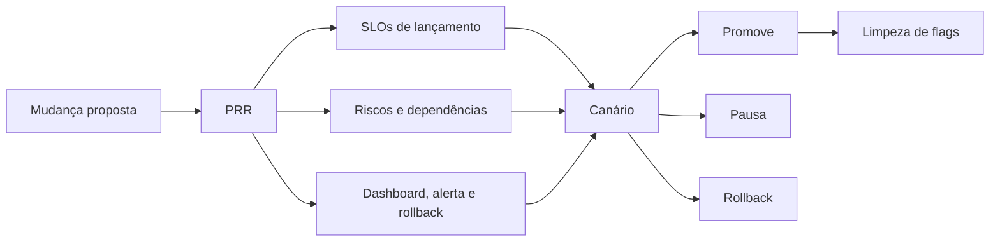

# Capítulo 18 - Lançamento de produtos confiáveis em escala

## Objetivos de aprendizagem

- Identificar como **Launch Coordination Engineering** aparece em produção.
- Aplicar o procedimento do tema em uma jornada, mudança, incidente ou dependência real.
- Produzir um artefato prático: métrica, política, checklist, runbook ou plano de melhoria.

## Síntese

Launch Coordination Engineering como função que ajuda produtos a chegar a produção com confiabilidade. Checklists de arquitetura, dependências, integração, capacidade, modos de falha, comportamento de clientes, automação e rollout reduzem surpresa. Técnicas como flags e lançamentos em fases permitem aprender com risco limitado.

Em uma frase: **Lançamentos confiáveis exigem coordenação, checklists, rollouts graduais e análise de modos de falha.**

## Por que isso importa

**Launch Coordination Engineering** importa porque serviços reais falham sob mudança, carga, dependências lentas, estado distribuído e comportamento humano. A equipe reduz surpresa quando transforma esse risco em rotina operacional clara, sinais confiáveis e decisões treinadas antes da crise.

## Conceitos essenciais

### **Launch Coordination Engineering**

**Launch Coordination Engineering**: É a coordenação de lançamento com foco em riscos, dependências e prontidão operacional. Ela ajuda produto e engenharia a lançar sem improviso.

Uma forma simples de aplicar isso é: Criar checklist de lançamento para um serviço.

### **checklist de lançamento**

**checklist de lançamento**: É uma memória operacional externa. Ajuda a evitar esquecimentos em lançamentos, incidentes e mudanças repetidas.

No dia a dia, isso aparece quando a equipe precisa planejar fases e critérios de rollback.

### **rollout gradual**

**rollout gradual**: É a liberação gradual de uma mudança. Permite observar impacto em pequena escala antes de afetar todos os usuários.

Esse conceito fica concreto quando a equipe consegue incluir modos de falha e abusos de clientes no plano.

### **feature flags**

**feature flags**: Flags permitem ativar, desativar ou limitar funcionalidades sem novo deploy. Elas reduzem risco, mas precisam de ciclo de limpeza.

Uma forma simples de aplicar isso é: Criar checklist de lançamento para um serviço.

### **planejamento de capacidade**

**planejamento de capacidade**: É transformar intenção, demanda e restrições em capacidade e ações. Em SRE, planejamento ruim vira incidente futuro.

No dia a dia, isso aparece quando a equipe precisa planejar fases e critérios de rollback.


## Aplicação prática

Escolha um serviço concreto e transforme o tema em uma ação verificável:

- Criar checklist de lançamento para um serviço.
- Planejar fases e critérios de rollback.
- Incluir modos de falha e abusos de clientes no plano.

Depois da ação, registre a evidência de melhoria: menos alertas irrelevantes,
recuperação mais rápida, dependência mais clara, deploy menos arriscado, métrica
mais confiável ou decisão mais fácil de explicar.

## Aprofundamento prático

Lançamento confiável é coordenação de risco antes da exposição ampla. O checklist do livro cobre arquitetura, dependências, capacidade, modos de falha, automação e rollout. Em prática moderna, isso vira revisão de prontidão com critérios objetivos de entrada e saída.

Um **PRR**, ou Production Readiness Review, é a revisão que responde a uma pergunta simples: "este lançamento pode falhar de modo previsível e recuperável?". Para público iniciante, a forma mais segura de pensar é separar prontidão em cinco blocos.

| Bloco | Pergunta prática | Evidência mínima |
| --- | --- | --- |
| SLO de lançamento | Que experiência do usuário não pode degradar? | SLI, objetivo e janela de avaliação definidos |
| Risco técnico | O que muda em código, dados, tráfego ou dependências? | Lista de modos de falha e donos |
| Capacidade | O serviço aguenta o tráfego esperado e o pico plausível? | Teste de carga, limite conhecido ou plano de escala |
| Operação | Como detectar, decidir e reverter? | Dashboard, alerta, runbook, rollback e kill switch |
| Pós-lançamento | O que precisa ser removido ou incorporado? | Dono e prazo para limpar flags, código morto e exceções |

Procedimento recomendado para conduzir o PRR:

1. Identifique usuários afetados, dependências e novas cargas esperadas.
2. Defina SLIs de lançamento e dashboards antes do rollout.
3. Liste modos de falha, abusos de cliente e comportamento sob dependência lenta.
4. Planeje fases: dogfood, beta, 1%, 10%, 50%, 100%.
5. Defina rollback, kill switch e responsáveis por decisão.
6. Registre a data de remoção das feature flags e o responsável pela limpeza.

Exemplo de critérios:

```yaml
launch: new_checkout
owner: "time-checkout"
decision_owner: "sre-oncall"
fases: ["interno", "1%", "10%", "50%", "100%"]
launch_slos:
  disponibilidade_checkout: "99.9% em 7 dias"
  p95_confirmacao_pagamento: "< 800ms"
  erro_usuario_final: "< 1%"
promote_if:
  error_rate: "< 1%"
  p95: "< 800ms"
  support_tickets: "sem aumento relevante"
  canary_window: "30m sem regressao"
rollback_if:
  error_rate: ">= 2% por 10m"
  payment_dependency: "timeouts acima do limite"
  saturation: "cpu ou conexoes acima de 85% por 15m"
feature_flags:
  checkout_v2:
    owner: "time-checkout"
    remove_until: "2026-07-30"
    kill_switch: true
```

Canário bom não é apenas "liberar para pouca gente". Ele compara uma versão candidata com uma base confiável e usa métricas que representam usuário, serviço e dependências. Um canário precisa ter:

- população pequena, mas realista;
- janela mínima para observar cauda de latência, erro e saturação;
- critério automático ou explícito de promoção;
- critério de pausa quando o sinal é inconclusivo;
- critério de rollback quando o sinal cruza limite de risco.

O checklist não é burocracia quando reduz surpresa. Ele força a equipe a descobrir lacunas enquanto ainda há tempo para corrigir. O anti-padrão é lançar com flag permanente, dashboard improvisado e rollback dependente de uma pessoa específica.

## Tradução para ferramentas modernas

**Ferramentas típicas:** LaunchDarkly, Unleash, Argo Rollouts, Flagger, Spinnaker, Cloud Deploy, feature flags, kill switches e scorecards de prontidão.

**Exemplo avançado:** planeje lançamento em fases: interno, 1%, 10%, 50%, 100%; cada fase com SLI, limite de erro, p95, tickets de suporte e critério de rollback.

**Cuidado de projeto:** feature flag sem ciclo de remoção vira complexidade permanente. OpenFeature ajuda a padronizar avaliação de flags entre provedores, mas não substitui governança: toda flag precisa de dono, propósito, data de revisão e plano de remoção.

## Exemplos e ferramentas do livro

O livro apresenta **Launch Coordination Engineering** e um **checklist de
coordenação de lançamento**. O checklist cobre riscos de arquitetura,
dependências, integração, capacidade, automação, rollout, comportamento de
clientes e modos de falha.

Em ambientes atuais, isso aparece em PRR, scorecards de prontidão, feature
flags, canários, progressive delivery, kill switches, testes de carga e
critérios objetivos de rollback.

## Diagrama de apoio



## Erros comuns

- Aplicar a prática como checklist sem conectar a risco real do serviço.
- Criar documentação ou automação sem validar durante incidentes ou mudanças reais.
- Medir apenas sinais internos e esquecer o impacto percebido pelo usuário.

## Perguntas para revisão

1. Qual risco operacional **Launch Coordination Engineering** ajuda a reduzir?
2. Que evidência mostraria que a prática foi aplicada com sucesso?
3. Como esse conceito mudaria uma decisão de release, plantão, arquitetura ou priorização?

## Exercícios

### Compreensão

Explique a ideia central em até cinco linhas, usando um serviço real como exemplo.

### Aplicação

Escolha um serviço real e preencha um PRR mínimo com SLO de lançamento, dependências, plano de canário, rollback e limpeza de flags.

### Análise

Liste duas formas de aplicar esse conceito de maneira superficial e explique o
risco de cada uma.

## Relação com práticas atuais

Em ambientes atuais, este tema aparece em revisões de serviço, plataformas internas, pipelines, dashboards, políticas de rollout e práticas de cloud native. A tecnologia muda; o princípio continua sendo tornar risco, responsabilidade e evidência visíveis.

## Recursos complementares

- **Livro oficial online do Google SRE:** <https://sre.google/sre-book/>
- **The Site Reliability Workbook:** <https://sre.google/workbook/>
- **Google SRE Book - Reliable Product Launches at Scale:** <https://sre.google/sre-book/reliable-product-launches/>
- **Google SRE Book - Launch Coordination Checklist:** <https://sre.google/sre-book/launch-checklist/>
- **Site Reliability Workbook - Canarying Releases:** <https://sre.google/workbook/canarying-releases/>
- **OpenFeature - Introduction:** <https://openfeature.dev/docs/reference/intro/>

## Fechamento

Guarde a ideia principal: **Lançamentos confiáveis exigem coordenação, checklists, rollouts graduais e análise de modos de falha.**

Próximo: [Capítulo 19 - Acelerando os SREs para chegar ao plantão e além](capitulo-19.md).

## Referências

- Beyer, B.; Jones, C.; Petoff, J.; Murphy, N. R. (eds.). **Site Reliability Engineering: How Google Runs Production Systems**. O'Reilly Media / Google, 2016. <https://sre.google/sre-book/>
- Beyer, B.; Murphy, N. R.; Rensin, D.; Kawahara, K.; Thorne, S. (eds.). **The Site Reliability Workbook**. O'Reilly Media / Google, 2018. <https://sre.google/workbook/>
- **Google SRE Book - Reliable Product Launches at Scale:** <https://sre.google/sre-book/reliable-product-launches/>
- **Google SRE Book - Launch Coordination Checklist:** <https://sre.google/sre-book/launch-checklist/>
- **Site Reliability Workbook - Canarying Releases:** <https://sre.google/workbook/canarying-releases/>
- **OpenFeature - Introduction:** <https://openfeature.dev/docs/reference/intro/>
- **Google Cloud Well-Architected Framework:** <https://docs.cloud.google.com/architecture/framework>
- **AWS Well-Architected Reliability Pillar:** <https://docs.aws.amazon.com/wellarchitected/latest/reliability-pillar/welcome.html>
- PDF local usado como fonte primária em português: `../Engenharia de Confiabilidade do Google ( etc.).pdf`.
