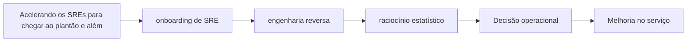

# Capítulo 19 - Acelerando os SREs para chegar ao plantão e além

## Objetivos de aprendizagem

- Explicar o problema de confiabilidade tratado pelo tema.
- Reconhecer onde o tema aparece em um serviço real.
- Aplicar o conceito em uma decisão operacional ou de engenharia.

## Síntese

Onboarding e desenvolvimento contínuo de SREs. Novos membros precisam aprender arquitetura, engenharia reversa, raciocínio estatístico, improviso controlado, leitura de postmortems, simulações e acompanhamento de plantão. A meta é formar autonomia operacional sem depender de aprendizado acidental durante crises.

Em uma frase: **Formar SREs exige trilhas de aprendizado, prática supervisionada e exposição progressiva a sistemas reais.**

## Por que isso importa

**onboarding de SRE** importa porque sistemas de produção são mantidos por pessoas, rotinas, decisões e relações entre equipes. Sem gestão explícita, mesmo boas práticas técnicas se degradam em filas de suporte, interrupções constantes e responsabilidades ambíguas.

## Conceitos essenciais

### **onboarding de SRE**

**onboarding de SRE**: É o processo de formar autonomia operacional com trilha, contexto, prática supervisionada e exposição progressiva ao serviço. Em SRE, bom onboarding reduz aprendizado acidental durante crises.

Uma forma simples de aplicar isso é: Criar trilha de 30/60/90 dias para SRE.

### **engenharia reversa**

**engenharia reversa**: É a capacidade de entender um sistema existente a partir de código, telemetria, arquitetura, histórico de incidentes e comportamento em produção. Ela ajuda novos SREs a descobrir como o serviço realmente funciona.

No dia a dia, isso aparece quando a equipe precisa usar postmortems como material de treinamento.

### **raciocínio estatístico**

**raciocínio estatístico**: É usar probabilidade, distribuição, amostragem e tendência para interpretar sinais operacionais. Sem esse raciocínio, médias escondem caudas, variação vira ruído e decisões de capacidade ficam frágeis.

Esse conceito fica concreto quando a equipe consegue planejar shadowing antes do plantão independente.

### **simulações de desastre**

**simulações de desastre**: São exercícios controlados para praticar resposta, validar runbooks e revelar lacunas antes de uma falha real. O objetivo é treinar julgamento, comunicação e recuperação.

Uma forma simples de aplicar isso é: Criar trilha de 30/60/90 dias para SRE.

### **aprendizado contínuo**

**aprendizado contínuo**: É transformar incidentes, revisões, plantões e mudanças em melhoria acumulada. A equipe aprende quando registra decisões, atualiza práticas e mede se a mudança reduziu risco.

No dia a dia, isso aparece quando a equipe precisa usar postmortems como material de treinamento.

## Aplicação prática

Para evitar burocracia, escolha um serviço concreto e execute uma ação pequena:

- Criar trilha de 30/60/90 dias para SRE.
- Usar postmortems como material de treinamento.
- Planejar shadowing antes do plantão independente.

Depois da ação, procure uma evidência simples de melhoria: menos alertas
irrelevantes, recuperação mais rápida, dependência mais clara, deploy menos
arriscado, métrica mais confiável ou decisão mais fácil de explicar.

## Diagrama de apoio

## Erros comuns

- Tratar o problema como falta de processo quando a causa é ambiguidade de responsabilidade.
- Criar reuniões, checklists ou treinamentos sem dono e sem revisão.
- Separar gestão de SRE da realidade técnica dos serviços em produção.

## Perguntas para revisão

1. Qual risco operacional **onboarding de SRE** ajuda a reduzir?
2. Que evidência mostraria que a prática foi aplicada com sucesso?
3. Como esse conceito mudaria uma decisão de release, plantão, arquitetura ou priorização?

## Exercícios

### Compreensão

Explique a ideia central em até cinco linhas, usando um serviço real como exemplo.

### Aplicação

Escolha um serviço real e execute uma das ações práticas.

### Análise

Liste duas formas de aplicar esse conceito de maneira superficial e explique o
risco de cada uma.

## Relação com práticas atuais

Gestão moderna de SRE aparece em onboarding estruturado, catálogos de serviço, revisões de prontidão, scorecards de confiabilidade, políticas de plantão e mecanismos de colaboração entre produto, plataforma e operação.

## Recursos complementares

- **Livro oficial online do Google SRE:** <https://sre.google/sre-book/>
- **The Site Reliability Workbook:** <https://sre.google/workbook/>
- **Google SRE Book - Accelerating SREs to On-Call and Beyond:** <https://sre.google/sre-book/accelerating-sre-on-call/>
- **Google SRE Resources:** <https://sre.google/resources/>

## Fechamento

Guarde a ideia principal: **Formar SREs exige trilhas de aprendizado, prática supervisionada e exposição progressiva a sistemas reais.**

Próximo: [Capítulo 20 - Lidando com interrupções](capitulo-20.md).

## Referências

- Beyer, B.; Jones, C.; Petoff, J.; Murphy, N. R. (eds.). **Site Reliability Engineering: How Google Runs Production Systems**. O'Reilly Media / Google, 2016. <https://sre.google/sre-book/>
- Beyer, B.; Murphy, N. R.; Rensin, D.; Kawahara, K.; Thorne, S. (eds.). **The Site Reliability Workbook**. O'Reilly Media / Google, 2018. <https://sre.google/workbook/>
- **Google SRE Book - Accelerating SREs to On-Call and Beyond:** <https://sre.google/sre-book/accelerating-sre-on-call/>
- **Google Cloud Well-Architected Framework:** <https://docs.cloud.google.com/architecture/framework>
- **AWS Well-Architected Reliability Pillar:** <https://docs.aws.amazon.com/wellarchitected/latest/reliability-pillar/welcome.html>
- PDF local usado como fonte primária em português: `../Engenharia de Confiabilidade do Google ( etc.).pdf`.
