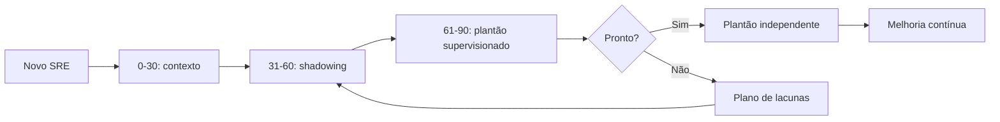

# Capítulo 19 - Acelerando os SREs para chegar ao plantão e além

## Objetivos de aprendizagem

- Identificar como **onboarding de SRE** aparece em produção.
- Aplicar o procedimento do tema em uma jornada, mudança, incidente ou dependência real.
- Produzir um artefato prático: métrica, política, checklist, runbook ou plano de melhoria.

## Síntese

Onboarding e desenvolvimento contínuo de SREs. Novos membros precisam aprender arquitetura, engenharia reversa, raciocínio estatístico, improviso controlado, leitura de postmortems, simulações e acompanhamento de plantão. A meta é formar autonomia operacional sem depender de aprendizado acidental durante crises.

Em uma frase: **Formar SREs exige trilhas de aprendizado, prática supervisionada e exposição progressiva a sistemas reais.**

## Por que isso importa

**onboarding de SRE** importa porque sistemas de produção são mantidos por pessoas, rotinas, decisões e relações entre equipes. Sem gestão explícita, mesmo boas práticas técnicas se degradam em filas de suporte, interrupções constantes e responsabilidades ambíguas.

## Conceitos essenciais

### **onboarding de SRE**

**onboarding de SRE**: É o processo de formar autonomia operacional com trilha, contexto, prática supervisionada e exposição progressiva ao serviço. Em SRE, bom onboarding reduz aprendizado acidental durante crises.

Uma forma simples de aplicar isso é: Criar trilha de 30/60/90 dias para SRE.

### **engenharia reversa**

**engenharia reversa**: É a capacidade de entender um sistema existente a partir de código, telemetria, arquitetura, histórico de incidentes e comportamento em produção. Ela ajuda novos SREs a descobrir como o serviço realmente funciona.

No dia a dia, isso aparece quando a equipe precisa usar postmortems como material de treinamento.

### **raciocínio estatístico**

**raciocínio estatístico**: É usar probabilidade, distribuição, amostragem e tendência para interpretar sinais operacionais. Sem esse raciocínio, médias escondem caudas, variação vira ruído e decisões de capacidade ficam frágeis.

Esse conceito fica concreto quando a equipe consegue planejar shadowing antes do plantão independente.

### **simulações de desastre**

**simulações de desastre**: São exercícios controlados para praticar resposta, validar runbooks e revelar lacunas antes de uma falha real. O objetivo é treinar julgamento, comunicação e recuperação.

Uma forma simples de aplicar isso é: Criar trilha de 30/60/90 dias para SRE.

### **aprendizado contínuo**

**aprendizado contínuo**: É transformar incidentes, revisões, plantões e mudanças em melhoria acumulada. A equipe aprende quando registra decisões, atualiza práticas e mede se a mudança reduziu risco.

No dia a dia, isso aparece quando a equipe precisa usar postmortems como material de treinamento.


## Aplicação prática

Escolha um serviço concreto e transforme o tema em uma ação verificável:

- Criar trilha de 30/60/90 dias para SRE.
- Usar postmortems como material de treinamento.
- Planejar shadowing antes do plantão independente.

Depois da ação, registre a evidência de melhoria: menos alertas irrelevantes,
recuperação mais rápida, dependência mais clara, deploy menos arriscado, métrica
mais confiável ou decisão mais fácil de explicar.

## Aprofundamento prático

Formar SRE para plantão exige exposição gradual. O livro destaca engenharia reversa, raciocínio estatístico, simulações e leitura de postmortems. A prática recomendada é uma trilha com marcos claros, não aprendizado acidental durante crise.

Procedimento recomendado:

1. Primeiros 30 dias: arquitetura, dependências, SLIs, dashboards e incidentes históricos.
2. Até 60 dias: shadowing de plantão, execução de runbooks e pequenos diagnósticos.
3. Até 90 dias: plantão supervisionado, simulado de incidente e contribuição em automação.
4. Depois: plantão independente com revisão de decisões e lacunas.

Matriz 30/60/90:

| Período | Foco | Evidências esperadas | Critério para avançar |
| --- | --- | --- | --- |
| 0-30 dias | Entender o serviço | Mapa de arquitetura, lista de dependências, leitura de 3 postmortems, explicação dos SLOs | Consegue explicar fluxo crítico e impacto de uma falha simples |
| 31-60 dias | Operar com acompanhamento | Shadowing de plantão, execução de 2 runbooks, análise de alerta real, participação em revisão semanal | Consegue investigar alerta comum sem assumir decisão final sozinho |
| 61-90 dias | Decidir com supervisão | Plantão supervisionado, simulado de incidente, rollback em ambiente seguro, melhoria pequena de automação | Consegue liderar incidente de baixo risco com supervisor disponível |
| Pós-90 dias | Autonomia e melhoria | Plantão independente, atualização de runbook, proposta de redução de toil ou alerta ruim | Mantém serviço operável e melhora o sistema de trabalho |

Checklist de shadowing:

- O novo SRE acompanhou troca de turno e entendeu pendências abertas.
- O mentor explicou quais alertas são acionáveis e quais são ruído conhecido.
- Pelo menos um alerta real ou simulado foi investigado com linha do tempo.
- O novo SRE praticou comunicação de incidente em canal público.
- O mentor revisou decisões tomadas, dúvidas e lacunas de documentação.
- Próxima exposição ficou registrada: observar, executar com supervisão ou liderar com supervisão.

Artefato de prontidão para plantão:

| Competência | Evidência |
| --- | --- |
| Explicar arquitetura | Desenho revisado por par |
| Investigar alerta comum | Exercício ou shadowing concluído |
| Executar rollback | Simulação registrada |
| Comunicar incidente | Participação em exercício |
| Entender SLO | Explica impacto e orçamento |
| Passar turno | Handoff com riscos, pendências e próximos passos |
| Escalar corretamente | Aciona especialistas com contexto e hipótese |

A meta não é decorar comandos. É desenvolver julgamento para decidir com informação incompleta, pressão de tempo e impacto real. Por isso, a avaliação precisa misturar conhecimento técnico, comportamento sob pressão e qualidade de comunicação.

Exemplo de avaliação prática:

```yaml
avaliacao_oncall:
  cenario: "latencia alta no checkout"
  tempo_maximo: "45m"
  evidencias:
    - "identifica SLI afetado"
    - "consulta dashboard correto"
    - "formula hipotese antes de agir"
    - "executa runbook sem pular validacao"
    - "comunica impacto, acao e proximo update"
  aprovado_se:
    - "nao piora o incidente"
    - "sabe quando escalar"
    - "registra lacuna para melhoria"
```

## Tradução para ferramentas modernas

**Ferramentas típicas:** Backstage Docs, service catalog, labs internos, game days, simulados de incidente, trilhas de aprendizagem e sessões de revisão de postmortems.

**Exemplo avançado:** crie trilha 30/60/90 dias para novo SRE com arquitetura, shadowing, execução de runbook, simulado, rollback e plantão supervisionado.

**Cuidado de projeto:** treinamento que só lista documentos não forma julgamento operacional. Plantão independente deve depender de evidência observável, não de tempo de casa.

## Diagrama de apoio



## Erros comuns

- Tratar o problema como falta de processo quando a causa é ambiguidade de responsabilidade.
- Criar reuniões, checklists ou treinamentos sem dono e sem revisão.
- Separar gestão de SRE da realidade técnica dos serviços em produção.

## Perguntas para revisão

1. Qual risco operacional **onboarding de SRE** ajuda a reduzir?
2. Que evidência mostraria que a prática foi aplicada com sucesso?
3. Como esse conceito mudaria uma decisão de release, plantão, arquitetura ou priorização?

## Exercícios

### Compreensão

Explique a ideia central em até cinco linhas, usando um serviço real como exemplo.

### Aplicação

Monte uma matriz 30/60/90 para um serviço real. Inclua pelo menos cinco evidências de prontidão e um simulado antes do plantão independente.

### Análise

Liste duas formas de aplicar esse conceito de maneira superficial e explique o
risco de cada uma.

## Relação com práticas atuais

Gestão moderna de SRE aparece em onboarding estruturado, catálogos de serviço, revisões de prontidão, scorecards de confiabilidade, políticas de plantão e mecanismos de colaboração entre produto, plataforma e operação.

## Recursos complementares

- **Livro oficial online do Google SRE:** <https://sre.google/sre-book/>
- **The Site Reliability Workbook:** <https://sre.google/workbook/>
- **Google SRE Book - Accelerating SREs to On-Call and Beyond:** <https://sre.google/sre-book/accelerating-sre-on-call/>
- **Google SRE Book - Being On-Call:** <https://sre.google/sre-book/being-on-call/>
- **Site Reliability Workbook - On-Call:** <https://sre.google/workbook/on-call/>
- **Google SRE Book - Postmortem Culture:** <https://sre.google/sre-book/postmortem-culture/>
- **Google SRE Resources:** <https://sre.google/resources/>

## Fechamento

Guarde a ideia principal: **Formar SREs exige trilhas de aprendizado, prática supervisionada e exposição progressiva a sistemas reais.**

Próximo: [Capítulo 20 - Lidando com interrupções](capitulo-20.md).

## Referências

- Beyer, B.; Jones, C.; Petoff, J.; Murphy, N. R. (eds.). **Site Reliability Engineering: How Google Runs Production Systems**. O'Reilly Media / Google, 2016. <https://sre.google/sre-book/>
- Beyer, B.; Murphy, N. R.; Rensin, D.; Kawahara, K.; Thorne, S. (eds.). **The Site Reliability Workbook**. O'Reilly Media / Google, 2018. <https://sre.google/workbook/>
- **Google SRE Book - Accelerating SREs to On-Call and Beyond:** <https://sre.google/sre-book/accelerating-sre-on-call/>
- **Google SRE Book - Being On-Call:** <https://sre.google/sre-book/being-on-call/>
- **Site Reliability Workbook - On-Call:** <https://sre.google/workbook/on-call/>
- **Google SRE Book - Postmortem Culture:** <https://sre.google/sre-book/postmortem-culture/>
- **Google Cloud Well-Architected Framework:** <https://docs.cloud.google.com/architecture/framework>
- **AWS Well-Architected Reliability Pillar:** <https://docs.aws.amazon.com/wellarchitected/latest/reliability-pillar/welcome.html>
- PDF local usado como fonte primária em português: `../Engenharia de Confiabilidade do Google ( etc.).pdf`.
