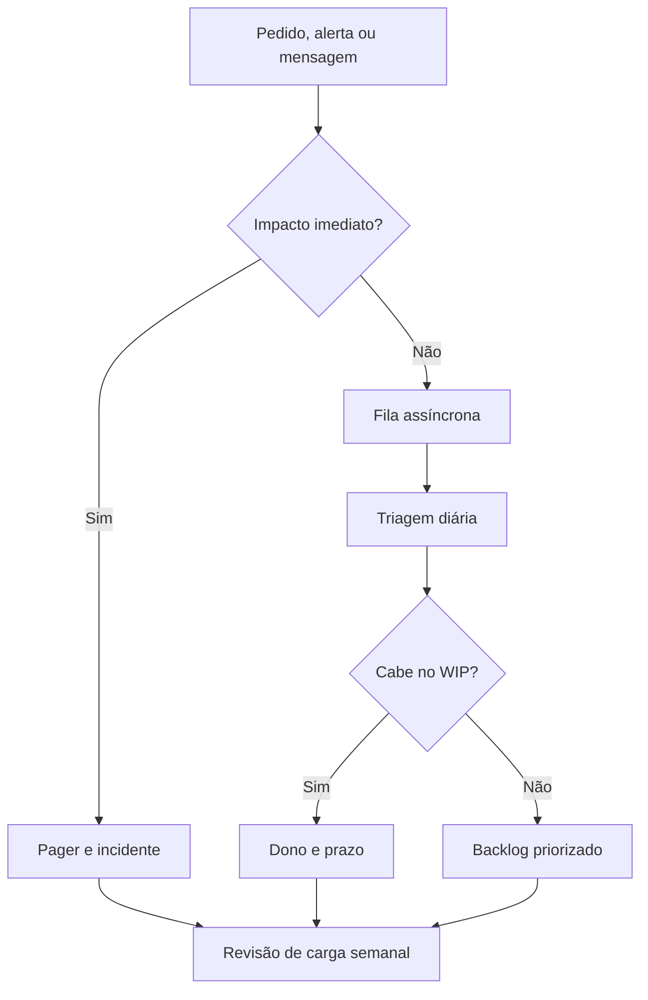

# Capítulo 20 - Lidando com interrupções

## Objetivos de aprendizagem

- Identificar como **carga operacional** aparece em produção.
- Aplicar o procedimento do tema em uma jornada, mudança, incidente ou dependência real.
- Produzir um artefato prático: métrica, política, checklist, runbook ou plano de melhoria.

## Síntese

Carga operacional sob a perspectiva humana. Sistemas complexos geram interrupções, mudanças de contexto e decisões sob pressão. Equipes melhores reduzem ruído, fornecem instruções claras, preservam fluxo cognitivo e projetam processos para que pessoas façam a tarefa certa no momento certo.

Em uma frase: **Interrupções cognitivas reduzem qualidade; processos devem proteger foco e orientar a ação.**

## Por que isso importa

**carga operacional** importa porque sistemas de produção são mantidos por pessoas, rotinas, decisões e relações entre equipes. Sem gestão explícita, mesmo boas práticas técnicas se degradam em filas de suporte, interrupções constantes e responsabilidades ambíguas.

## Conceitos essenciais

### **carga operacional**

**carga operacional**: É o volume de interrupções, decisões, tarefas reativas e suporte que compete com trabalho profundo de engenharia. Ela precisa ser medida porque a sensação de urgência costuma esconder padrões repetitivos.

Uma forma simples de aplicar isso é medir fontes de interrupção da equipe.

### **interrupções**

**Interrupções cognitivas** são quebras de atenção humana: mensagens urgentes, pedidos diretos, reuniões sem decisão, tickets aleatórios e alertas sem ação clara. Elas são diferentes de **interrupções de serviço**, que são perda ou degradação real para usuários. Confundir as duas coisas cria dois problemas: tudo vira urgente e a equipe perde capacidade de fazer engenharia preventiva.

No dia a dia, isso aparece quando a equipe precisa separar canais urgentes de canais informativos.

### **fluxo cognitivo**

**fluxo cognitivo**: É a capacidade de manter atenção em uma tarefa complexa. Interrupções frequentes quebram raciocínio e aumentam erro operacional.

Esse conceito fica concreto quando a equipe consegue criar instruções claras para alertas críticos.

### **instrução acionável**

**instrução acionável**: É orientação curta e específica sobre o que fazer diante de um sinal. Um alerta crítico deve indicar impacto, primeiro diagnóstico, caminho de mitigação e quando escalar.

Uma forma simples de aplicar isso é medir fontes de interrupção da equipe.

### **redução de ruído**

**redução de ruído**: É remover, rebaixar ou redirecionar interrupções que não exigem ação imediata. O objetivo não é silenciar produção, mas proteger atenção humana para os eventos que realmente precisam dela.

No dia a dia, isso aparece quando a equipe precisa separar canais urgentes de canais informativos.


## Aplicação prática

Escolha um serviço concreto e transforme o tema em uma ação verificável:

- Medir fontes de interrupção da equipe.
- Separar canais urgentes de canais informativos.
- Criar instruções claras para alertas críticos.

Depois da ação, registre a evidência de melhoria: menos alertas irrelevantes,
recuperação mais rápida, dependência mais clara, deploy menos arriscado, métrica
mais confiável ou decisão mais fácil de explicar.

## Aprofundamento prático

Interrupções cognitivas são trabalho invisível. Mensagens soltas, alertas informativos, reuniões sem decisão e pedidos urgentes quebram fluxo e aumentam erro. Atenção humana precisa ser tratada como recurso limitado.

O capítulo do livro separa carga operacional em páginas, tickets e atividades operacionais contínuas. Essa separação ajuda porque cada tipo de interrupção precisa de rota diferente. Página exige resposta imediata. Ticket precisa de fila, prioridade e SLO interno. Atividade contínua, como rollout de flag ou dúvida recorrente, precisa de dono e janela planejada.

Procedimento recomendado:

1. Meça fontes de interrupção por uma semana: alertas, chats, tickets, reuniões e pedidos diretos.
2. Classifique urgência real: agora, hoje, esta semana ou informativo.
3. Crie canais separados para página, suporte, dúvidas e anúncios.
4. Defina horário de triagem para trabalho não urgente.
5. Revise instruções de alertas para que a primeira ação seja clara.
6. Limite WIP operacional: quem está em projeto não deve ser destino padrão de interrupções.

Política de interrupções:

| Tipo | Exemplo | Canal | Resposta esperada | Dono |
| --- | --- | --- | --- | --- |
| Impacto em produção | SLO queimando, erro massivo, perda de dados | Pager | Imediata | On-call primário |
| Degradação sem urgência | Latência piorando sem violar SLO | Ticket | Mesmo dia útil | Triagem operacional |
| Suporte assíncrono | Dúvida de integração, pedido de capacidade | Fila de suporte | Próxima janela de triagem | Responsável da semana |
| Trabalho planejado | Rollout, revisão de alerta, limpeza de flag | Backlog | Planejamento semanal | Dono do serviço |
| Informação | Aviso, relatório, mudança sem ação | Canal informativo | Sem resposta obrigatória | Autor do anúncio |

Métrica semanal mínima:

```yaml
interrupcoes_semanais:
  pages: 12
  tickets_recebidos: 31
  tickets_repetidos: 9
  pedidos_diretos_fora_canal: 14
  reunioes_sem_decisao: 3
  horas_em_trabalho_reativo: 28
  wip_operacional_aberto: 7
  meta_proxima_semana: "reduzir pedidos diretos fora de canal em 50%"
```

Rota de triagem:

1. A pessoa identifica se há impacto imediato em usuário ou risco de perda de dados.
2. Se houver impacto imediato, aciona pager e registra incidente.
3. Se não houver impacto imediato, abre ticket com serviço, urgência, evidência e prazo desejado.
4. A triagem diária classifica o pedido por impacto, esforço, recorrência e dono.
5. Pedidos repetidos viram automação, documentação ou mudança de produto.

A boa gestão de interrupções não isola SRE do resto da empresa. Ela protege foco para que respostas urgentes sejam melhores.

## Tradução para ferramentas modernas

**Ferramentas típicas:** PagerDuty event rules, Slack workflows, Jira Service Management, filas de triagem, service desk, status channels e políticas de interrupção.

**Exemplo avançado:** separe canais por urgência: página para impacto imediato, ticket para trabalho assíncrono, canal de dúvidas para suporte e anúncio para informação. Use relatórios semanais para mostrar se a política reduziu WIP, pedidos diretos e alertas sem ação.

**Cuidado de projeto:** toda interrupção compete com engenharia profunda. Sem política, o trabalho urgente aparente domina o importante.

## Diagrama de apoio



## Erros comuns

- Tratar o problema como falta de processo quando a causa é ambiguidade de responsabilidade.
- Criar reuniões, checklists ou treinamentos sem dono e sem revisão.
- Separar gestão de SRE da realidade técnica dos serviços em produção.

## Perguntas para revisão

1. Qual risco operacional **carga operacional** ajuda a reduzir?
2. Que evidência mostraria que a prática foi aplicada com sucesso?
3. Como esse conceito mudaria uma decisão de release, plantão, arquitetura ou priorização?

## Exercícios

### Compreensão

Explique a ideia central em até cinco linhas, usando um serviço real como exemplo.

### Aplicação

Crie uma política de interrupções para um time real ou fictício. Inclua canais, SLO interno de resposta, limite de WIP, rota de triagem e métrica semanal.

### Análise

Liste duas formas de aplicar esse conceito de maneira superficial e explique o
risco de cada uma.

## Relação com práticas atuais

A prática moderna usa métricas, logs e traces com contexto compartilhado. Alertas devem representar impacto ou risco real para o usuário; o restante deve virar dashboard, análise assíncrona ou automação.

## Recursos complementares

- **Livro oficial online do Google SRE:** <https://sre.google/sre-book/>
- **The Site Reliability Workbook:** <https://sre.google/workbook/>
- **Google SRE Book - Dealing with Interrupts:** <https://sre.google/sre-book/dealing-with-interrupts/>
- **DORA - Capabilities:** <https://dora.dev/capabilities/>
- **Google SRE Resources:** <https://sre.google/resources/>

## Fechamento

Guarde a ideia principal: **Interrupções cognitivas reduzem qualidade; processos devem proteger foco e orientar a ação.**

Próximo: [Capítulo 21 - Incluindo um SRE para se recuperar de uma sobrecarga operacional](capitulo-21.md).

## Referências

- Beyer, B.; Jones, C.; Petoff, J.; Murphy, N. R. (eds.). **Site Reliability Engineering: How Google Runs Production Systems**. O'Reilly Media / Google, 2016. <https://sre.google/sre-book/>
- Beyer, B.; Murphy, N. R.; Rensin, D.; Kawahara, K.; Thorne, S. (eds.). **The Site Reliability Workbook**. O'Reilly Media / Google, 2018. <https://sre.google/workbook/>
- **Google SRE Book - Dealing with Interrupts:** <https://sre.google/sre-book/dealing-with-interrupts/>
- **DORA - Capabilities:** <https://dora.dev/capabilities/>
- **Google Cloud Well-Architected Framework:** <https://docs.cloud.google.com/architecture/framework>
- **AWS Well-Architected Reliability Pillar:** <https://docs.aws.amazon.com/wellarchitected/latest/reliability-pillar/welcome.html>
- PDF local usado como fonte primária em português: `../Engenharia de Confiabilidade do Google ( etc.).pdf`.
