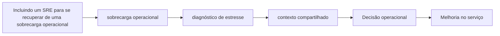

# Capítulo 21 - Incluindo um SRE para se recuperar de uma sobrecarga operacional

## Objetivos de aprendizagem

- Identificar como **sobrecarga operacional** aparece em produção.
- Aplicar o procedimento do tema em uma jornada, mudança, incidente ou dependência real.
- Produzir um artefato prático: métrica, política, checklist, runbook ou plano de melhoria.

## Síntese

Um SRE pode ajudar um serviço em crise operacional. O processo comeca por conhecer o serviço, identificar fontes de estresse, documentar o contexto e classificar problemas. Depois, a equipe ataca fundamentos: monitoração, runbooks, bugs recorrentes, automação e comunicação do raciocínio para conquistar alinhamento.

Em uma frase: **Recuperar uma equipe sobrecarregada exige entender contexto, compartilhar diagnóstico e conduzir mudanças básicas primeiro.**

## Por que isso importa

**sobrecarga operacional** importa porque sistemas de produção são mantidos por pessoas, rotinas, decisões e relações entre equipes. Sem gestão explícita, mesmo boas práticas técnicas se degradam em filas de suporte, interrupções constantes e responsabilidades ambíguas.

## Conceitos essenciais

### **sobrecarga operacional**

**sobrecarga operacional**: É quando demanda excede capacidade útil. O sistema precisa degradar de forma planejada em vez de falhar de forma caótica.

Uma forma simples de aplicar isso é: Mapear principais causas de estresse operacional.

### **diagnóstico de estresse**

**diagnóstico de estresse**: É formar e testar hipóteses sobre a causa do problema. Ele deve ser guiado por evidências, não por tentativa aleatória.

No dia a dia, isso aparece quando a equipe precisa escrever diagnóstico compartilhado para a equipe.

### **contexto compartilhado**

**contexto compartilhado**: É uma prática que transforma uma preocupação operacional em decisão concreta. Ela aparece quando a equipe precisa escolher entre aceitar risco, automatizar, simplificar, melhorar observabilidade, mudar o processo de release ou corrigir a causa raiz de um problema recorrente.

Esse conceito fica concreto quando a equipe consegue priorizar correções simples que reduzem alertas ou tickets.

### **mudanças básicas**

**mudanças básicas**: É uma prática que transforma uma preocupação operacional em decisão concreta. Ela aparece quando a equipe precisa escolher entre aceitar risco, automatizar, simplificar, melhorar observabilidade, mudar o processo de release ou corrigir a causa raiz de um problema recorrente.

Uma forma simples de aplicar isso é: Mapear principais causas de estresse operacional.

### **priorizacao**

**priorizacao**: É uma prática que transforma uma preocupação operacional em decisão concreta. Ela aparece quando a equipe precisa escolher entre aceitar risco, automatizar, simplificar, melhorar observabilidade, mudar o processo de release ou corrigir a causa raiz de um problema recorrente.

No dia a dia, isso aparece quando a equipe precisa escrever diagnóstico compartilhado para a equipe.

## Aplicação prática

Escolha um serviço concreto e transforme o tema em uma ação verificável:

- Mapear principais causas de estresse operacional.
- Escrever diagnóstico compartilhado para a equipe.
- Priorizar correções simples que reduzem alertas ou tickets.

Depois da ação, registre a evidência de melhoria: menos alertas irrelevantes,
recuperação mais rápida, dependência mais clara, deploy menos arriscado, métrica
mais confiável ou decisão mais fácil de explicar.

## Aprofundamento prático

Recuperar uma equipe em sobrecarga operacional exige diagnóstico antes de solução. Um SRE que chega em um serviço saturado deve criar contexto compartilhado: alertas frequentes, bugs recorrentes, deploys frágeis, runbooks ausentes, dependências instáveis e pedidos manuais.

Procedimento recomendado:

1. Passe uma semana observando plantão, tickets e releases.
2. Liste fontes de estresse e impacto: frequência, duração e risco.
3. Escolha vitórias básicas: alerta ruim, runbook faltante, rollback quebrado, bug repetido.
4. Comunique diagnóstico em linguagem comum para produto, engenharia e gestão.
5. Priorize correções que devolvem capacidade de engenharia.

Plano de 30 dias:

| Semana | Foco |
| --- | --- |
| 1 | Entender serviço, donos, SLOs e incidentes recentes |
| 2 | Reduzir ruído de alertas e escrever runbooks críticos |
| 3 | Corrigir principal fonte de toil ou bug recorrente |
| 4 | Revisar deploy, rollback e próximos riscos |

O risco é tentar resolver tudo. Em sobrecarga, primeiro crie espaço para respirar; depois ataque arquitetura e processos maiores.

## Diagrama de apoio

## Erros comuns

- Tratar o problema como falta de processo quando a causa é ambiguidade de responsabilidade.
- Criar reuniões, checklists ou treinamentos sem dono e sem revisão.
- Separar gestão de SRE da realidade técnica dos serviços em produção.

## Perguntas para revisão

1. Qual risco operacional **sobrecarga operacional** ajuda a reduzir?
2. Que evidência mostraria que a prática foi aplicada com sucesso?
3. Como esse conceito mudaria uma decisão de release, plantão, arquitetura ou priorização?

## Exercícios

### Compreensão

Explique a ideia central em até cinco linhas, usando um serviço real como exemplo.

### Aplicação

Escolha um serviço real e execute uma das ações práticas.

### Análise

Liste duas formas de aplicar esse conceito de maneira superficial e explique o
risco de cada uma.

## Relação com práticas atuais

Gestão moderna de SRE aparece em onboarding estruturado, catálogos de serviço, revisões de prontidão, scorecards de confiabilidade, políticas de plantão e mecanismos de colaboração entre produto, plataforma e operação.

## Recursos complementares

- **Livro oficial online do Google SRE:** <https://sre.google/sre-book/>
- **The Site Reliability Workbook:** <https://sre.google/workbook/>
- **Google SRE Book - Operational Overload:** <https://sre.google/sre-book/operational-overload/>
- **Google SRE Resources:** <https://sre.google/resources/>

## Fechamento

Guarde a ideia principal: **Recuperar uma equipe sobrecarregada exige entender contexto, compartilhar diagnóstico e conduzir mudanças básicas primeiro.**

Próximo: [Capítulo 22 - Comunicação e colaboração em SRE](capitulo-22.md).

## Referências

- Beyer, B.; Jones, C.; Petoff, J.; Murphy, N. R. (eds.). **Site Reliability Engineering: How Google Runs Production Systems**. O'Reilly Media / Google, 2016. <https://sre.google/sre-book/>
- Beyer, B.; Murphy, N. R.; Rensin, D.; Kawahara, K.; Thorne, S. (eds.). **The Site Reliability Workbook**. O'Reilly Media / Google, 2018. <https://sre.google/workbook/>
- **Google SRE Book - Operational Overload:** <https://sre.google/sre-book/operational-overload/>
- **Google Cloud Well-Architected Framework:** <https://docs.cloud.google.com/architecture/framework>
- **AWS Well-Architected Reliability Pillar:** <https://docs.aws.amazon.com/wellarchitected/latest/reliability-pillar/welcome.html>
- PDF local usado como fonte primária em português: `../Engenharia de Confiabilidade do Google ( etc.).pdf`.
