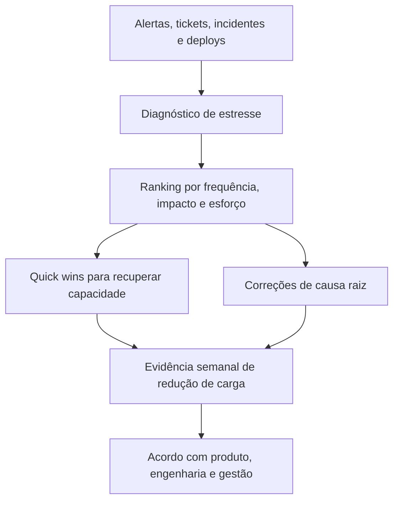

# Capítulo 21 - Incluindo um SRE para se recuperar de uma sobrecarga operacional

## Objetivos de aprendizagem

- Reconhecer sinais de **sobrecarga operacional** em uma equipe responsável por produção.
- Separar sintomas visíveis, como alertas e tickets, das causas sistêmicas que mantêm a equipe reativa.
- Montar um plano de recuperação de 30 dias com diagnóstico, quick wins, donos e evidência de melhoria.

## Síntese

Um SRE pode ajudar um serviço em crise operacional, mas não deve começar
propondo uma arquitetura nova ou uma plataforma inteira. O primeiro trabalho é
entender o serviço, observar plantão, tickets, deploys, incidentes recentes,
runbooks ausentes e fontes de toil. Depois disso, a equipe escolhe poucas ações
de alto retorno: remover alertas ruins, documentar respostas críticas, corrigir
bugs recorrentes, estabilizar rollback e tornar a priorização visível para
produto, engenharia e gestão.

Em uma frase: **Recuperar uma equipe sobrecarregada exige entender contexto, compartilhar diagnóstico e conduzir mudanças básicas primeiro.**

## Por que isso importa

**Sobrecarga operacional** transforma uma equipe de engenharia em uma fila de
resposta reativa. Quando isso acontece, quase todo o tempo vai para alertas,
tickets, reuniões urgentes, deploys assistidos e correções temporárias. A equipe
perde espaço para engenharia preventiva e o serviço fica cada vez mais difícil
de operar.

O risco não é apenas cansaço. Uma equipe sobrecarregada toma decisões piores,
deixa runbooks desatualizados, ignora sinais fracos, posterga correções de causa
raiz e normaliza incidentes recorrentes.

## Conceitos essenciais

### **sobrecarga operacional**

**Sobrecarga operacional** aparece quando a demanda de operação supera a
capacidade real da equipe de responder, aprender e melhorar o serviço. Os sinais
costumam ser concretos: muitas páginas fora de horário, tickets repetidos,
deploys que exigem acompanhamento manual, incidentes parecidos, runbooks
faltando e backlog de confiabilidade sempre adiado.

O ponto crítico é medir a carga, não apenas sentir que a equipe está ocupada.
Sem dados de alertas, tickets, incidentes e tempo gasto, a discussão vira
opinião.

### **diagnóstico de estresse**

**Diagnóstico de estresse** é a leitura estruturada das fontes de pressão sobre
a equipe. Ele cruza dados de plantão, incidentes, mudanças, tickets, dúvidas
recorrentes, dependências instáveis e atividades manuais.

Um bom diagnóstico responde três perguntas: o que mais interrompe a equipe, que
risco isso cria para usuários e qual intervenção pequena devolveria mais
capacidade de engenharia.

### **contexto compartilhado**

**Contexto compartilhado** é o acordo mínimo sobre a realidade do serviço: quais
jornadas importam, quem é dono de cada parte, quais SLOs estão em risco, quais
alertas mais interrompem, quais bugs voltam e quais dependências mais quebram.

Esse contexto evita que cada área enxergue apenas sua parte. Produto entende o
custo da instabilidade, engenharia entende a prioridade das correções e SRE
consegue defender mudanças com evidência.

### **mudanças básicas**

**Mudanças básicas** são intervenções pequenas que reduzem carga rapidamente sem
exigir redesenho completo: remover alerta sem ação, escrever runbook do alerta
mais frequente, corrigir um bug repetido, automatizar um pedido manual, testar
rollback ou esclarecer ownership de uma dependência.

Elas importam porque uma equipe afogada raramente consegue executar uma grande
transformação. Primeiro é preciso recuperar capacidade.

### **priorização**

**Priorização** em recuperação operacional combina impacto, frequência,
esforço, risco e tempo de retorno. O melhor primeiro item nem sempre é o maior
problema arquitetural; muitas vezes é o alerta que acorda a equipe toda semana
ou o procedimento manual que bloqueia todo release.

Uma regra prática: escolha uma ação que reduza interrupção visível em poucos
dias e uma ação que ataque causa raiz em poucas semanas.


## Aplicação prática

Escolha um serviço em carga operacional alta e monte um rescue plan de 30 dias:

- Levante os 10 alertas mais frequentes, os 10 tickets mais repetidos e os incidentes dos últimos 90 dias.
- Classifique cada item por frequência, impacto, dono, esforço e risco.
- Escolha três quick wins e duas correções de causa raiz.
- Defina um dono, uma data e uma evidência de conclusão para cada ação.
- Revise semanalmente se a carga reativa está caindo.

Depois da ação, registre a evidência de melhoria: menos alertas irrelevantes,
recuperação mais rápida, dependência mais clara, deploy menos arriscado, métrica
mais confiável ou decisão mais fácil de explicar.

## Aprofundamento prático

Recuperar uma equipe em sobrecarga operacional exige diagnóstico antes de solução. Um SRE que chega em um serviço saturado deve criar contexto compartilhado: alertas frequentes, bugs recorrentes, deploys frágeis, runbooks ausentes, dependências instáveis e pedidos manuais.

Separe dois fenômenos que costumam aparecer juntos:

- **sobrecarga do sistema:** CPU, memória, filas, banco de dados, rede ou dependências acima do limite seguro;
- **sobrecarga da equipe:** páginas, tickets, reuniões urgentes, deploys manuais e suporte ad hoc acima da capacidade humana.

Um serviço pode ter capacidade computacional sobrando e ainda assim destruir a semana da equipe com alertas ruins e pedidos repetidos. O rescue plan precisa medir os dois lados.

Procedimento recomendado:

1. Passe uma semana observando plantão, tickets e releases.
2. Liste fontes de estresse e impacto: frequência, duração e risco.
3. Escolha vitórias básicas: alerta ruim, runbook faltante, rollback quebrado, bug repetido.
4. Comunique diagnóstico em linguagem comum para produto, engenharia e gestão.
5. Priorize correções que devolvem capacidade de engenharia.

Diagnóstico quantitativo:

| Sinal | Como medir | Por que importa |
| --- | --- | --- |
| Páginas por semana | eventos do pager por serviço e severidade | mede interrupção imediata |
| Tickets repetidos | tickets agrupados por causa e solicitante | revela suporte que deveria virar produto, documentação ou automação |
| Incidentes 90 dias | SEV, duração, causa contribuinte e recorrência | mostra risco real para usuários |
| Toil | horas em tarefas manuais, repetitivas e sem aprendizado | mostra capacidade desperdiçada |
| Deploys assistidos | quantidade de releases que exigem acompanhamento manual | indica fragilidade de release |
| Runbooks ausentes | alertas sem primeira ação clara | aumenta MTTR e dependência de especialistas |

Plano de 30 dias:

| Semana | Foco | Entrega | Evidência |
| --- | --- | --- | --- |
| 1 | Diagnóstico | Top 10 alertas, top 10 tickets, incidentes 90 dias, SLOs em risco | Relatório com frequência, impacto, dono e esforço |
| 2 | Quick wins | Remover ou corrigir 3 alertas ruins, escrever 2 runbooks críticos | Queda de ruído ou primeira ação clara |
| 3 | Causa raiz | Corrigir 1 bug recorrente ou automatizar 1 pedido manual | Menos tickets repetidos ou menos horas de toil |
| 4 | Acordo de gestão | Backlog priorizado, ownership e metas para 60 dias | Decisão registrada com produto e engenharia |

Exemplo de rescue plan:

```yaml
rescue_plan_30d:
  servico: "checkout"
  baseline:
    pages_semana: 18
    tickets_semana: 42
    tickets_repetidos_percentual: 38
    toil_horas_semana: 31
    incidentes_90d: 7
  metas_30d:
    pages_semana: "<= 10"
    tickets_repetidos_percentual: "<= 25"
    toil_horas_semana: "<= 20"
  quick_wins:
    - "remover alerta de latencia sem impacto em SLO"
    - "criar runbook para falha de conciliacao"
    - "automatizar reprocessamento de pedido travado"
  acordo_gestao:
    tradeoff: "adiar duas features pequenas por 30 dias"
    motivo: "recuperar capacidade operacional e reduzir risco de incidente recorrente"
```

O risco é tentar resolver tudo. Em sobrecarga, primeiro crie espaço para respirar; depois ataque arquitetura e processos maiores.

## Tradução para ferramentas modernas

**Ferramentas típicas:** SLO dashboards, incident analytics, service scorecards, backlog de confiabilidade, error budget reports e revisões operacionais semanais.

**Exemplo avançado:** ao entrar em serviço sobrecarregado, faça diagnóstico de 30 dias: top alertas, top tickets, incidentes, deploys falhos, runbooks ausentes e bugs recorrentes. Leve o resultado para um acordo explícito com gestão: quais features pausam, quais riscos serão aceitos e qual melhoria precisa aparecer em 30 dias.

**Cuidado de projeto:** comece criando espaço para respirar; grandes redesenhos falham quando a equipe ainda está afogada em operação reativa.

## Diagrama de apoio



## Erros comuns

- Tratar o problema como falta de processo quando a causa é ambiguidade de responsabilidade.
- Propor redesenho grande antes de reduzir a carga reativa imediata.
- Medir apenas quantidade de tickets, sem separar recorrência, impacto e causa.
- Automatizar pedidos manuais sem perguntar por que eles existem.
- Criar reuniões, checklists ou treinamentos sem dono, prazo e revisão.
- Separar gestão de SRE da realidade técnica dos serviços em produção.

## Perguntas para revisão

1. Quais três fontes mais consomem capacidade operacional da equipe?
2. Qual ação pequena reduziria carga ainda nesta semana?
3. Qual correção de causa raiz precisa entrar no roadmap para impedir reincidência?
4. Que evidência provaria que a equipe recuperou tempo de engenharia?

## Exercícios

### Compreensão

Explique a diferença entre um serviço tecnicamente complexo e uma equipe em
sobrecarga operacional.

### Aplicação

Monte uma tabela com top alertas, top tickets e incidentes recentes. Escolha
três ações para os próximos 30 dias e escreva o acordo de prioridade necessário com gestão.

### Análise

Compare duas estratégias: corrigir o alerta mais ruidoso ou redesenhar uma
dependência crítica. Em que situação cada uma deve vir primeiro?

## Relação com práticas atuais

Em organizações modernas, recuperação de sobrecarga costuma combinar análise de
incidentes, métricas de plantão, backlog de confiabilidade, scorecards de
serviço, plataforma interna e revisão de ownership. Ferramentas ajudam, mas a
mudança real depende de prioridade explícita: reduzir carga operacional precisa
competir com novas features usando dados, não apenas apelo informal.

## Recursos complementares

- **Livro oficial online do Google SRE:** <https://sre.google/sre-book/>
- **The Site Reliability Workbook:** <https://sre.google/workbook/>
- **Google SRE Book - Operational Overload:** <https://sre.google/sre-book/operational-overload/>
- **Google SRE Book - Eliminating Toil:** <https://sre.google/sre-book/eliminating-toil/>
- **Google SRE Book - Being On-Call:** <https://sre.google/sre-book/being-on-call/>
- **DORA - Capabilities:** <https://dora.dev/capabilities/>
- **Google SRE Resources:** <https://sre.google/resources/>

## Fechamento

Guarde a ideia principal: **Recuperar uma equipe sobrecarregada exige entender contexto, compartilhar diagnóstico e conduzir mudanças básicas primeiro.**

Próximo: [Capítulo 22 - Comunicação e colaboração em SRE](capitulo-22.md).

## Referências

- Beyer, B.; Jones, C.; Petoff, J.; Murphy, N. R. (eds.). **Site Reliability Engineering: How Google Runs Production Systems**. O'Reilly Media / Google, 2016. <https://sre.google/sre-book/>
- Beyer, B.; Murphy, N. R.; Rensin, D.; Kawahara, K.; Thorne, S. (eds.). **The Site Reliability Workbook**. O'Reilly Media / Google, 2018. <https://sre.google/workbook/>
- **Google SRE Book - Operational Overload:** <https://sre.google/sre-book/operational-overload/>
- **Google SRE Book - Eliminating Toil:** <https://sre.google/sre-book/eliminating-toil/>
- **Google SRE Book - Being On-Call:** <https://sre.google/sre-book/being-on-call/>
- **DORA - Capabilities:** <https://dora.dev/capabilities/>
- **Google Cloud Well-Architected Framework:** <https://docs.cloud.google.com/architecture/framework>
- **AWS Well-Architected Reliability Pillar:** <https://docs.aws.amazon.com/wellarchitected/latest/reliability-pillar/welcome.html>
- PDF local usado como fonte primária em português: `../Engenharia de Confiabilidade do Google ( etc.).pdf`.
