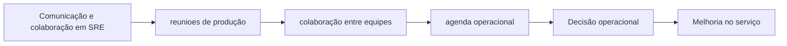

# Capítulo 22 - Comunicação e colaboração em SRE

## Objetivos de aprendizagem

- Explicar o problema de confiabilidade tratado pelo tema.
- Reconhecer onde o tema aparece em um serviço real.
- Aplicar o conceito em uma decisão operacional ou de engenharia.

## Síntese

Reunioes de produção, composicao de equipes e técnicas de colaboração. Como SRE fica entre produto, infraestrutura e operação, precisa criar foruns, agendas, documentos e relacoes que mantenham todos alinhados. Comunicação eficaz reduz ambiguidades e permite decisões técnicas mais rápidas.

Em uma frase: **SRE depende de comunicação estruturada entre equipes com objetivos, incentivos e contextos diferentes.**

## Por que isso importa

**reunioes de produção** importa porque sistemas de produção são mantidos por pessoas, rotinas, decisões e relações entre equipes. Sem gestão explícita, mesmo boas práticas técnicas se degradam em filas de suporte, interrupções constantes e responsabilidades ambíguas.

## Conceitos essenciais

### **reunioes de produção**

**reunioes de produção**: São pontos de sincronização para decisões e riscos operacionais. Reuniões boas têm pauta, decisões registradas e próximos passos claros.

Uma forma simples de aplicar isso é: Definir pauta fixa para reuniao de produção.

### **colaboração entre equipes**

**colaboração entre equipes**: É alinhar times com responsabilidades diferentes. Em SRE, colaboração boa transforma conflito entre velocidade e estabilidade em decisão explícita.

No dia a dia, isso aparece quando a equipe precisa registrar decisões e pendencias operacionais.

### **agenda operacional**

**agenda operacional**: É o contrato da reunião. Uma agenda clara evita discussões abertas demais e mantém foco em produção, risco e decisão.

Esse conceito fica concreto quando a equipe consegue criar canal claro para negociacao de SLO e prioridades.

### **composicao de equipe**

**composicao de equipe**: É uma prática que transforma uma preocupação operacional em decisão concreta. Ela aparece quando a equipe precisa escolher entre aceitar risco, automatizar, simplificar, melhorar observabilidade, mudar o processo de release ou corrigir a causa raiz de um problema recorrente.

Uma forma simples de aplicar isso é: Definir pauta fixa para reuniao de produção.

### **alinhamento**

**alinhamento**: É uma prática que transforma uma preocupação operacional em decisão concreta. Ela aparece quando a equipe precisa escolher entre aceitar risco, automatizar, simplificar, melhorar observabilidade, mudar o processo de release ou corrigir a causa raiz de um problema recorrente.

No dia a dia, isso aparece quando a equipe precisa registrar decisões e pendencias operacionais.

## Aplicação prática

Para evitar burocracia, escolha um serviço concreto e execute uma ação pequena:

- Definir pauta fixa para reuniao de produção.
- Registrar decisões e pendencias operacionais.
- Criar canal claro para negociacao de SLO e prioridades.

Depois da ação, procure uma evidência simples de melhoria: menos alertas
irrelevantes, recuperação mais rápida, dependência mais clara, deploy menos
arriscado, métrica mais confiável ou decisão mais fácil de explicar.

## Diagrama de apoio

## Erros comuns

- Tratar o problema como falta de processo quando a causa é ambiguidade de responsabilidade.
- Criar reuniões, checklists ou treinamentos sem dono e sem revisão.
- Separar gestão de SRE da realidade técnica dos serviços em produção.

## Perguntas para revisão

1. Qual risco operacional **reunioes de produção** ajuda a reduzir?
2. Que evidência mostraria que a prática foi aplicada com sucesso?
3. Como esse conceito mudaria uma decisão de release, plantão, arquitetura ou priorização?

## Exercícios

### Compreensão

Explique a ideia central em até cinco linhas, usando um serviço real como exemplo.

### Aplicação

Escolha um serviço real e execute uma das ações práticas.

### Análise

Liste duas formas de aplicar esse conceito de maneira superficial e explique o
risco de cada uma.

## Relação com práticas atuais

Gestão moderna de SRE aparece em onboarding estruturado, catálogos de serviço, revisões de prontidão, scorecards de confiabilidade, políticas de plantão e mecanismos de colaboração entre produto, plataforma e operação.

## Recursos complementares

- **Livro oficial online do Google SRE:** <https://sre.google/sre-book/>
- **The Site Reliability Workbook:** <https://sre.google/workbook/>
- **Google SRE Book - Communication and Collaboration in SRE:** <https://sre.google/sre-book/communication-and-collaboration/>
- **Google SRE Resources:** <https://sre.google/resources/>

## Fechamento

Guarde a ideia principal: **SRE depende de comunicação estruturada entre equipes com objetivos, incentivos e contextos diferentes.**

Próximo: [Capítulo 23 - O modelo de engajamento da SRE em evolução](capitulo-23.md).

## Referências

- Beyer, B.; Jones, C.; Petoff, J.; Murphy, N. R. (eds.). **Site Reliability Engineering: How Google Runs Production Systems**. O'Reilly Media / Google, 2016. <https://sre.google/sre-book/>
- Beyer, B.; Murphy, N. R.; Rensin, D.; Kawahara, K.; Thorne, S. (eds.). **The Site Reliability Workbook**. O'Reilly Media / Google, 2018. <https://sre.google/workbook/>
- **Google SRE Book - Communication and Collaboration in SRE:** <https://sre.google/sre-book/communication-and-collaboration/>
- **Google Cloud Well-Architected Framework:** <https://docs.cloud.google.com/architecture/framework>
- **AWS Well-Architected Reliability Pillar:** <https://docs.aws.amazon.com/wellarchitected/latest/reliability-pillar/welcome.html>
- PDF local usado como fonte primária em português: `../Engenharia de Confiabilidade do Google ( etc.).pdf`.
