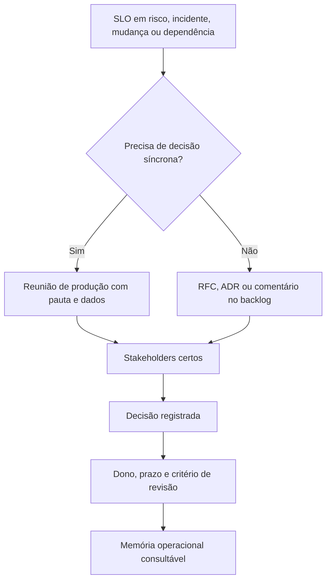

# Capítulo 22 - Comunicação e colaboração em SRE

## Objetivos de aprendizagem

- Estruturar comunicação entre SRE, produto, desenvolvimento, plataforma e operação.
- Usar reuniões de produção, documentos de decisão e canais assíncronos para reduzir ambiguidade.
- Registrar decisões operacionais com contexto, dono, prazo e critério de revisão.

## Síntese

Reuniões de produção, composição de equipes e técnicas de colaboração ajudam SRE
a transformar sinais operacionais em decisões compartilhadas. Como SRE fica
entre produto, desenvolvimento, infraestrutura e operação, a equipe precisa de
fóruns, documentos e canais que deixem claro quem decide, com quais dados, até
quando e com que consequência.

Em uma frase: **SRE depende de comunicação estruturada entre equipes com objetivos, incentivos e contextos diferentes.**

## Por que isso importa

**Comunicação operacional** importa porque confiabilidade quase sempre cruza
fronteiras de equipe. Um SLO em risco pode exigir adiar release, ajustar
capacidade, corrigir dependência, mudar prioridade de produto ou aceitar risco
de forma explícita. Sem registro e fórum adequado, essas decisões viram disputa
de opinião ou desaparecem em conversas de chat.

## Conceitos essenciais

### **reuniões de produção**

**Reuniões de produção** são pontos regulares para revisar saúde do serviço,
risco de mudanças, incidentes recentes, SLOs, capacidade, dependências e ações
pendentes. Elas não substituem investigação técnica profunda; servem para
decidir prioridades e remover ambiguidades.

Uma reunião boa tem pauta curta, dados antes de opinião, decisões registradas e
próximos passos com dono.

### **colaboração entre equipes**

**colaboração entre equipes**: É alinhar times com responsabilidades diferentes. Em SRE, colaboração boa transforma conflito entre velocidade e estabilidade em decisão explícita.

No dia a dia, isso aparece quando produto quer avançar um lançamento, engenharia
quer corrigir uma causa raiz e SRE mostra que o error budget está em risco. A
colaboração madura não elimina conflito; ela torna o trade-off visível.

### **agenda operacional**

**agenda operacional**: É o contrato da reunião. Uma agenda clara evita discussões abertas demais e mantém foco em produção, risco e decisão.

Esse conceito fica concreto quando a equipe consegue criar canal claro para
negociação de SLO, prioridades e exceções operacionais.

### **composição de equipe**

**Composição de equipe** define quais perfis participam da decisão operacional.
Um fórum de produção geralmente precisa de alguém que entenda produto, alguém
que conheça o serviço, alguém responsável pela plataforma ou infraestrutura e
alguém com contexto de SRE. Sem as pessoas certas, a reunião acumula pendências
ou decide sem autoridade.

Composição não significa colocar todo mundo em toda conversa. Significa chamar
as pessoas certas para a decisão certa.

### **alinhamento**

**Alinhamento** é a clareza compartilhada sobre objetivo, risco aceito, decisão,
dono e prazo. Em SRE, alinhamento precisa aparecer em artefatos consultáveis:
ADR, RFC, ata de reunião, postmortem, contrato de engajamento, scorecard de
serviço ou backlog de confiabilidade.

Alinhamento real permite que uma pessoa nova entenda por que uma decisão foi
tomada sem depender de memória oral.


## Aplicação prática

Escolha um serviço com várias equipes envolvidas e estruture a comunicação:

- Defina uma pauta fixa para reunião de produção.
- Liste participantes obrigatórios e participantes chamados sob demanda.
- Registre decisões, pendências, donos e prazos.
- Crie um canal claro para negociação de SLO, release e prioridades.
- Use ADR ou RFC quando a decisão mudar arquitetura, ownership ou processo.

Depois da ação, registre a evidência de melhoria: menos alertas irrelevantes,
recuperação mais rápida, dependência mais clara, deploy menos arriscado, métrica
mais confiável ou decisão mais fácil de explicar.

## Aprofundamento prático

Comunicação operacional precisa de fóruns previsíveis. Reunião de produção não deve ser uma conversa genérica; deve revisar risco, mudanças recentes, SLOs, incidentes, capacidade, dependências e ações pendentes.

Procedimento recomendado:

1. Mantenha pauta fixa e curta.
2. Traga dados: SLO, error budget, incidentes, top alertas e mudanças relevantes.
3. Registre decisões, donos e prazos.
4. Separe discussão técnica profunda para follow-up.
5. Revise pendências antigas e remova o que perdeu sentido.
6. Use RFC para propostas em debate e ADR para decisões tomadas.

Modelo de pauta:

```markdown
# Reunião de produção
SLOs em risco:
Mudanças relevantes:
Incidentes e quase-incidentes:
Top fontes de toil:
Dependências críticas:
Decisões tomadas:
Ações com dono e prazo:
```

Mapa de stakeholders:

| Stakeholder | Interesse | Precisa decidir? | Informação necessária |
| --- | --- | --- | --- |
| Produto | Prazo, usuário, meta comercial | Sim, quando há trade-off de escopo ou data | Impacto em usuário, risco aceito e alternativa |
| Engenharia | Implementação e manutenção | Sim, quando muda arquitetura ou ownership | Opções técnicas, esforço, risco e dívida criada |
| SRE | Confiabilidade e operabilidade | Sim, quando SLO, plantão ou operação mudam | Error budget, incidentes, carga operacional e rollback |
| Suporte | Comunicação com cliente | Às vezes | Sintomas, mitigação, prazo de atualização |
| Segurança ou compliance | Risco regulatório ou abuso | Às vezes | Dados afetados, controles, exceções e prazo |

Quando usar cada artefato:

| Artefato | Use quando | Resultado esperado |
| --- | --- | --- |
| Reunião de produção | Há decisão recorrente sobre saúde do serviço | Decisões, donos e prazos |
| RFC | Ainda há opções em aberto e pessoas precisam comentar | Proposta discutida antes da implementação |
| ADR | A decisão foi tomada e precisa virar memória durável | Contexto, decisão, alternativas e consequências |
| Postmortem | Houve incidente ou quase-incidente relevante | Aprendizado e ações corretivas |
| Comentário no backlog | A decisão é pequena e ligada a uma tarefa | Histórico suficiente sem documento longo |

Modelo de ADR operacional:

```markdown
# ADR: pausar rollout do checkout v2

## Contexto
O error budget mensal do checkout está 70% consumido e o canário do checkout v2 elevou p95 em 35%.

## Opções
1. Continuar rollout e aceitar risco.
2. Pausar rollout por 7 dias e corrigir gargalo.
3. Fazer rollback completo e replanejar.

## Decisão
Pausar rollout por 7 dias.

## Consequências
- Produto ajusta comunicação de prazo.
- Engenharia prioriza correção de latência.
- SRE mantém monitoramento diário do SLO.

## Revisão
Reavaliar em 2026-07-01 com dados do canário.
```

Conflito comum: produto quer cumprir uma data, enquanto SRE mostra que o SLO está em risco. A saída madura não é "SRE bloqueia" nem "produto manda". A decisão precisa deixar explícitos dados, opções e risco aceito:

1. Qual SLO está em risco e quanto error budget resta?
2. Qual usuário ou jornada será afetado?
3. Que opções existem: reduzir escopo, pausar rollout, lançar para menos usuários, aceitar risco ou investir em mitigação?
4. Quem tem autoridade para aceitar o risco?
5. Quando a decisão será revisada?

A técnica é transformar conversa em memória operacional. Decisão que fica apenas no chat desaparece; decisão registrada pode ser cobrada, revisada e aprendida.

## Tradução para ferramentas modernas

**Ferramentas típicas:** ADRs, RFCs, reuniões de produção, service review docs, Slack/Teams, Google Docs, Confluence, Linear/Jira e dashboards compartilhados.

**Exemplo avançado:** implemente reunião de produção com pauta fixa: SLOs em risco, mudanças, incidentes, toil, dependências, decisões e ações com dono. Use RFC quando ainda há proposta em aberto e ADR quando a decisão precisa ser consultada depois.

**Cuidado de projeto:** comunicação sem registro não escala. Decisão operacional precisa virar memória consultável.

## Exemplos e ferramentas do livro

O estudo de caso **Viceroy** aparece no livro para discutir colaboração em
SRE. A lição é que confiabilidade depende de relações de trabalho,
comunicação estruturada, decisões registradas e entendimento compartilhado
entre equipes.

No curso, conecte esse exemplo a reuniões de produção, documentos de decisão,
revisão de SLO, acompanhamento de ações e fóruns de alinhamento entre
produto, desenvolvimento, plataforma e SRE.

## Diagrama de apoio



## Erros comuns

- Tratar o problema como falta de processo quando a causa é ambiguidade de responsabilidade.
- Fazer reunião sem dados de SLO, incidentes, mudanças ou capacidade.
- Decidir no chat e não registrar contexto, dono e prazo.
- Colocar pessoas demais em fóruns recorrentes sem critério de participação.
- Criar reuniões, checklists ou treinamentos sem dono e sem revisão.
- Separar gestão de SRE da realidade técnica dos serviços em produção.

## Perguntas para revisão

1. Que decisões operacionais hoje dependem de memória oral ou conversa de chat?
2. Qual fórum deveria revisar SLOs em risco, incidentes e mudanças relevantes?
3. Quando a equipe deve usar reunião, RFC, ADR ou comentário no backlog?
4. Que evidência mostra que a comunicação reduziu ambiguidade?

## Exercícios

### Compreensão

Explique por que comunicação operacional não é apenas "fazer mais reuniões".

### Aplicação

Crie uma pauta de reunião de produção para um serviço real ou fictício,
incluindo SLOs, mudanças, incidentes, dependências e ações pendentes.
Depois escreva um ADR curto sobre uma decisão SLO versus prazo.

### Análise

Escolha uma decisão operacional recente e escreva um mini-ADR com contexto,
opções consideradas, decisão, consequências e data de revisão.

## Relação com práticas atuais

Em ambientes atuais, comunicação SRE aparece em RFCs, ADRs, revisões de
produção, canais de incidente, documentos vivos, scorecards de serviço,
catálogos internos e rituais de planejamento. A prática madura combina
comunicação assíncrona para contexto durável e reuniões curtas para decisões
que exigem alinhamento rápido entre áreas.

## Recursos complementares

- **Livro oficial online do Google SRE:** <https://sre.google/sre-book/>
- **The Site Reliability Workbook:** <https://sre.google/workbook/>
- **Google SRE Book - Communication and Collaboration in SRE:** <https://sre.google/sre-book/communication-and-collaboration/>
- **Architectural Decision Records:** <https://adr.github.io/>
- **Google SRE Resources:** <https://sre.google/resources/>

## Fechamento

Guarde a ideia principal: **SRE depende de comunicação estruturada entre equipes com objetivos, incentivos e contextos diferentes.**

Próximo: [Capítulo 23 - O modelo de engajamento da SRE em evolução](capitulo-23.md).

## Referências

- Beyer, B.; Jones, C.; Petoff, J.; Murphy, N. R. (eds.). **Site Reliability Engineering: How Google Runs Production Systems**. O'Reilly Media / Google, 2016. <https://sre.google/sre-book/>
- Beyer, B.; Murphy, N. R.; Rensin, D.; Kawahara, K.; Thorne, S. (eds.). **The Site Reliability Workbook**. O'Reilly Media / Google, 2018. <https://sre.google/workbook/>
- **Google SRE Book - Communication and Collaboration in SRE:** <https://sre.google/sre-book/communication-and-collaboration/>
- **Architectural Decision Records:** <https://adr.github.io/>
- **Google Cloud Well-Architected Framework:** <https://docs.cloud.google.com/architecture/framework>
- **AWS Well-Architected Reliability Pillar:** <https://docs.aws.amazon.com/wellarchitected/latest/reliability-pillar/welcome.html>
- PDF local usado como fonte primária em português: `../Engenharia de Confiabilidade do Google ( etc.).pdf`.
