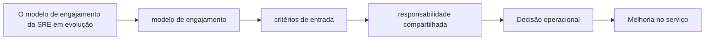

# Capítulo 23 - O modelo de engajamento da SRE em evolução

## Objetivos de aprendizagem

- Explicar o problema de confiabilidade tratado pelo tema.
- Reconhecer onde o tema aparece em um serviço real.
- Aplicar o conceito em uma decisão operacional ou de engenharia.

## Síntese

SRE decide quando se engajar com um serviço e como esse modelo evolui. A relação deve deixar explícitos requisitos de confiabilidade, maturidade operacional, responsabilidades, limites e mecanismos de revisão. Isso evita que SRE vire uma fila de suporte e preserva foco em engenharia de impacto.

Em uma frase: **O relacionamento entre SRE e equipes de produto precisa de critérios claros de entrada, saída e responsabilidade.**

## Por que isso importa

**modelo de engajamento** importa porque sistemas de produção são mantidos por pessoas, rotinas, decisões e relações entre equipes. Sem gestão explícita, mesmo boas práticas técnicas se degradam em filas de suporte, interrupções constantes e responsabilidades ambíguas.

## Conceitos essenciais

### **modelo de engajamento**

**modelo de engajamento**: É o acordo que define quando SRE entra, permanece ou sai da operação de um serviço. Ele protege a equipe contra suporte ilimitado e deixa responsabilidades visíveis.

Uma forma simples de aplicar isso é: Definir critérios para SRE aceitar um serviço.

### **critérios de entrada**

**critérios de entrada**: São requisitos mínimos para um serviço receber apoio de SRE, como SLOs, observabilidade, runbooks, rollback, ownership e capacidade de responder incidentes.

No dia a dia, isso aparece quando a equipe precisa criar checklist de prontidao operacional.

### **responsabilidade compartilhada**

**responsabilidade compartilhada**: É a divisão explícita de obrigações entre SRE, produto, plataforma e desenvolvimento. Confiabilidade melhora quando todos sabem quais decisões continuam sob seu controle.

Esse conceito fica concreto quando a equipe consegue estabelecer revisoes periodicas de engajamento.

### **maturidade operacional**

**maturidade operacional**: É o grau em que um serviço consegue ser operado com risco conhecido: alertas úteis, documentação viva, deploy reversível, dependências entendidas e incidentes aprendidos.

Uma forma simples de aplicar isso é: Definir critérios para SRE aceitar um serviço.

### **revisão de serviço**

**revisão de serviço**: É uma avaliação periódica da saúde operacional do serviço. Ela verifica SLOs, incidentes, toil, dependências, capacidade, riscos e ações pendentes.

No dia a dia, isso aparece quando a equipe precisa criar checklist de prontidao operacional.

## Aplicação prática

Para evitar burocracia, escolha um serviço concreto e execute uma ação pequena:

- Definir critérios para SRE aceitar um serviço.
- Criar checklist de prontidao operacional.
- Estabelecer revisoes periodicas de engajamento.

Depois da ação, procure uma evidência simples de melhoria: menos alertas
irrelevantes, recuperação mais rápida, dependência mais clara, deploy menos
arriscado, métrica mais confiável ou decisão mais fácil de explicar.

## Diagrama de apoio

## Erros comuns

- Tratar o problema como falta de processo quando a causa é ambiguidade de responsabilidade.
- Criar reuniões, checklists ou treinamentos sem dono e sem revisão.
- Separar gestão de SRE da realidade técnica dos serviços em produção.

## Perguntas para revisão

1. Qual risco operacional **modelo de engajamento** ajuda a reduzir?
2. Que evidência mostraria que a prática foi aplicada com sucesso?
3. Como esse conceito mudaria uma decisão de release, plantão, arquitetura ou priorização?

## Exercícios

### Compreensão

Explique a ideia central em até cinco linhas, usando um serviço real como exemplo.

### Aplicação

Escolha um serviço real e execute uma das ações práticas.

### Análise

Liste duas formas de aplicar esse conceito de maneira superficial e explique o
risco de cada uma.

## Relação com práticas atuais

Gestão moderna de SRE aparece em onboarding estruturado, catálogos de serviço, revisões de prontidão, scorecards de confiabilidade, políticas de plantão e mecanismos de colaboração entre produto, plataforma e operação.

## Recursos complementares

- **Livro oficial online do Google SRE:** <https://sre.google/sre-book/>
- **The Site Reliability Workbook:** <https://sre.google/workbook/>
- **Google SRE Book - The Evolving SRE Engagement Model:** <https://sre.google/sre-book/evolving-sre-engagement-model/>
- **Site Reliability Workbook - SRE Engagement Model:** <https://sre.google/workbook/engagement-model/>
- **Google SRE Resources:** <https://sre.google/resources/>

## Fechamento

Guarde a ideia principal: **O relacionamento entre SRE e equipes de produto precisa de critérios claros de entrada, saída e responsabilidade.**

Próximo: [Capítulo 24 - Lições aprendidas com outros mercados](capitulo-24.md).

## Referências

- Beyer, B.; Jones, C.; Petoff, J.; Murphy, N. R. (eds.). **Site Reliability Engineering: How Google Runs Production Systems**. O'Reilly Media / Google, 2016. <https://sre.google/sre-book/>
- Beyer, B.; Murphy, N. R.; Rensin, D.; Kawahara, K.; Thorne, S. (eds.). **The Site Reliability Workbook**. O'Reilly Media / Google, 2018. <https://sre.google/workbook/>
- **Google SRE Book - The Evolving SRE Engagement Model:** <https://sre.google/sre-book/evolving-sre-engagement-model/>
- **Site Reliability Workbook - SRE Engagement Model:** <https://sre.google/workbook/engagement-model/>
- **Google Cloud Well-Architected Framework:** <https://docs.cloud.google.com/architecture/framework>
- **AWS Well-Architected Reliability Pillar:** <https://docs.aws.amazon.com/wellarchitected/latest/reliability-pillar/welcome.html>
- PDF local usado como fonte primária em português: `../Engenharia de Confiabilidade do Google ( etc.).pdf`.
