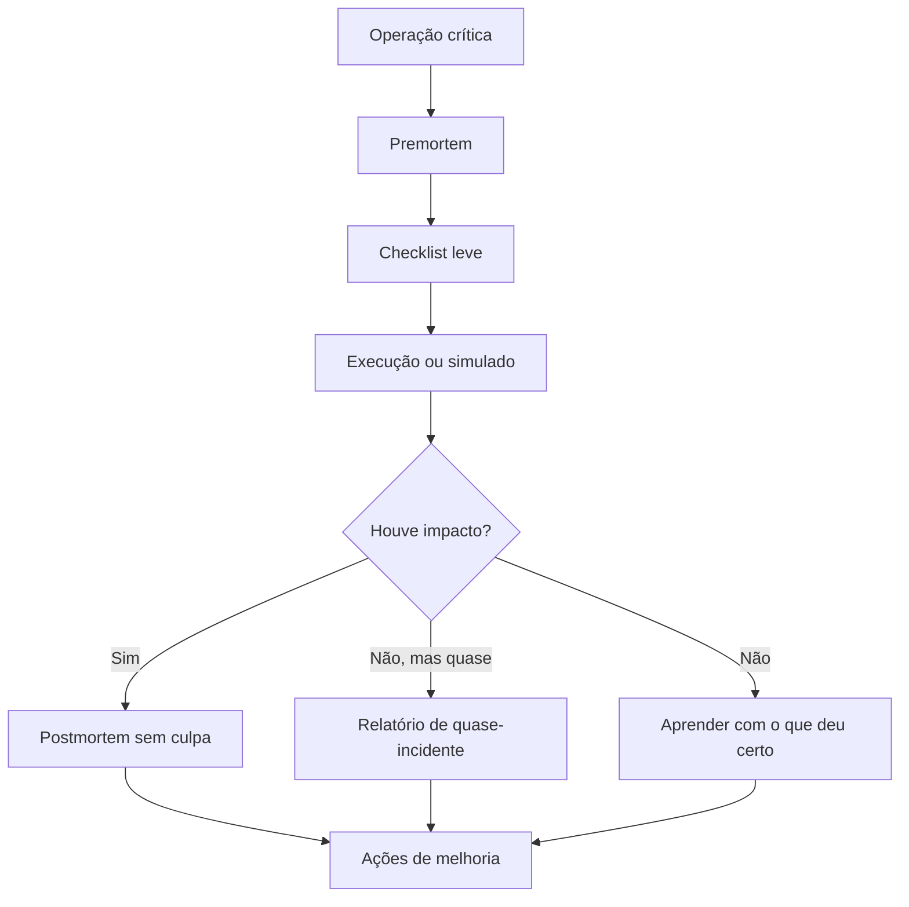

# Capítulo 24 - Lições aprendidas com outros mercados

## Objetivos de aprendizagem

- Identificar como **aprendizado intersetorial** aparece em produção.
- Aplicar o procedimento do tema em uma jornada, mudança, incidente ou dependência real.
- Produzir um artefato prático: métrica, política, checklist, runbook ou plano de melhoria.

## Síntese

SRE com mercados que lidam com risco, segurança e operação crítica. A confiabilidade em software pode aprender com checklists, cultura de reporte, investigação sem culpa, treinamento, redundância e padrões. A diferença é que software muda muito rápido, portanto precisa adaptar essas práticas a ciclos curtos e sistemas distribuídos.

Em uma frase: **Setores como saúde, aviação e energia mostram práticas de segurança que inspiram confiabilidade em software.**

## Por que isso importa

**aprendizado intersetorial** importa porque sistemas de produção são mantidos por pessoas, rotinas, decisões e relações entre equipes. Sem gestão explícita, mesmo boas práticas técnicas se degradam em filas de suporte, interrupções constantes e responsabilidades ambíguas.

## Conceitos essenciais

### **aprendizado intersetorial**

**aprendizado intersetorial**: É adaptar práticas de setores de alto risco para software, como checklists, treinamento, investigação sem culpa e reporte de quase-incidentes.

Uma forma simples de aplicar isso é: Comparar um processo interno com práticas de setores regulados.

### **segurança operacional**

**segurança operacional**: É a condição para responder incidentes sem medo de punição por decisões razoáveis. Sem isso, pessoas escondem falhas e atrasam aprendizado.

No dia a dia, isso aparece quando a equipe precisa introduzir checklist em uma operação crítica.

### **checklists**

**checklists**: É uma memória operacional externa. Ajuda a evitar esquecimentos em lançamentos, incidentes e mudanças repetidas.

Esse conceito fica concreto quando a equipe consegue incentivar reporte de quase-incidentes.

### **cultura de reporte**

**cultura de reporte**: É o ambiente em que pessoas relatam falhas, riscos e quase-incidentes sem medo de punição por decisões razoáveis. Sem reporte, a organização perde sinais precoces.

Uma forma simples de aplicar isso é: Comparar um processo interno com práticas de setores regulados.

### **adaptação a software**

**adaptação a software**: É ajustar práticas de segurança operacional ao ritmo de sistemas digitais, que mudam rápido, têm dependências distribuídas e permitem automação em escala.

No dia a dia, isso aparece quando a equipe precisa introduzir checklist em uma operação crítica.


## Aplicação prática

Escolha um serviço concreto e transforme o tema em uma ação verificável:

- Comparar um processo interno com práticas de setores regulados.
- Introduzir checklist em uma operação crítica.
- Incentivar reporte de quase-incidentes.

Depois da ação, registre a evidência de melhoria: menos alertas irrelevantes,
recuperação mais rápida, dependência mais clara, deploy menos arriscado, métrica
mais confiável ou decisão mais fácil de explicar.

## Aprofundamento prático

Setores como aviação, saúde e energia mostram que sistemas críticos dependem de treinamento, checklists, reporte de quase-incidentes e investigação sem culpa. A adaptação para software precisa respeitar a velocidade de mudança: checklists devem ser leves, versionados e usados no fluxo real.

Safety-I e Safety-II ajudam a ampliar a análise. Safety-I pergunta "o que deu errado e como evitar repetição?". Safety-II pergunta também "o que normalmente dá certo, apesar de pressão, improviso e variação?". Em software, isso muda a conversa: além de investigar incidentes, a equipe aprende com deploys difíceis que terminaram bem, plantões que evitaram impacto e mitigação feita cedo.

**Cultura justa** não significa ausência de responsabilidade. Significa separar erro humano razoável, decisão sob contexto incompleto, violação deliberada e desenho de sistema que induz falha. Sem essa distinção, pessoas escondem sinais fracos; com ela, a organização aprende mais cedo.

Procedimento recomendado:

1. Escolha uma operação crítica: lançamento, migração, failover, restauração ou resposta a incidente.
2. Crie checklist curto com itens que evitam esquecimento perigoso.
3. Teste o checklist em simulado ou mudança real pequena.
4. Incentive reporte de quase-incidentes sem punição.
5. Revise o processo depois de cada uso.
6. Faça premortem antes de mudanças de alto risco.

Exemplo de checklist de failover:

| Item | Confirmação |
| --- | --- |
| Critério de failover atingido | Sim / não |
| Capacidade do destino validada | Sim / não |
| Stakeholders informados | Sim / não |
| Plano de retorno definido | Sim / não |
| Métricas pós-failover monitoradas | Sim / não |

Relatório de quase-incidente:

```markdown
# Quase-incidente: fila de pagamentos chegou a 85% do limite

## O que quase aconteceu?
A fila de pagamentos se aproximou do limite que causaria atraso para usuários.

## Como percebemos?
Alerta de saturação e observação do on-call durante rollout.

## O que funcionou?
Canário pausado rapidamente, dashboard tinha métrica correta e suporte foi avisado.

## O que foi adaptação humana?
On-call correlacionou aumento de fila com deploy antes de violar SLO.

## O que precisa melhorar?
Adicionar critério automático de pausa e documentar limite seguro da fila.

## Ações
- Ajustar regra de canário até sexta.
- Atualizar runbook de saturação.
- Incluir cenário no próximo game day.
```

Premortem de mudança crítica:

| Pergunta | Resposta esperada |
| --- | --- |
| Se isso falhar em 24h, qual foi a causa provável? | Hipóteses de falha antes do deploy |
| Que sinal apareceria primeiro? | Métrica, log, alerta ou reclamação |
| Qual decisão seria difícil sob pressão? | Critério de rollback, comunicação ou aceitação de risco |
| Quem pode abortar? | Nome ou papel com autoridade |
| Que parte do plano depende de memória humana? | Item que precisa virar checklist ou automação |

O aprendizado intersetorial mais útil é disciplina operacional, não burocracia. O processo deve reduzir erro humano sem impedir resposta rápida.

## Tradução para ferramentas modernas

**Ferramentas típicas:** checklists digitais, game days, safety cases leves, premortems, quase-incidentes, revisões sem culpa e auditorias operacionais.

**Exemplo avançado:** adapte prática de aviação para failover: checklist curto, confirmação verbal, critério de abortar, responsável por comunicação e revisão pós-execução. Use quase-incidentes como fonte de aprendizado antes que o usuário seja afetado.

**Cuidado de projeto:** processo inspirado em setor crítico deve reduzir erro, não criar burocracia incompatível com software.

## Diagrama de apoio



## Erros comuns

- Tratar o problema como falta de processo quando a causa é ambiguidade de responsabilidade.
- Criar reuniões, checklists ou treinamentos sem dono e sem revisão.
- Separar gestão de SRE da realidade técnica dos serviços em produção.

## Perguntas para revisão

1. Qual risco operacional **aprendizado intersetorial** ajuda a reduzir?
2. Que evidência mostraria que a prática foi aplicada com sucesso?
3. Como esse conceito mudaria uma decisão de release, plantão, arquitetura ou priorização?

## Exercícios

### Compreensão

Explique a ideia central em até cinco linhas, usando um serviço real como exemplo.

### Aplicação

Escolha uma operação crítica e produza dois artefatos: um checklist de failover e um relatório de quase-incidente.

### Análise

Liste duas formas de aplicar esse conceito de maneira superficial e explique o
risco de cada uma.

## Relação com práticas atuais

Gestão moderna de SRE aparece em onboarding estruturado, catálogos de serviço, revisões de prontidão, scorecards de confiabilidade, políticas de plantão e mecanismos de colaboração entre produto, plataforma e operação.

## Recursos complementares

- **Livro oficial online do Google SRE:** <https://sre.google/sre-book/>
- **The Site Reliability Workbook:** <https://sre.google/workbook/>
- **Google SRE Book - Lessons Learned from Other Industries:** <https://sre.google/sre-book/lessons-learned/>
- **NIST Cybersecurity Framework:** <https://www.nist.gov/cyberframework>
- **Safety-II overview - SKYbrary:** <https://www.skybrary.aero/articles/safety-ii>
- **PSNet - Safety-I, Safety-II and New Views of Safety:** <https://psnet.ahrq.gov/primer/safety-i-safety-ii-and-new-views-safety>
- **Google SRE Resources:** <https://sre.google/resources/>

## Fechamento

Guarde a ideia principal: **Setores como saúde, aviação e energia mostram práticas de segurança que inspiram confiabilidade em software.**

Próximo: [Capítulo 25 - Conclusão](capitulo-25.md).

## Referências

- Beyer, B.; Jones, C.; Petoff, J.; Murphy, N. R. (eds.). **Site Reliability Engineering: How Google Runs Production Systems**. O'Reilly Media / Google, 2016. <https://sre.google/sre-book/>
- Beyer, B.; Murphy, N. R.; Rensin, D.; Kawahara, K.; Thorne, S. (eds.). **The Site Reliability Workbook**. O'Reilly Media / Google, 2018. <https://sre.google/workbook/>
- **Google SRE Book - Lessons Learned from Other Industries:** <https://sre.google/sre-book/lessons-learned/>
- **NIST Cybersecurity Framework:** <https://www.nist.gov/cyberframework>
- **Safety-II overview - SKYbrary:** <https://www.skybrary.aero/articles/safety-ii>
- **PSNet - Safety-I, Safety-II and New Views of Safety:** <https://psnet.ahrq.gov/primer/safety-i-safety-ii-and-new-views-safety>
- **Google Cloud Well-Architected Framework:** <https://docs.cloud.google.com/architecture/framework>
- **AWS Well-Architected Reliability Pillar:** <https://docs.aws.amazon.com/wellarchitected/latest/reliability-pillar/welcome.html>
- PDF local usado como fonte primária em português: `../Engenharia de Confiabilidade do Google ( etc.).pdf`.
