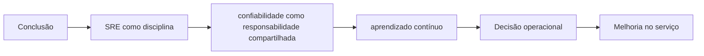

# Capítulo 25 - Conclusão

## Objetivos de aprendizagem

- Identificar como **SRE como disciplina** aparece em produção.
- Aplicar o procedimento do tema em uma jornada, mudança, incidente ou dependência real.
- Produzir um artefato prático: métrica, política, checklist, runbook ou plano de melhoria.

## Síntese

SRE nasceu de necessidades reais de operar serviços em escala e amadureceu como conjunto de princípios, práticas e modelos organizacionais. A confiabilidade não é propriedade de uma única equipe: ela emerge de escolhas de arquitetura, automação, lançamento, resposta a incidentes, aprendizado e comunicação.

Em uma frase: **SRE é uma disciplina prática que combina engenharia, operação, produto e cultura para construir serviços confiáveis.**

## Por que isso importa

**SRE como disciplina** importa porque sistemas de produção são mantidos por pessoas, rotinas, decisões e relações entre equipes. Sem gestão explícita, mesmo boas práticas técnicas se degradam em filas de suporte, interrupções constantes e responsabilidades ambíguas.

## Conceitos essenciais

### **SRE como disciplina**

**SRE como disciplina**: É a disciplina que aplica engenharia de software à operação de serviços. O objetivo é tornar confiabilidade uma propriedade construída no sistema, não apenas um esforço manual de suporte.

Uma forma simples de aplicar isso é: Revisar quais práticas do curso já existem na organização.

### **confiabilidade como responsabilidade compartilhada**

**confiabilidade como responsabilidade compartilhada**: É a divisão explícita de obrigações entre SRE, produto, plataforma e desenvolvimento. Confiabilidade melhora quando todos sabem quais decisões continuam sob seu controle.

No dia a dia, isso aparece quando a equipe precisa escolher três lacunas prioritárias de confiabilidade.

### **aprendizado contínuo**

**aprendizado contínuo**: É transformar incidentes, revisões, plantões e mudanças em melhoria acumulada. A equipe aprende quando registra decisões, atualiza práticas e mede se a mudança reduziu risco.

Esse conceito fica concreto quando a equipe consegue montar um plano de melhoria incremental.

### **engenharia aplicada a operação**

**engenharia aplicada a operação**: É usar software, automação, design de sistemas, testes e métricas para reduzir trabalho manual e tornar produção mais previsível.

Uma forma simples de aplicar isso é: Revisar quais práticas do curso já existem na organização.

### **escala**

**escala**: É o crescimento de tráfego, serviços, equipes, dados e mudanças. Em SRE, escala exige mecanismos que não dependam de esforço humano proporcional.

No dia a dia, isso aparece quando a equipe precisa escolher três lacunas prioritárias de confiabilidade.

## Aplicação prática

Escolha um serviço concreto e transforme o tema em uma ação verificável:

- Revisar quais práticas do curso já existem na organização.
- Escolher três lacunas prioritárias de confiabilidade.
- Montar um plano de melhoria incremental.

Depois da ação, registre a evidência de melhoria: menos alertas irrelevantes,
recuperação mais rápida, dependência mais clara, deploy menos arriscado, métrica
mais confiável ou decisão mais fácil de explicar.

## Aprofundamento prático

A conclusão prática do curso é transformar princípios em um plano de melhoria. Escolha um serviço real e avalie maturidade em seis frentes: objetivos de serviço, observabilidade, mudança, incidentes, dados/estado e colaboração. Depois selecione poucas ações de alto retorno.

Procedimento recomendado:

1. Dê nota de 1 a 5 para cada frente de confiabilidade.
2. Use evidências, não sensação: dashboards, incidentes, runbooks, pipelines e postmortems.
3. Escolha três lacunas prioritárias.
4. Defina ação, dono, prazo e métrica de sucesso.
5. Revise mensalmente se o risco diminuiu.

Modelo de plano:

| Frente | Lacuna | Ação | Evidência de sucesso |
| --- | --- | --- | --- |
| SLO | Sem meta de usuário | Definir SLI e SLO de checkout | Dashboard usado em release |
| Incidentes | Sem documento vivo | Adotar template e simulado | Incidente com linha do tempo clara |
| Toil | Tickets repetidos | Criar self-service seguro | Redução de 50% em 60 dias |

SRE amadurece quando deixa de ser um conjunto de ideias e vira rotina mensurável: menos surpresa, melhor recuperação, mudanças mais seguras e aprendizado acumulado.

## Diagrama de apoio

## Erros comuns

- Tratar o problema como falta de processo quando a causa é ambiguidade de responsabilidade.
- Criar reuniões, checklists ou treinamentos sem dono e sem revisão.
- Separar gestão de SRE da realidade técnica dos serviços em produção.

## Perguntas para revisão

1. Qual risco operacional **SRE como disciplina** ajuda a reduzir?
2. Que evidência mostraria que a prática foi aplicada com sucesso?
3. Como esse conceito mudaria uma decisão de release, plantão, arquitetura ou priorização?

## Exercícios

### Compreensão

Explique a ideia central em até cinco linhas, usando um serviço real como exemplo.

### Aplicação

Escolha um serviço real e execute uma das ações práticas.

### Análise

Liste duas formas de aplicar esse conceito de maneira superficial e explique o
risco de cada uma.

## Relação com práticas atuais

Gestão moderna de SRE aparece em onboarding estruturado, catálogos de serviço, revisões de prontidão, scorecards de confiabilidade, políticas de plantão e mecanismos de colaboração entre produto, plataforma e operação.

## Recursos complementares

- **Livro oficial online do Google SRE:** <https://sre.google/sre-book/>
- **The Site Reliability Workbook:** <https://sre.google/workbook/>
- **Google SRE Book - Part V Conclusions:** <https://sre.google/sre-book/part-V-conclusions/>
- **Google SRE Book - Service Best Practices:** <https://sre.google/sre-book/service-best-practices/>
- **Google SRE Resources:** <https://sre.google/resources/>

## Fechamento

Guarde a ideia principal: **SRE é uma disciplina prática que combina engenharia, operação, produto e cultura para construir serviços confiáveis.**

Este é o capítulo final. Revise os conceitos centrais e transforme os exercícios em um plano de melhoria para um serviço real.

## Referências

- Beyer, B.; Jones, C.; Petoff, J.; Murphy, N. R. (eds.). **Site Reliability Engineering: How Google Runs Production Systems**. O'Reilly Media / Google, 2016. <https://sre.google/sre-book/>
- Beyer, B.; Murphy, N. R.; Rensin, D.; Kawahara, K.; Thorne, S. (eds.). **The Site Reliability Workbook**. O'Reilly Media / Google, 2018. <https://sre.google/workbook/>
- **Google SRE Book - Part V Conclusions:** <https://sre.google/sre-book/part-V-conclusions/>
- **Google SRE Book - Service Best Practices:** <https://sre.google/sre-book/service-best-practices/>
- **Google Cloud Well-Architected Framework:** <https://docs.cloud.google.com/architecture/framework>
- **AWS Well-Architected Reliability Pillar:** <https://docs.aws.amazon.com/wellarchitected/latest/reliability-pillar/welcome.html>
- PDF local usado como fonte primária em português: `../Engenharia de Confiabilidade do Google ( etc.).pdf`.
