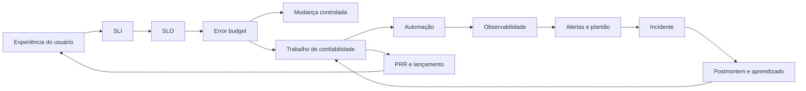

# Conceitos centrais

Esta página é um **mapa de navegação conceitual**. Ela não substitui os
capítulos e não tenta redefinir todos os termos. Use-a para descobrir onde cada
conceito aparece, que decisão ele ajuda a tomar e qual capítulo deve ser lido
para aprofundar.

## Como usar

Para cada tema, siga três passos:

1. Encontre a decisão operacional que você precisa tomar.
2. Abra os capítulos indicados.
3. Produza o artefato prático daquele capítulo: SLO, alerta, runbook, PRR,
   postmortem, plano de restore, contrato de engajamento ou roadmap.

## Mapa de decisões

| Decisão de confiabilidade | Conceitos-chave | Onde aprofundar |
| --- | --- | --- |
| Quanto risco o serviço pode aceitar? | SLI, SLO, SLA, error budget, risco administrado | [Cap. 01](capitulos/capitulo-01.md), [Cap. 02](capitulos/capitulo-02.md) |
| O que deve acordar uma pessoa? | sintomas, quatro sinais de ouro, burn rate, alerta acionável | [Cap. 04](capitulos/capitulo-04.md), [Cap. 07](capitulos/capitulo-07.md) |
| Como reduzir trabalho manual? | toil, automação, estado desejado, self-service | [Cap. 03](capitulos/capitulo-03.md), [Cap. 05](capitulos/capitulo-05.md), [Cap. 12](capitulos/capitulo-12.md) |
| Como responder quando produção falha? | plantão, triagem, comando de incidente, postmortem | [Cap. 07](capitulos/capitulo-07.md), [Cap. 08](capitulos/capitulo-08.md), [Cap. 09](capitulos/capitulo-09.md) |
| Como saber se estamos melhorando? | catálogo de incidentes, tendência, recorrência, quase-incidente | [Cap. 10](capitulos/capitulo-10.md), [Cap. 24](capitulos/capitulo-24.md) |
| Como validar confiabilidade antes da falha real? | testes de confiabilidade, chaos, sondas, game day | [Cap. 11](capitulos/capitulo-11.md), [Cap. 17](capitulos/capitulo-17.md) |
| Como evitar amplificação de falhas? | balanceamento, sobrecarga, retries, backoff, jitter, circuit breaker | [Cap. 13](capitulos/capitulo-13.md), [Cap. 14](capitulos/capitulo-14.md) |
| Como proteger estado e dados? | consenso, liderança, workflows, RPO/RTO, PITR, restore | [Cap. 15](capitulos/capitulo-15.md), [Cap. 16](capitulos/capitulo-16.md), [Cap. 17](capitulos/capitulo-17.md) |
| Como lançar mudanças com risco controlado? | release engineering, rollout, canário, feature flag, PRR | [Cap. 05](capitulos/capitulo-05.md), [Cap. 18](capitulos/capitulo-18.md) |
| Como sustentar SRE como prática organizacional? | onboarding, interrupções, comunicação, engajamento, capstone | [Cap. 19](capitulos/capitulo-19.md) a [Cap. 25](capitulos/capitulo-25.md) |

## Rotas de leitura

| Situação | Leia primeiro | Entrega prática |
| --- | --- | --- |
| Você está começando em SRE | Cap. 01, 02, 03, 04 | Vocabulário comum, SLO inicial e lista de toil |
| O time sofre com alertas | Cap. 04, 07, 20 | Política de alerta e triagem de interrupções |
| Incidentes se repetem | Cap. 08, 09, 10, 24 | Linha do tempo, postmortem e catálogo de recorrência |
| Deploys geram instabilidade | Cap. 05, 11, 18 | Pipeline com rollback, teste e PRR |
| Dados são críticos | Cap. 15, 16, 17 | Plano de restore com RPO/RTO medido |
| SRE virou suporte infinito | Cap. 20, 21, 22, 23 | Rescue plan, RACI e contrato de engajamento |
| Você precisa fechar o curso | Cap. 25 | Capstone e rubrica de maturidade |

## Mapa visual

## Checagem rápida

Use esta lista para revisar se você entendeu a conexão entre os capítulos:

- SLO sem decisão de release vira métrica decorativa.
- Alerta sem ação vira ruído.
- Automação sem recuperação observável vira risco oculto.
- Postmortem sem ação rastreável vira documentação morta.
- Backup sem restore testado vira esperança.
- Feature flag sem remoção vira complexidade permanente.
- SRE sem contrato de engajamento vira fila de suporte.

## Referências

- Google. **Site Reliability Engineering: How Google Runs Production Systems**. <https://sre.google/sre-book/>.
- Google. **The Site Reliability Workbook**. <https://sre.google/workbook/>.
