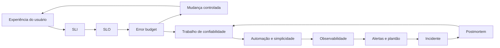

# Conceitos centrais

Esta página existe como **mapa de referência** do curso. Ela não substitui
os capítulos; ela ajuda a enxergar como os conceitos se conectam e quais
decisões cada um melhora em produção.

Use esta página antes de começar o curso para criar vocabulário comum, e
volte a ela depois de cada parte para revisar o encadeamento entre risco,
medição, automação, operação, incidentes, arquitetura e gestão.

## Como usar

Para cada conceito, responda três perguntas:

- Que decisão operacional ele melhora?
- Que evidência mostra que ele está funcionando?
- Que erro comum ele ajuda a evitar?

## Mapa de decisões

| Decisão de confiabilidade | Conceitos que sustentam a decisão | Capítulos |
| --- | --- | --- |
| Quanto risco o serviço pode aceitar? | **SLI**, **SLO**, **SLA**, **error budget**, risco administrado | 01, 02 |
| O que deve acordar uma pessoa? | **quatro sinais de ouro**, **alertas acionáveis**, sintomas, burn rate | 04, 07 |
| Como reduzir trabalho manual? | **toil**, **automação**, estado desejado, idempotência, release seguro | 03, 05 |
| Como responder quando produção falha? | **plantão**, troubleshooting, comando de incidente, postmortem sem culpa | 07, 08, 09 |
| Como evitar amplificação de falhas? | balanceamento, sobrecarga, retries, backoff, jitter, degradação elegante | 13, 14 |
| Como proteger estado e dados? | consenso distribuído, liderança, workflows, integridade, backup e recuperação | 15, 16, 17 |
| Como levar mudanças grandes para produção? | testes de confiabilidade, rollouts, feature flags, prontidão de lançamento | 11, 18 |
| Como sustentar SRE como prática organizacional? | onboarding, interrupções, engajamento, comunicação, responsabilidade compartilhada | 19 a 25 |

## Fundamentos

### **SRE**

**SRE** aplica engenharia de software ao trabalho historicamente tratado
como operação. A equipe não existe apenas para manter sistemas funcionando;
ela reduz intervenção manual, automatiza rotinas, melhora arquitetura,
mede comportamento real e cria mecanismos para equilibrar velocidade e
confiabilidade.

### **Confiabilidade como decisão de produto**

**Confiabilidade** não é busca automática por 100%. O nível correto depende
de expectativa do usuário, impacto da falha, custo de redução de risco e
velocidade de evolução desejada. Um serviço interno eventual e uma API de
pagamento não têm o mesmo alvo.

### **SLI, SLO e SLA**

**SLI** mede uma experiência relevante do serviço. **SLO** define a meta
para essa medição em uma janela. **SLA** é o compromisso externo, geralmente
contratual, com consequência quando não é cumprido. A ordem saudável é medir
bem, definir objetivo interno e só então prometer externamente.

### **Error budget**

**Error budget** é a margem de falha permitida por um SLO. Ele transforma
confiabilidade em uma regra de decisão: orçamento saudável permite mudança
com risco controlado; orçamento queimando rápido desloca prioridade para
estabilização.

### **Toil**

**Toil** é trabalho manual, repetitivo, reativo, sem valor durável e que
cresce com o serviço. Toil excessivo prende a equipe em operação reativa e
reduz tempo disponível para engenharia.

### **Simplicidade operacional**

**Simplicidade operacional** reduz estados, dependências, exceções e
caminhos de falha. Remover complexidade não é estética: é reduzir o número
de coisas que precisam ser entendidas durante mudança, incidente e
recuperação.

## Operação diária

### **Observabilidade e monitoração**

**Monitoração** transforma sinais de produção em decisão. **Observabilidade**
amplia a capacidade de investigar sistemas distribuídos usando métricas,
logs, traces e eventos. O objetivo não é coletar tudo; é criar evidência
suficiente para detectar impacto e diagnosticar causa.

### **Quatro sinais de ouro**

**Latência**, **tráfego**, **erros** e **saturação** formam uma base prática
para observar serviços. Eles aproximam a operação da experiência do usuário
e ajudam a separar sintoma de causa.

### **Alertas acionáveis**

**Alertas acionáveis** exigem julgamento humano imediato. Se uma notificação
não muda uma decisão agora, ela deve virar ticket, dashboard, automação ou
análise assíncrona.

### **Plantão saudável**

**Plantão saudável** depende de volume manejável, alertas bons, runbooks,
escalonamento claro, treinamento e recuperação. Plantão não é apenas uma
escala de pessoas; é um sistema sociotécnico que precisa ser projetado.

### **Troubleshooting**

**Troubleshooting** eficaz usa triagem, hipóteses testáveis, experimentos
pequenos e linha do tempo. Resultados negativos são úteis porque reduzem o
espaço de busca e evitam mudanças aleatórias em produção.

## Incidentes e aprendizado

### **Resposta a incidentes**

**Resposta a incidentes** organiza papéis, comunicação, mitigação e registro
durante uma crise. Separar coordenação de execução técnica reduz caos e
melhora a qualidade das decisões.

### **Postmortem sem culpa**

**Postmortem sem culpa** investiga condições sistêmicas, não culpados. A
saída útil é ação corretiva rastreável: dono, prazo e evidência de redução
de risco.

### **Interrupções de serviço**

**Interrupções** precisam ser registradas, classificadas e analisadas ao
longo do tempo. Sem linha de base, a equipe não sabe se está melhorando
confiabilidade ou apenas reagindo ao incidente mais recente.

## Arquitetura e mudança

### **Automação confiável**

**Automação confiável** expressa intenção, valida pré-condições, executa de
forma idempotente, observa resultado e permite recuperação. Script rápido
não é suficiente quando o efeito em produção não é rastreável.

### **Engenharia de release**

**Engenharia de release** torna mudanças pequenas, rastreáveis, testáveis e
reversíveis. Builds reprodutíveis, artefatos versionados, configuração
controlada, rollout gradual e rollback exercitado reduzem surpresa.

### **Balanceamento de carga**

**Balanceamento de carga** direciona tráfego para destinos saudáveis,
próximos e capazes. A decisão acontece em camadas: borda, região, proxy,
pool e backend.

### **Sobrecarga e falhas em cascata**

**Sobrecarga** deve ser controlada com limites, throttling, prioridades e
rejeição explícita. **Falhas em cascata** aparecem quando retries, filas,
timeouts ruins e dependências lentas amplificam uma falha parcial.

### **Consenso distribuído**

**Consenso distribuído** coordena estado crítico quando decisões
conflitantes seriam perigosas: eleição de líder, locks, configuração,
filas confiáveis e máquinas de estado replicadas.

### **Workflows e pipelines**

**Workflows confiáveis** têm estado visível, liderança ou coordenação,
idempotência, tratamento de atraso, controle de duplicidade e validação de
resultado. Jobs periódicos e pipelines falham de formas parecidas.

### **Integridade de dados**

**Integridade de dados** exige prevenção, detecção, replicação, backup e
restauração testada. Backup sem recuperação verificável é apenas esperança.

## Gestão de SRE

### **Prontidão para produção**

**Prontidão para produção** combina arquitetura, capacidade, observabilidade,
runbooks, rollback, modos de falha, suporte e critérios de lançamento.

### **Responsabilidade compartilhada**

**Responsabilidade compartilhada** impede que SRE vire uma fila de suporte.
Produto, desenvolvimento, plataforma e SRE precisam de objetivos,
responsabilidades e critérios de engajamento claros.

### **Comunicação operacional**

**Comunicação operacional** reduz ambiguidade entre equipes. Reuniões,
documentos, canais e decisões registradas importam porque sistemas de
produção atravessam fronteiras organizacionais.

## Mapa visual dos conceitos

## Tabela de estudo rápido

| Conceito | Pergunta que ele responde | Resultado esperado |
| --- | --- | --- |
| SLI | O que vamos medir? | Evidência objetiva de comportamento. |
| SLO | Qual nível é bom o suficiente? | Meta clara para produto e engenharia. |
| Error budget | Quanto risco ainda podemos gastar? | Decisão objetiva sobre releases e estabilização. |
| Toil | Que trabalho repetitivo consome a equipe? | Priorização de automação e melhoria. |
| Monitoramento | O que precisa acordar uma pessoa? | Alertas acionáveis e menos ruído. |
| Incidente | Quem coordena e comunica durante a crise? | Resposta mais rápida e menos caos. |
| Postmortem | O que o sistema nos ensinou? | Ações preventivas e memória operacional. |
| Overload | Quando rejeitar ou degradar trabalho? | Proteção contra cascatas. |
| Consenso | Que estado não pode divergir? | Coordenação forte para decisões críticas. |
| Integridade | O dado pode ser restaurado e verificado? | Recuperação confiável. |

## Leitura complementar

- Livro oficial online do Google SRE: <https://sre.google/sre-book/table-of-contents/>
- Materiais suplementares citados no PDF: <https://g.co/SREBook>

## Referências

- Beyer, Betsy; Jones, Chris; Petoff, Jennifer; Murphy, Niall Richard, eds. **Engenharia de Confiabilidade do Google**. Novatec, 2016.
- Google. **Site Reliability Engineering: How Google Runs Production Systems**. <https://sre.google/sre-book/>.
