# Trilha de aprendizagem e ciclo SRE

Esta trilha organiza o curso para levar o estudante do nível básico ao
avançado. O objetivo não é apenas conhecer termos de **SRE**, mas aprender a
projetar um ciclo completo de desenvolvimento e operação confiável: entender
o serviço, definir objetivos, construir mudanças seguras, operar produção,
responder incidentes e transformar aprendizado em engenharia.

Use o [Projeto prático - Checkout API](projeto-pratico.md) como contexto
acumulativo. Cada capítulo melhora um artefato do mesmo serviço, para que a
formação termine em um dossiê SRE completo.

As entregas devem ser avaliadas pelas [Rubricas de avaliação SRE](rubricas.md),
que definem o padrão mínimo para SLO, alerta, runbook, postmortem, release,
teste de confiabilidade, restauração, PRR e roadmap.

A página [SRE em 2026](sre-2026.md) orienta como conectar os fundamentos do
livro a OpenTelemetry, Kubernetes, workloads de IA, platform engineering,
supply chain security e FinOps.

## Resultado esperado

Ao concluir o curso, o estudante deve conseguir:

- explicar **SRE**, **SLI**, **SLO**, **SLA**, **error budget**, **toil**,
  **observabilidade**, **plantão**, **postmortem**, **rollback** e
  **resiliência**;
- mapear o caminho de uma requisição ou workflow crítico;
- definir SLIs e SLOs ligados à experiência do usuário;
- projetar alertas acionáveis, runbooks e critérios de escalonamento;
- desenhar um pipeline de release com canário, rollback e validação;
- identificar toil e propor automação ou simplificação;
- planejar resposta a incidentes e postmortems sem culpa;
- projetar controles para sobrecarga, retries, timeouts, consenso,
  integridade de dados e pipelines;
- avaliar maturidade operacional de um serviço e propor evolução.

## Nível 1 - Fundamentos

O primeiro nível constrói vocabulário e raciocínio operacional.

| Capítulos | Competência |
| --- | --- |
| 01 | Entender SRE como engenharia aplicada à operação e mapear produção como ecossistema. |
| 02 | Transformar risco em SLI, SLO, SLA e error budget. |
| 03 | Identificar toil e proteger tempo de engenharia. |
| 04 | Diferenciar sintomas, causas, monitoração e observabilidade. |
| 05 | Entender automação e release como cadeia controlada de mudança. |
| 06 | Reduzir complexidade como prática de confiabilidade. |

Evidência de domínio: o estudante consegue escolher um serviço real,
desenhar sua jornada crítica, propor um SLI/SLO inicial e apontar três
fontes de toil.

## Nível 2 - Operação controlada

O segundo nível transforma conceitos em rotina operacional.

| Capítulos | Competência |
| --- | --- |
| 07 | Projetar alertas acionáveis e plantão saudável. |
| 08 | Investigar problemas com hipóteses, evidências e linha do tempo. |
| 09 | Coordenar incidentes, comunicação e postmortems. |
| 10 | Registrar interrupções e analisar tendências. |
| 11 | Testar confiabilidade sob falha, carga, rollback e desastre. |
| 12 | Construir ferramentas internas para problemas operacionais recorrentes. |

Evidência de domínio: o estudante consegue criar um runbook, revisar um
alerta ruidoso, conduzir uma investigação estruturada e escrever ações de
postmortem com dono e prazo.

## Nível 3 - Arquitetura para resiliência

O terceiro nível trata sistemas distribuídos, dependências e dados.

| Capítulos | Competência |
| --- | --- |
| 13 | Projetar distribuição de carga na borda e dentro do datacenter. |
| 14 | Controlar sobrecarga, retries, timeouts e falhas em cascata. |
| 15 | Entender consenso distribuído e estado crítico. |
| 16 | Projetar jobs periódicos e pipelines com estado, idempotência e validação. |
| 17 | Proteger integridade de dados, backup, restauração e verificação. |
| 18 | Planejar lançamentos confiáveis em escala. |

Evidência de domínio: o estudante consegue desenhar uma estratégia de
degradação, uma política de retry, um plano de restauração e um rollout
gradual com critérios objetivos.

## Nível 4 - Gestão e evolução

O quarto nível conecta engenharia, pessoas e modelo operacional.

| Capítulos | Competência |
| --- | --- |
| 19 | Formar SREs para plantão e autonomia operacional. |
| 20 | Reduzir interrupções cognitivas e proteger foco. |
| 21 | Recuperar equipes sob sobrecarga operacional. |
| 22 | Estruturar comunicação e colaboração entre equipes. |
| 23 | Definir modelo de engajamento, entrada, saída e responsabilidade. |
| 24 | Adaptar práticas de setores críticos para software. |
| 25 | Consolidar um plano de melhoria contínua. |

Evidência de domínio: o estudante consegue avaliar maturidade operacional,
negociar responsabilidades e propor uma evolução incremental de SRE para um
serviço ou plataforma.

## O ciclo de desenvolvimento SRE

O ciclo abaixo conecta desenvolvimento e operação. Ele deve ser repetido
para cada serviço crítico.

```mermaid
flowchart LR
    Discovery["1. Entender serviço e jornada crítica"] --> Objectives["2. Definir SLIs, SLOs e risco"]
    Objectives --> Design["3. Projetar arquitetura e dependências"]
    Design --> Build["4. Implementar com testes, automação e observabilidade"]
    Build --> Release["5. Lançar com canário, rollback e critérios"]
    Release --> Operate["6. Operar com alertas, runbooks e plantão"]
    Operate --> Incident["7. Responder incidentes e mitigar impacto"]
    Incident --> Learn["8. Aprender com postmortem e dados históricos"]
    Learn --> Improve["9. Reduzir toil, simplificar e evoluir"]
    Improve --> Discovery
```

## Artefatos do ciclo

| Etapa | Artefato produzido |
| --- | --- |
| Entender serviço | Mapa da jornada crítica e dependências |
| Definir objetivos | Documento de SLI/SLO/error budget |
| Projetar arquitetura | Análise de modos de falha e dependências críticas |
| Implementar | Testes, instrumentação, runbooks e automação |
| Lançar | Plano de rollout, canário, rollback e critérios de parada |
| Operar | Alertas acionáveis, dashboards e escala de plantão |
| Responder incidente | Documento vivo, linha do tempo e comunicação |
| Aprender | Postmortem sem culpa com ações rastreáveis |
| Evoluir | Backlog de confiabilidade, redução de toil e simplificação |

## Projeto final sugerido

Use o `checkout-api` descrito em [Projeto prático - Checkout API](projeto-pratico.md)
ou escolha um serviço real equivalente e produza um dossiê SRE:

1. mapa da jornada crítica;
2. dependências e modos de falha;
3. SLIs, SLOs e error budget;
4. dashboard mínimo;
5. política de alerta;
6. runbook de primeiro diagnóstico;
7. pipeline de release com canário e rollback;
8. política de retry, timeout e degradação;
9. plano de backup/restauração, quando houver dados críticos;
10. template de incidente e postmortem;
11. plano de redução de toil;
12. roadmap de maturidade operacional.

## Critério de avanço

O estudante está avançando quando deixa de responder apenas "o que é" e
passa a responder:

- que risco isso reduz;
- que decisão isso melhora;
- que evidência prova que funcionou;
- que artefato precisa existir;
- como isso se comporta durante mudança, falha e recuperação.

## Referências

- Beyer, B.; Jones, C.; Petoff, J.; Murphy, N. R. (eds.). **Site Reliability Engineering: How Google Runs Production Systems**. O'Reilly Media / Google, 2016. <https://sre.google/sre-book/>
- Beyer, B.; Murphy, N. R.; Rensin, D.; Kawahara, K.; Thorne, S. (eds.). **The Site Reliability Workbook**. O'Reilly Media / Google, 2018. <https://sre.google/workbook/>
- PDF local usado como fonte primária em português: `../Engenharia de Confiabilidade do Google ( etc.).pdf`.
